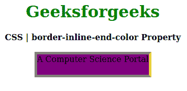
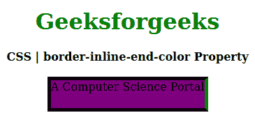

# CSS |边框-内联-结束-颜色属性

> 原文:[https://www . geesforgeks . org/CSS-border-inline-end-color-property/](https://www.geeksforgeeks.org/css-border-inline-end-color-property/)

CSS 中的**边框内联结束颜色**属性用于在样式表中的一个位置定义单个逻辑内联结束边框颜色属性值。此属性设置定义元素边框底部的边框颜色。

**语法:**

```css
border-inline-end-color: border-color;
```

**属性值:**

*   **边框颜色:**该属性保存边框的颜色。

以下示例说明了 CSS 中的**边框内联结束颜色属性**:

**例 1:**

```css
<!DOCTYPE html>
<html>

<head>
    <title>CSS | border-inline-end-color Property</title>
    <style>
        h1 {
            color: green;
        }

        div {
            background-color: yellow;
            width: 220px;
            height: 40px;
        }
        .one {
            border: 5px solid gray;
            border-inline-end-color: yellow;
            background-color: purple;
        }
    </style>
</head>

<body>
    <center>
        <h1>Geeksforgeeks</h1>
        <b>CSS | border-inline-end-color Property</b>
        <br><br>
        <div class="one">A Computer Science Portal</div>
    </center>
</body>

</html>
```

**输出:**


**例 2:**

```css
<!DOCTYPE html>
<html>

<head>
    <title>CSS | border-inline-end-color Property</title>
    <style>
        h1 {
            color: green;
        }

        div {
            background-color: yellow;
            width: 220px;
            height: 40px;
        }
        .one {
            border: 5px solid black;
            border-inline-end-color: green;
            background-color: purple;
        }
    </style>
</head>

<body>
    <center>
        <h1>Geeksforgeeks</h1>
        <b>CSS | border-inline-end-color Property</b>
        <br><br>
        <div class="one">A Computer Science Portal</div>
    </center>
</body>

</html>
```

**输出:**


**支持的浏览器:****边框内联端色属性**支持的浏览器如下:

*   火狐浏览器
*   歌剧
*   边缘

**参考:**[https://developer . Mozilla . org/en-US/docs/Web/CSS/border-inline-end-color](https://developer.mozilla.org/en-US/docs/Web/CSS/border-inline-end-color)