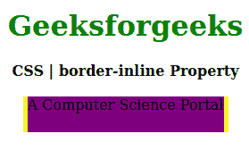

# CSS |边框内联属性

> 原文:[https://www.geeksforgeeks.org/css-border-inline-property/](https://www.geeksforgeeks.org/css-border-inline-property/)

CSS 中的**边框内联属性**用于在样式表中的单个位置设置单个逻辑块内联边框属性值。它设置定义元素的内联边框-顶部(左)和底部(右)。

**语法:**

```html
border-inline: border-width| border-style| border-color;
```

**属性值:**

*   **边框宽度:**该属性值保存属性的宽度。
*   **边框样式:**该属性保存可以是虚线、实线等的边框样式。
*   **边框颜色:**该属性保存边框的颜色。

以下示例说明了 CSS 中的**边框内联属性**:

**例 1:**

```html
<!DOCTYPE html>
<html>

<head>
    <title>CSS | border-inline Property</title>
    <style>
        h1 {
            color: green;
        }

        div {
            background-color: yellow;
            width: 220px;
            height: 40px;
        }
        .one {
            border-inline: 5px solid yellow;
            background-color: purple;
        }
    </style>
</head>

<body>
    <center>
        <h1>Geeksforgeeks</h1>
        <b>CSS | border-inline Property</b>
        <br><br>
        <div class="one">A Computer Science Portal</div>
    </center>
</body>

</html>
```

**输出:**


**例 2:**

```html
<!DOCTYPE html>
<html>

<head>
    <title>CSS | border-inline Property</title>
    <style>
        h1 {
            color: green;
        }

        div {
            background-color: yellow;
            width: 220px;
            height: 40px;
        }
        .one {
            border-inline: 5px dashed yellow;
            background-color: purple;
        }
    </style>
</head>

<body>
    <center>
        <h1>Geeksforgeeks</h1>
        <b>CSS | border-inline Property</b>
        <br><br>
        <div class="one">A Computer Science Portal</div>
    </center>
</body>

</html>
```

**输出:**


**支持的浏览器:****边框内联属性**支持的浏览器如下:

*   火狐浏览器
*   歌剧
*   边缘