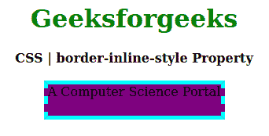
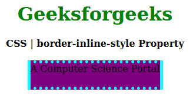

# CSS |边框内嵌样式属性

> 原文:[https://www . geesforgeks . org/CSS-border-inline-style-property/](https://www.geeksforgeeks.org/css-border-inline-style-property/)

**内联边框样式属性**是 CSS 中的一个内置属性，用于在样式表中的一个位置设置单个逻辑块内联边框样式属性值。它设置定义边框元素的内联边框样式的顶部(左)和底部(右)。

**语法:**

```
border-inline-style: style;
```

**属性值:**

*   **样式:**该属性保存边框虚线、边框、虚线等样式。

以下示例说明了 CSS 中的**边框内联样式属性**:
**示例 1:**

```
<!DOCTYPE html>
<html>

<head>
    <title>CSS | border-inline-style Property</title>
    <style>
        h1 {
            color: green;
        }

        div {
            background-color: yellow;
            width: 220px;
            height: 40px;
        }

        .one {
            border: 5px solid cyan;
            border-inline-style: dashed;
            background-color: purple;
        }
    </style>
</head>

<body>
    <center>
        <h1>Geeksforgeeks</h1>
        <b>CSS | border-inline-style Property</b>
        <br><br>
        <div class="one">A Computer Science Portal</div>
    </center>
</body>

</html>                    
```

**输出:**


**例 2:**

```
<!DOCTYPE html>
<html>

<head>
    <title>CSS | border-inline-style Property</title>
    <style>
        h1 {
            color: green;
        }

        div {
            background-color: yellow;
            width: 220px;
            height: 40px;
        }

        .one {
            border: 5px dotted cyan;
            border-inline-style: solid;
            background-color: purple;
        }
    </style>
</head>

<body>
    <center>
        <h1>Geeksforgeeks</h1>
        <b>CSS | border-inline-style Property</b>
        <br><br>
        <div class="one">A Computer Science Portal</div>
    </center>
</body>

</html>                    
```

**输出:**


**参考:**[https://developer . Mozilla . org/en-US/docs/Web/CSS/border-inline-style #:~:text = The % 20 border % 2d inline % 2d style % 20CSS，% 2C % 20 directionity % 2C % 20 和%20text%20orientation。](https://developer.mozilla.org/en-US/docs/Web/CSS/border-inline-style#:~:text=The%20border%2Dinline%2Dstyle%20CSS,%2C%20directionality%2C%20and%20text%20orientation.)

**支持的浏览器:****边框内嵌样式属性**支持的浏览器如下:

*   火狐浏览器
*   歌剧
*   边缘