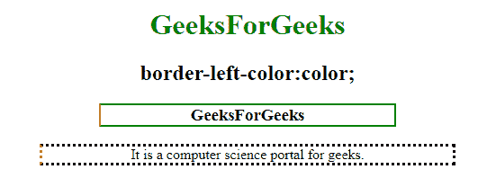
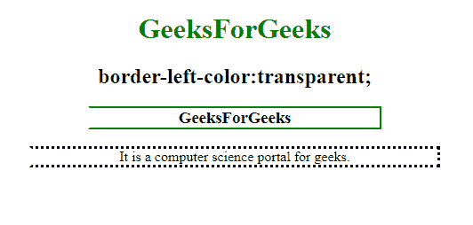
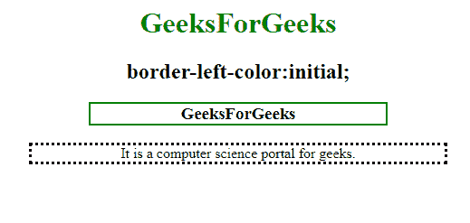

# CSS |边框-左侧颜色属性

> 原文:[https://www . geesforgeks . org/CSS-border-left-color-property/](https://www.geeksforgeeks.org/css-border-left-color-property/)

**左边框颜色**属性用于设置元素中左边框的颜色。必须在边框左颜色属性之前声明边框样式或边框左样式属性。
**语法:**

```css
border-left-color: color|transparent|initial|inherit; 
```

**默认值:**元素的当前颜色

**属性值**
**颜色:**设置元素左边框的颜色。

*   **语法:**

```css
border-left-color: color
```

*   **例:**

## 超文本标记语言

```css
<!DOCTYPE html>
<html>

<head>
    <title>
        CSS | border-left-color Property
    </title>
    <style>
        h1 {
            color: green;
        }

        h3 {
            border: 2px solid green;
            border-left-color: red;
            width: 50%;
        }
    </style>
</head>

<body>
    <center>

        <h1>GeeksForGeeks</h1>
        <h2>border-left-color:color;</h2>
        <h3>GeeksForGeeks</h3>

        <!-- Sets the color-->
        <p style="border-style:dotted;
                  border-left-color:coral;
                  width:70%;">
          It is a computer science portal for geeks.</p>

</body>

</html></li>
```

*   **输出:**



*   **语法:**

```css
border-left-color:transparent;
```

*   **例:**

## 超文本标记语言

```css
<!DOCTYPE html>
<html>

<head>
    <title>
        CSS | border-left-color Property
    </title>
    <style>
        h1 {
            color: green;
        }

        h3 {
            border: 2px solid green;
            border-left-color: transparent;
            width: 50%;
        }
    </style>
</head>

<body>
    <center>

        <h1>GeeksForGeeks</h1>
        <h2>border-left-color:transparent</h2>
        <h3>GeeksForGeeks</h3>

        <!-- Sets the color to transparent-->
        <p style="border-style:dotted;
                  border-left-color:transparent;
                  width:70%;">
          It is a computer science portal for geeks.</p>

</body>

</html>
```

*   **输出:**



*   **语法:**

```css
border-left-color:initial;
```

*   **例:**

## 超文本标记语言

```css
<!DOCTYPE html>
<html>

<head>
    <title>
        CSS | border-left-color Property
    </title>
    <style>
        h1 {
            color: green;
        }

        h3 {
            border: 2px solid green;
            border-left-color: initial;
            width: 50%;
        }
    </style>
</head>

<body>
    <center>

        <h1>GeeksForGeeks</h1>
        <h2>border-left-color:initial;</h2>
        <h3>GeeksForGeeks</h3>

        <!-- Sets the color to its default value-->
        <p style="border-style:dotted;
                  border-left-color:initial;
                  width:70%;">
          It is a computer science portal for geeks.</p>

</body>

</html>
```

*   **输出:**



**支持的浏览器:**CSS 边框左颜色属性支持的浏览器如下:

*   谷歌 Chrome 1.0
*   Internet Explorer 4.0
*   Firefox 1.0
*   歌剧 3.5
*   苹果 Safari 1.0