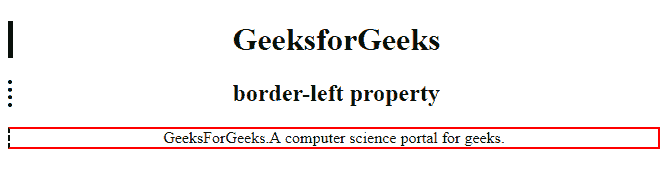

# CSS |左边框属性

> 原文:[https://www.geeksforgeeks.org/css-border-left-property/](https://www.geeksforgeeks.org/css-border-left-property/)

CSS 中的**左边框**属性用于设置一行中所有的左下属性。它用于设置左边框的宽度、样式和颜色。
**语法:**

```
border-left: border-width border-style border-color|initial|
inherit; 
```

**左边框**是设置以下属性值的简写。
**房产价值:**

*   **边框宽度:**用于设置边框的宽度。
*   **边框样式:**用于设置边框的样式。它的默认值是“无”。
*   **边框颜色:**用于设置边框的颜色。
*   **初始值:**该属性用于将边框底部设置为默认值。
*   **inherit:** 此属性从其父级继承。

**示例-1:**

## 超文本标记语言

```
<!DOCTYPE html>
<html>

<head>
    <title>border-left property</title>

    <!-- border-left CSS property -->
    <style>
        h1 {
            border-left: 5px solid green;
        }

        h2 {
            border-left: 4px dotted black;
        }

        div {
            border: 2px solid red;
            border-left: 2px dashed black;
        }
    </style>
</head>

<body style="text-align:center">

    <h1>GeeksforGeeks</h1>
    <h2>border-left property</h2>
    <div>
      GeeksForGeeks.
      A computer science portal for geeks.
    </div>
</body>

</html>         
```

**输出:**



**支持的浏览器:***左边框属性*支持的浏览器如下:

*   谷歌 Chrome 1.0
*   Internet Explorer 4.0
*   Firefox 1.0
*   Opera 1.0
*   Safari 3.5