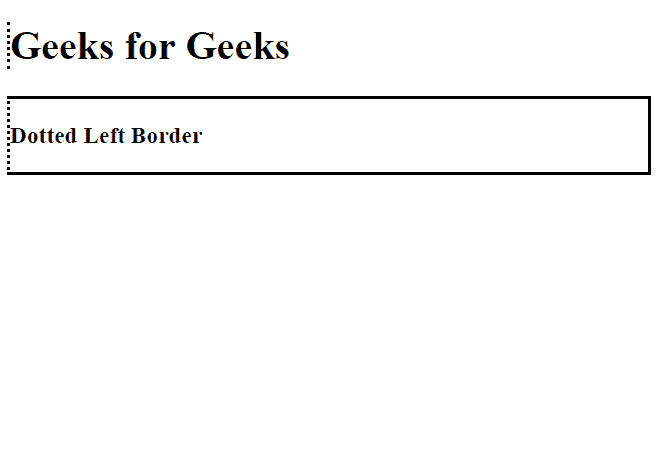
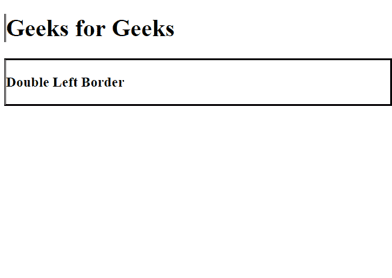
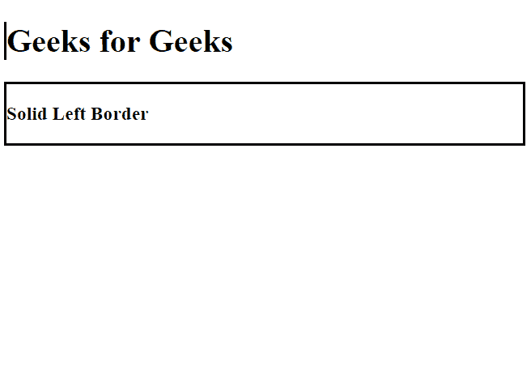

# CSS |左边框样式属性

> 原文:[https://www . geesforgeks . org/CSS-border-left-style-property/](https://www.geeksforgeeks.org/css-border-left-style-property/)

**CSS 左边框样式属性**用于设置元素**左边框**的样式。

**默认值**

*   **无**

**语法:**

```
border-left-style: none| hidden| dotted| dashed| solid| double |
groove| ridge| inset| outset| initial| inherit;
```

**属性值:**

<figure class="table">

| **value** | **Description** |
| without | It has no left border. |
| hide | It does not set borders, except for border conflict resolution of table elements. |
| dotted line | It sets a dashed left border. |
| dotted line | It has a dashed left border. |
| sincere | It has a solid left border. |
| double | It has double borders. |
| fillister | It has a 3D groove left border. |
| ridge | It has a 3D ridged left border. |
| illustration | It sets the left border of a 3D illustration. |
| begin | It sets a 3D start left border. |
| initial | It sets the left border style property to the default value. |
| inherit | It inherits the attribute value from its parent element. |

</figure>

**返回值:**返回元素左边框的样式。

**示例-1:** 显示虚线左边框。

## 超文本标记语言

```
<!DOCTYPE html>
<html>

<head>
    <style>
        h1 {
            border-left-style: dotted;
        }

        div {
            border-style: solid;
            border-left-style: dotted;
        }
    </style>
</head>

<body>

    <h1>Geeks for Geeks</h1>

    <div>
        <h3>Dotted Left Border</h3></div>

</body>

</html>
```

**输出:**



**示例-2:** 显示双左边框

## 超文本标记语言

```
<!DOCTYPE html>
<html>

<head>
    <style>
        h1 {
            border-left-style: double;
        }

        div {
            border-style: solid;
            border-left-style: double;
        }
    </style>
</head>

<body>

    <h1>Geeks for Geeks</h1>

    <div>
        <h3>Double Left Border</h3></div>

</body>

</html>
```

**输出:**



**示例-3:** 显示实心左边框

## 超文本标记语言

```
<!DOCTYPE html>
<html>

<head>
    <style>
        h1 {
            border-left-style: solid;
        }

        div {
            border-style: solid;
            border-left-style: solid;
        }
    </style>
</head>

<body>

    <h1>Geeks for Geeks</h1>

    <div>
        <h3>Solid Left Border</h3></div>

</body>

</html>
```

**输出:**



**支持的浏览器:***CSS 边框左样式属性*支持的浏览器如下:

*   谷歌 Chrome
*   火狐浏览器
*   微软公司出品的 web 浏览器
*   歌剧
*   旅行队