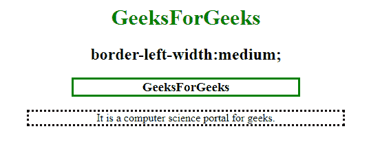
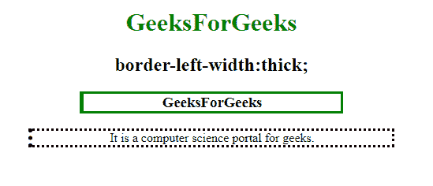
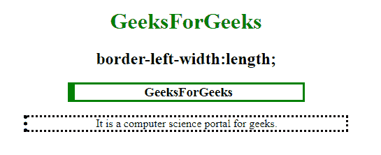
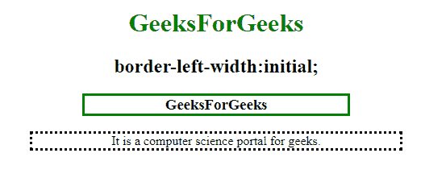

# CSS |边框-左宽度属性

> 原文:[https://www . geesforgeks . org/CSS-border-left-width-property/](https://www.geeksforgeeks.org/css-border-left-width-property/)

**左边框宽度**属性用于设置元素左边框的宽度。必须在边框左颜色属性之前声明边框样式或边框左样式属性。

**语法:**

```css
border-left-width: medium|thin|thick|length|initial|inherit;
```

**属性值**

**中**:有默认值。它用于指定中等大小的左边框。

*   **语法:**

    ```css
    border-left-width:medium;
    ```

*   **例:**

    ```css
    <!DOCTYPE html>
    <html>

    <head>
        <title>
            CSS | border-left-width Property
        </title>
        <style>
            h1 {
                color: green;
            }

            h3 {
                border: solid green;
                border-left-width: medium;
                width: 50%;
            }
        </style>
    </head>

    <body>
        <center>

            <h1>GeeksForGeeks</h1>
            <h2>border-left-width:medium;</h2>
            <h3>GeeksForGeeks</h3>

            <p style="border-style:dotted;
                      border-left-width:medium;
                      width:70%;">
              It is a computer science portal for geeks.</p>

    </body>

    </html>
    ```

*   **输出:**
    

**细:**指定一条细的左边框。

*   **语法:**

    ```css
    border-left-width:thin;
    ```

*   **例:**

    ```css
    <!DOCTYPE html>
    <html>

    <head>
        <title>
            CSS | border-left-width Property
        </title>
        <style>
            h1 {
                color: green;
            }

            h3 {
                border: solid green;
                border-left-width: thin;
                width: 50%;
            }
        </style>
    </head>

    <body>
        <center>

            <h1>GeeksForGeeks</h1>
            <h2>border-left-width:thin;</h2>
            <h3>GeeksForGeeks</h3>

            <p style="border-style:dotted;
                      border-left-width:thin;
                      width:70%;">
              It is a computer science portal for geeks.</p>

    </body>

    </html>
    ```

*   **输出:**
    

**粗:**指定元素的左边框粗。

*   **语法:**

    ```css
    border-left-width:thick;
    ```

*   **例:**

    ```css
    <!DOCTYPE html>
    <html>

    <head>
        <title>
            CSS | border-left-width Property
        </title>
        <style>
            h1 {
                color: green;
            }

            h3 {
                border: solid green;
                border-left-width: thick;
                width: 50%;
            }
        </style>
    </head>

    <body>
        <center>

            <h1>GeeksForGeeks</h1>
            <h2>border-left-width:thick;</h2>
            <h3>GeeksForGeeks</h3>

            <p style="border-style:dotted;
                      border-left-width:thick;
                      width:70%;">
              It is a computer science portal for geeks.</p>

    </body>

    </html>
    ```

*   **输出:**
    

**长度:**以像素为单位指定左边框的厚度。

*   **语法:**

    ```css
    border-left-width: length;

    ```

*   **例:**

    ```css
    <!DOCTYPE html>
    <html>

    <head>
        <title>
            CSS | border-left-width Property
        </title>
        <style>
            h1 {
                color: green;
            }

            h3 {
                border: solid green;
                border-left-width: 10px;
                width: 50%;
            }
        </style>
    </head>

    <body>
        <center>

            <h1>GeeksForGeeks</h1>
            <h2>border-left-width:length;</h2>
            <h3>GeeksForGeeks</h3>

            <p style="border-style:dotted;
                      border-left-width:5px;
                      width:70%;">
              It is a computer science portal for geeks.</p>

    </body>

    </html>
    ```

*   **输出:**
    

**初始值:**将属性设置为默认值。

*   **语法:**

    ```css
    border-left-width:initial;
    ```

*   **例:**

    ```css
    <!DOCTYPE html>
    <html>

    <head>
        <title>
            CSS | border-left-width Property
        </title>
        <style>
            h1 {
                color: green;
            }

            h3 {
                border: solid green;
                border-left-width: initial;
                width: 50%;
            }
        </style>
    </head>

    <body>
        <center>

            <h1>GeeksForGeeks</h1>
            <h2>border-left-width:initial;</h2>
            <h3>GeeksForGeeks</h3>

            <p style="border-style:dotted;
                      border-left-width:initial;
                      width:70%;">
              It is a computer science portal for geeks.</p>

    </body>

    </html>
    ```

*   **输出:**
    

**支持的浏览器:**CSS 边框左宽属性支持的浏览器如下:

*   谷歌 Chrome 1.0
*   Internet Explorer 4.0
*   Firefox 1.0
*   歌剧 3.5
*   苹果 Safari 1.0