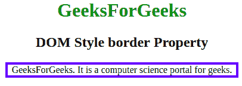

# CSS 边框属性

> 原文:[https://www.geeksforgeeks.org/css-border-property/](https://www.geeksforgeeks.org/css-border-property/)

CSS 中的**边框**属性用于设置元素边框的样式。该属性是其他三个属性*边框宽度*、*边框样式*和*边框颜色*的组合，可以用作这三个属性的简写符号。它设置或返回边框宽度、边框样式、边框颜色属性。
**语法:**

```html
border = "width style color|initial|inherit"
```

**默认值:**其默认值为初始值。

**房产价值** :

*   **宽度**:该值指定边框的粗细或宽度。
*   **样式**:该值为边框指定一种样式，即边框是否为虚线、虚线、实线等。
*   **颜色**:该值指定边框的颜色。

下面的代码说明了 CSS 中的边框属性:
**示例:**

## 超文本标记语言

```html
<!DOCTYPE html>
<html>

<head>
    <title>
        CSS | border Property
    </title>
    <style>
        h1 {
            color: green;
        }

        #gfg {
            border: 4px solid blue;
            width: 60%;
        }
    </style>
</head>

<body>
    <center>
        <h1>GeeksForGeeks</h1>

        <h2>DOM Style border Property</h2>

        <!-- Element whose border will be styled -->
        <div id="gfg">
            GeeksForGeeks.
            It is a computer science portal for geeks.
        </div>
    </center>
</body>

</html>              
```

**输出:**



**支持的浏览器:**CSS 边框属性支持的浏览器如下:

*   谷歌 Chrome 1.0
*   Internet Explorer 4.0
*   Firefox 1.0
*   歌剧 3.5
*   苹果 Safari 1.0