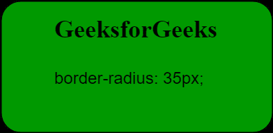
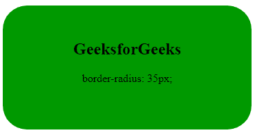
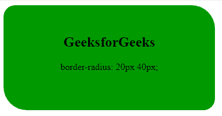
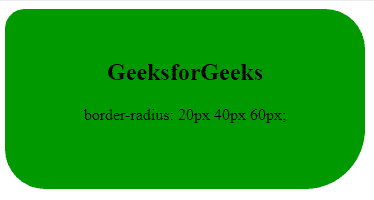
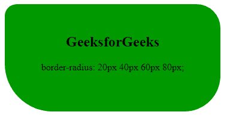
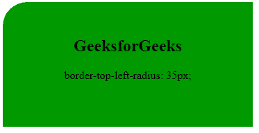
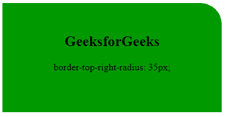
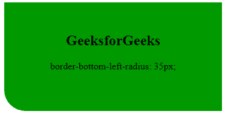
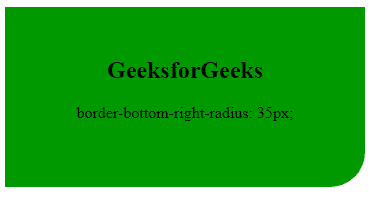
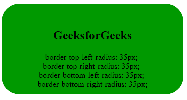

# CSS 边框半径属性

> 原文:[https://www.geeksforgeeks.org/css-border-radius-property/](https://www.geeksforgeeks.org/css-border-radius-property/)

CSS 中的**边框半径属性**用于圆化元素外边框边缘的角。该属性可以包含一个、两个、三个或四个值。边框半径属性用于设置边框半径。当[边框折叠](https://www.geeksforgeeks.org/css-border-collapse-property/)折叠时，该属性不适用于表格元素。



**语法:**

```css
border-radius: 1-4 length|% / 1-4 length|%|initial|inherit;
```

**属性值:**

*   **长度**:表示边角的形状&默认值为 0。
*   **百分比(%)** :代表角的形状，单位为%。
*   [**初始**](https://www.geeksforgeeks.org/css-value-initial/) :用于将元素的 CSS 属性设置为默认值。
*   [**继承**](https://www.geeksforgeeks.org/css-value-inherit/) :用于从元素的父元素属性值继承元素的属性。

每个半径的 4 个值可以按如下顺序指定:左上、右上、右下、左下。如果左下角被移除，那么它将与右上角相同。同样，如果右下和右上将被删除，那么它将分别与左上和左上相同。

**边界半径:**边界半径属性可以包含一个、两个、三个或四个值。

**边框半径:35px**用于设置每个角的边框半径。它是四个属性的组合:边框-左上角半径、边框-右上角半径、边框-左下角半径、边框-右下角半径。它将所有角设置为相同的值。

**示例:**本示例说明了**边界半径**属性，其值由单个值指定。

## 超文本标记语言

```css
<!DOCTYPE html>
<html>
<head>
    <title>Rounded Corners</title>
    <style>
    .GFG {
        border-radius: 35px;
        background: #009900;
        padding: 30px;
        text-align: center;
        width: 300px;
        height: 120px;
    }
    </style>
</head>

<body>
    <div class="GFG">
        <h2>GeeksforGeeks</h2>

<p>border-radius: 35px;</p>

    </div>
</body>
</html>
```

**输出:**



**边框半径:20px 40px**该属性用于将第一个值设置为左上角和右下角，将第二个值设置为右上角和左下角。

**示例:**此示例说明了**边界半径**属性，其值由双精度值指定。

## 超文本标记语言

```css
<!DOCTYPE html>
<html>

<head>
    <title>Rounded Corners</title>
    <style>
        .GFG {
            border-radius: 20px 40px;
            background: #009900;
            padding: 30px;
            text-align: center;
            width: 300px;
            height: 120px;
        }
    </style>
</head>

<body>
    <div class="GFG">
        <h2>GeeksforGeeks</h2>

<p>border-radius: 20px 40px;</p>

    </div>
</body>

</html>
```

**输出:**



**边框半径:20px 40px 60px**该属性用于将第一个值设置为左上角，第二个值应用于右上角和左下角，第三个值应用于右下角。

**示例:**此示例说明了**边界半径**属性，其值由三个值指定。

## 超文本标记语言

```css
<!DOCTYPE html>
<html>
<head>
    <title>Rounded Corners</title>
    <style>
    .GFG {
        border-radius: 20px 40px 60px;
        background: #009900;
        padding: 30px;
        text-align: center;
        width: 300px;
        height: 120px;
    }
    </style>
</head>

<body>
    <div class="GFG">
        <h2>GeeksforGeeks</h2>

<p>border-radius: 20px 40px 60px;</p>

    </div>
</body>
</html>
```

**输出:**



**边框半径:20px 40px 60px 80px**此属性用于将边框半径的第一、第二、第三和第四个值分别设置为左上角、右上角、右下角和左下角。

**示例:**本示例说明了**边界半径**属性，其值由四个值指定。

## 超文本标记语言

```css
<!DOCTYPE html>
<html>
<head>
    <title>Rounded Corners</title>
    <style>
    .GFG {
        border-radius: 20px 40px 60px 80px;
        background: #009900;
        padding: 30px;
        text-align: center;
        width: 300px;
        height: 120px;
    }
    </style>
</head>

<body>
    <div class="GFG">
        <h2>GeeksforGeeks</h2>

<p>border-radius: 20px 40px 60px 80px;</p>

    </div>
</body>
</html>
```

**输出:**



现在，我们将理解下面给出的边界半径属性的简写属性。

[**边框-左上角-半径**](https://www.geeksforgeeks.org/css-border-top-left-radius-property/) **:** 此属性用于指定元素左上角的半径。

**示例:**本示例说明了**边界半径**属性，其中属性值应用于元素的左上角。

## 超文本标记语言

```css
<!DOCTYPE html>
<html>
<head>
    <title>Rounded Corners</title>
    <style>
    .GFG {
        border-top-left-radius: 35px;
        background: #009900;
        padding: 30px;
        text-align: center;
        width: 300px;
        height: 120px;
    }
    </style>
</head>

<body>
    <div class="GFG">
        <h2>GeeksforGeeks</h2>

<p>border-top-left-radius: 35px;</p>

    </div>
</body>
</html>
```

**输出:**



[**边框-右上角-半径**](https://www.geeksforgeeks.org/css-border-top-right-radius-property/) **:** 该属性用于定义给定元素边框右上角的半径。

**示例:**此示例说明了**边界半径**属性，其中属性值应用于元素的右上角。

## 超文本标记语言

```css
<!DOCTYPE html>
<html>
<head>
    <title>Rounded Corners</title>
    <style>
    .GFG {
        border-top-right-radius: 35px;
        background: #009900;
        padding: 30px;
        text-align: center;
        width: 300px;
        height: 120px;
    }
    </style>
</head>

<body>
    <div class="GFG">
        <h2>GeeksforGeeks</h2>

<p>border-top-right-radius: 35px;</p>

    </div>
</body>
</html>
```

**输出:**



[**边框-左下角-半径**](https://www.geeksforgeeks.org/css-border-bottom-left-radius-property/) **:** 此属性用于定义边框左下角的半径，即使边框左下角为圆形。

**示例:**此示例说明了**边界半径**属性，其中属性值应用于元素的左下角。

## 超文本标记语言

```css
<!DOCTYPE html>
<html>
<head>
    <title>Rounded Corners</title>
    <style>
    .GFG {
        border-bottom-left-radius: 35px;
        background: #009900;
        padding: 30px;
        text-align: center;
        width: 300px;
        height: 120px;
    }
    </style>
</head>

<body>
    <div class="GFG">
        <h2>GeeksforGeeks</h2>

<p>border-bottom-left-radius: 35px;</p>

    </div>
</body>
</html>
```

**输出:**



[**边框-底部-右侧-半径**](https://www.geeksforgeeks.org/css-border-bottom-right-radius-property/) **:** 该属性用于定义给定元素边框右下角的半径。

**示例:**此示例说明了**边界半径**属性，其中属性值应用于元素的右下角。

## 超文本标记语言

```css
<!DOCTYPE html>
<html>
<head>
    <title>Rounded Corners</title>
    <style>
    .GFG {
        border-bottom-right-radius: 35px;
        background: #009900;
        padding: 30px;
        text-align: center;
        width: 300px;
        height: 120px;
    }
    </style>
</head>

<body>
    <div class="GFG">
        <h2>GeeksforGeeks</h2>

<p>border-bottom-right-radius: 35px;</p>

    </div>
</body>
</html>
```

**输出:**



**混合边框半径属性:**该属性用于将所有角设置为给定值。

**示例:**此示例说明了**边界半径**属性，其中属性值应用于元素的所有角。

## 超文本标记语言

```css
<!DOCTYPE html>
<html>
<head>
    <title>Rounded Corners</title>
    <style>
    .GFG {
        border-top-left-radius: 35px;
        border-top-right-radius: 35px;
        border-bottom-left-radius: 35px;
        border-bottom-right-radius: 35px;
        background: #009900;
        padding: 30px;
        text-align: center;
        width: 300px;
        height: 120px;
    }
    </style>
</head>

<body>
    <div class="GFG">
        <h2>GeeksforGeeks</h2>

<p>border-top-left-radius: 35px;
            <br>border-top-right-radius: 35px;
            <br>border-bottom-left-radius: 35px;
            <br>border-bottom-right-radius: 35px;</p>

    </div>
</body>
</html>
```

**输出:**



**人手不够:**

*   **将半径值应用于所有四个角:**

```css
border-radius: value; 
```

*   **在左上角和右下角应用值 1，在右上角和左下角应用值 2:**

```css
border-radius: value1 value2; 
```

*   **在左上角应用值 1，在右上角和左下角应用值 2，在右下角应用值 3:**

```css
border-radius: value1 value2 value3; 
```

*   **在左上角应用值 1，在右上角应用值 2，在右下角应用值 3，在左下角应用值 4:**

```css
border-radius: value1 value2 value3 value4;
```

**支持的浏览器:**

*   Google chrome 5.0，4.0 -webkit-
*   Internet Explorer 9.0
*   微软边缘 12.0
*   火狐 4.0， 3.0 -moz-
*   歌剧 10.5
*   Safari 5.0、3.1 -webkit-