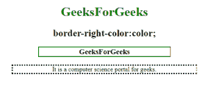
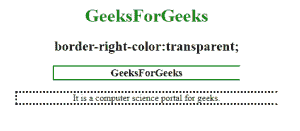
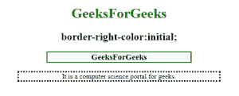

# CSS |边框-右侧-颜色属性

> 原文:[https://www . geesforgeks . org/CSS-border-right-color-property/](https://www.geeksforgeeks.org/css-border-right-color-property/)

**右边框颜色**属性用于设置元素中右边框的颜色。必须在边框-右边色属性之前声明边框样式或边框-左边样式属性。

**语法:**

```html
border-right-color: color|transparent|initial|inherit; 
```

**属性值**

**颜色:**设置元素右边框的颜色。

*   **语法:**

    ```html
    border-right-color: color;
    ```

*   **例:**

    ```html
    <!DOCTYPE html>
    <html>

    <head>
        <title>
           CSS | border-right-color Property
        </title>
        <style>
            h1 {
                color: green;
            }

            h3 {
                border: 2px solid green;
                border-right-color: red;
                width: 50%;
            }
        </style>
    </head>

    <body>
        <center>

            <h1>GeeksForGeeks</h1>
            <h2>border-right-color:color;</h2>
            <h3>GeeksForGeeks</h3>

            <p style="border-style:dotted;
                      border-right-color:coral;
                      width:70%;">
                It is a computer science portal for geeks.</p>

    </body>

    </html>
    ```

*   **输出:**
    

**透明:**指定右边框的透明值。

*   **语法:**

    ```html
    border-right-color:transparent;
    ```

*   **例:**

    ```html
    <!DOCTYPE html>
    <html>

    <head>
        <title>
           CSS | border-right-color Property
        </title>
        <style>
            h1 {
                color: green;
            }

            h3 {
                border: 2px solid green;
                border-right-color: transparent;
                width: 50%;
            }
        </style>
    </head>

    <body>
        <center>

            <h1>GeeksForGeeks</h1>
            <h2>border-right-color:transparent;</h2>
            <h3>GeeksForGeeks</h3>
            <p style="border-style:dotted;
                      border-right-color:transparent;
                      width:70%;">
              It is a computer science portal for geeks.</p>

    </body>

    </html>
    ```

*   **输出:**
    

**初始值:**将属性设置为默认值。

*   **语法:**

    ```html
    border-right-color:initial;
    ```

*   **例:**

    ```html
    <!DOCTYPE html>
    <html>

    <head>
        <title>
           CSS | border-right-color Property
        </title>
        <style>
            h1 {
                color: green;
            }

            h3 {
                border: 2px solid green;
                border-right-color: initial;
                width: 50%;
            }
        </style>
    </head>

    <body>
        <center>

            <h1>GeeksForGeeks</h1>
            <h2>border-right-color:initial;</h2>
            <h3>GeeksForGeeks</h3>

            <p style="border-style:dotted;
                      border-right-color:
                      initial;width:70%;">
              It is a computer science portal for geeks.</p>

    </body>

    </html>
    ```

*   **输出:**
    

**支持的浏览器:**CSS 边框-右边色属性支持的浏览器如下:

*   谷歌 Chrome 1.0
*   Internet Explorer 4.0
*   Firefox 1.0
*   歌剧 3.5
*   苹果 Safari 1.0