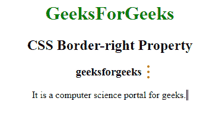
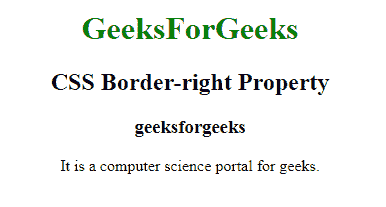

# CSS |边框右属性

> 原文:[https://www.geeksforgeeks.org/css-border-right-property/](https://www.geeksforgeeks.org/css-border-right-property/)

**边框右侧属性**是用于下面给出的所有三个属性的简写属性-

*   边框-右宽度
*   右边框样式(如果需要)
*   右边框颜色

**语法:**

```
border-right: border-width border-style border-color|initial|
inherit;
```

**属性值:**

**边框宽度边框样式边框颜色:**用于设置元素边框的宽度、样式和颜色。

*   **语法:**

    ```
    border-right: border-width border-style border-color 
    ```

*   **例:**

    ```
    <!DOCTYPE html>
    <html>

    <head>
        <title>
            CSS | border-right Property
        </title>
        <style>
            h1 {
                border-right: 5px solid red;
            }

            h2 {
                border-right: 4px dotted blue;
            }

            div {
                border-right: double;
            }
        </style>
    </head>

    <body>

        <h1>A heading with a solid red right border</h1>

        <h2>A heading with a dotted blue right border</h2>

        <div>A div element with a double right border.</div>

    </body>

    </html>
    ```

*   **输出:**
    

**初始值:**将属性设置为默认值。

*   **语法:**

    ```
    border-right:initial;
    ```

*   **例:**

    ```
    <!DOCTYPE html>
    <html>
    <head>
    <style>
    h1 {
       color:green;
    }

    h3 {
      border-right: initial;
      width:20%;
    }

    div {
      border-right: initial;
      width:40%;
    }
    </style>
    </head>
    <body>
    <center>
    <h1>GeeksForGeeks</h1>
    <h2> CSS Border-right Property</h2>
    <h3>geeksforgeeks</h3>

    <div>It is a computer science portal for geeks.</div>

    </body>
    </html>
    ```

*   **输出:**
    

**支持的浏览器:**CSS 边框属性支持的浏览器如下:

*   谷歌 Chrome 1.0
*   Internet Explorer 4.0
*   Firefox 1.0
*   歌剧 3.5
*   苹果 Safari 1.0