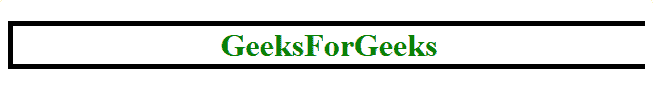
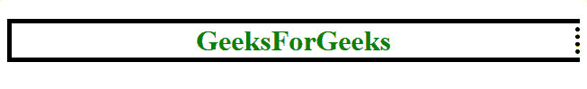
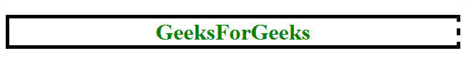
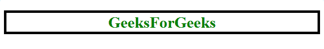
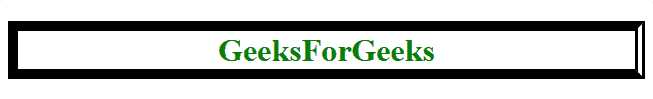
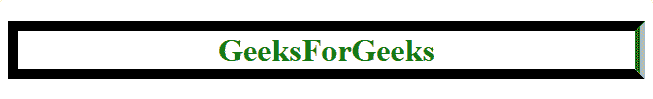
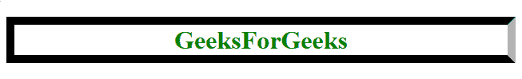
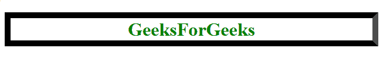
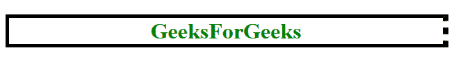

# CSS |边框右侧样式属性

> 原文:[https://www . geesforgeks . org/CSS-border-right-style-property/](https://www.geeksforgeeks.org/css-border-right-style-property/)

CSS 中的**边框右样式属性**用于更改元素边框右线段的外观。

**默认值**

*   没有人

**语法:**

```css
border-right-style: none|hidden|dotted|dashed|solid|double|groove|
ridge|inset|outset|inherit; 
```

**房产价值:**

**无:**为默认值，使右边框宽度为零。因此，它是不可见的。

*   **语法:**

```css
border-right-style: none;
```

*   **例:**

## 超文本标记语言

```css
<!DOCTYPE html>
<html>
    <head>
        <title>
            CSS border-right-style property
        </title>

        <!-- Internal CSS Style Sheet -->
        <style>
            h1 {
                color: green;
                text-align: center;
                border: 5px solid black;

                /* CSS Property for border-right-style */
                border-right-style: none;
            }
        </style>

    </head>

    <body>
        <!-- border-right-style:none; -->
        <h1>GeeksForGeeks</h1>
    </body>
</html>                   
```

*   **输出:**



**隐藏:**用于使右边框不可见，与*无*一样，除了表格元素的边框冲突解决。

*   **语法:**

```css
border-right-style: hidden;
```

*   **例:**

## 超文本标记语言

```css
<!DOCTYPE html>
<html>
    <head>
        <title>
            CSS border-right-style property
        </title>

        <!-- Internal CSS Style Sheet -->
        <style>
            h1 {
                color: green;
                text-align: center;
                border: 5px solid black;

                /* CSS Property for border-right-style */
                border-right-style: hidden;
            }
        </style>

    </head>

    <body>
        <!-- border-right-style:hidden; -->
        <h1>GeeksForGeeks</h1>
    </body>
</html>                   
```

*   **输出:**


**虚线:**用于用一系列点组成右边框。

*   **语法:**

```css
border-right-style: dotted;
```

*   **例:**

## 超文本标记语言

```css
<!DOCTYPE html>
<html>
    <head>
        <title>
            CSS border-right-style property
        </title>

        <!-- Internal CSS Style Sheet -->
        <style>
            h1 {
                color: green;
                text-align: center;
                border: 5px solid black;

                /* CSS Property for border-right-style */
                border-right-style: dotted;
            }
        </style>

    </head>

    <body>
        <!-- border-right-style:dotted; -->
        <h1>GeeksForGeeks</h1>
    </body>
</html>                   
```

*   **输出:**



**虚线:**用一系列短线段做右边框。

*   **语法:**

```css
border-right-style: dashed;
```

*   **例:**

## 超文本标记语言

```css
<!DOCTYPE html>
<html>
    <head>
        <title>
            CSS border-right-style property
        </title>

        <!-- Internal CSS Style Sheet -->
        <style>
            h1 {
                color: green;
                text-align: center;
                border: 5px solid black;

                /* CSS Property for border-right-style */
                border-right-style: dashed;
            }
        </style>

    </head>

    <body>
        <!-- border-right-style:dashed; -->
        <h1>GeeksForGeeks</h1>
    </body>
</html>                   
```

*   **输出:**



**实线:**用单个实线线段做右边框。

*   **语法:**

```css
border-right-style: solid;
```

*   **例:**

## 超文本标记语言

```css
<!DOCTYPE html>
<html>
    <head>
        <title>
            CSS border-right-style property
        </title>

        <!-- Internal CSS Style Sheet -->
        <style>
            h1 {
                color: green;
                text-align: center;
                border: 5px solid black;

                /* CSS Property for border-right-style */
                border-right-style: solid;
            }
        </style>

    </head>

    <body>
        <!-- border-right-style:solid; -->
        <h1>GeeksForGeeks</h1>
    </body>
</html>                   
```

*   **输出:**



**double:** 这个属性用双实线做右边框。在这种情况下，边框宽度等于两条线段的宽度和它们之间的间距之和。

*   **语法:**

```css
border-right-style: double;
```

*   **例:**

## 超文本标记语言

```css
<!DOCTYPE html>
<html>
    <head>
        <title>
            CSS border-right-style property
        </title>

        <!-- Internal CSS Style Sheet -->
        <style>
            h1 {
                color: green;
                text-align: center;
                border: 5px solid black;

                /* CSS Property for border-right-style */
                border-right-style: double;
            }
        </style>

    </head>

    <body>
        <!-- border-right-style:double; -->
        <h1>GeeksForGeeks</h1>
    </body>
</html>                   
```

*   **输出:**



**凹槽:**它用一条有凹槽的线段做右边框，让我们感觉它在往里走。

*   **语法:**

```css
border-right-style: groove;
```

*   **例:**

## 超文本标记语言

```css
<!DOCTYPE html>
<html>
    <head>
        <title>
            CSS border-right-style property
        </title>

        <!-- Internal CSS Style Sheet -->
        <style>
            h1 {
                border: 10px;
                border-style: solid;

                /* CSS Property for border-right-style */
                border-right-style: groove;
            }
        </style>

    </head>

    <body>
        <!-- border-right-style:groove; -->
        <h1>GeeksForGeeks</h1>
    </body>
</html>                               
```

*   **输出:**



**插页:**用内嵌线段做右边框，让我们感觉它深深的固定在屏幕上。

*   **语法:**

```css
border-right-style: inset;
```

*   **例:**

## 超文本标记语言

```css
<!DOCTYPE html>
<html>
    <head>
        <title>
            CSS border-right-style property
        </title>

        <!-- Internal CSS Style Sheet -->
        <style>
            h1 {
                border: 10px;
                border-style: solid;

                /* CSS Property for border-right-style */
                border-right-style: inset;
            }
        </style>

    </head>

    <body>
        <!-- border-right-style:inset; -->
        <h1>GeeksForGeeks</h1>
    </body>
</html>                   
```

*   **输出:**



**开头:**与*插图*相反。它用一条线段做右边框，这条线段看起来要出来了。

*   **语法:**

```css
border-right-style: outset;
```

*   **例:**

## 超文本标记语言

```css
<!DOCTYPE html>
<html>
    <head>
        <title>
            CSS border-right-style property
        </title>

        <!-- Internal CSS Style Sheet -->
        <style>
            h1 {
                border: 10px;
                border-style: solid;

                /* CSS Property for border-right-style */
                border-right-style: outset;
            }
        </style>

    </head>

    <body>
        <!-- border-right-style:outset; -->
        <h1>GeeksForGeeks</h1>
    </body>
</html>                   
```

*   **输出:**



**继承:**使*右边框样式的*属性从其父元素继承。

*   **语法:**

```css
border-right-style: inherit;
```

*   **例:**

## 超文本标记语言

```css
<!DOCTYPE html>
<html>
    <head>
        <title>
            CSS border-right-style Property
        </title>

        <!-- Internal CSS Style Sheet -->
        <style>
            body {
                border-right-style: dashed;
            }
            h1 {
                color: green;
                text-align: center;
                border: 5px solid black;

                /* CSS Property | border-right-style */
                border-right-style: inherit;
            }
        </style>
    </head>

    <body>
        <!-- border-right-style: inherit; -->
        <h1>GeeksForGeeks</h1>
    </body>
</html>                   
```

*   **输出:**



**支持的浏览器:**支持的浏览器*边框右键*属性如下:

*   谷歌 Chrome 1.0
*   Internet Explorer 4.0
*   Firefox 1.0
*   歌剧 3.5
*   Safari 1.0