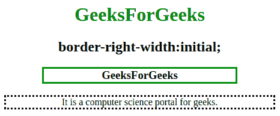

# CSS |边框右宽属性

> 原文:[https://www . geesforgeks . org/CSS-border-right-width-property/](https://www.geeksforgeeks.org/css-border-right-width-property/)

CSS 中的**边框右宽属性**用于设置元素右边框的宽度。必须在边框右宽属性之前声明边框样式或边框右样式属性。

**默认值:**

*   **中等**

**语法:**

```css
border-right-width: medium|thin|thick|length|initial|inherit; 
```

**属性值:**
**中:**为默认值。它用于指定中等大小的右边框。

*   **语法:**

```css
border-right-width: medium;
```

*   **示例:**

## 超文本标记语言

```css
<!DOCTYPE html>
<html>
    <head>
        <title>
            CSS | border-right-width Property
        </title>
        <style>
            h3 {
                border: solid green;
                border-right-width: medium;
                width: 50%;
            }
            p {
                border-style:dotted;
                border-right-width:medium;
                width:70%;
            }
        </style>
    </head>

    <body>
        <center>
            <h1 style = "color:green">
             GeeksForGeeks
            </h1>
            <h2>border-right-width:initial;</h2>

            <!-- border-right-width property
                                   used here -->
            <h3>GeeksForGeeks</h3>

            <!-- border-right-width property
                                   used here -->

<p>
             It is a computer science portal for geeks.
            </p>

        </center>
    </body>
</html>                   
```

*   **输出:**


**薄:**此属性用于将右边框宽度设置为薄。

*   **语法:**

```css
border-right-width: thin;
```

*   **示例:**

## 超文本标记语言

```css
<!DOCTYPE html>
<html>
    <head>
        <title>
            CSS | border-right-width Property
        </title>
        <style>
            h3 {
                border: solid green;
                border-right-width: thin;
                width: 50%;
            }
            p {
                border-style:dotted;
                border-right-width:thin;
                width:70%;
            }
        </style>
    </head>

    <body>
        <center>
            <h1 style = "color:green">
             GeeksForGeeks
            </h1>
            <h2>border-right-width:initial;</h2>

            <!-- border-right-width property
                                   used here -->
            <h3>GeeksForGeeks</h3>

            <!-- border-right-width property
                                   used here -->

<p>
             It is a computer science portal for geeks.
            </p>

        </center>>
    </body>
</html>                   
```

*   **输出:**


**粗:**该属性用于指定元素的粗右边框。

*   **语法:**

```css
border-right-width: thick;
```

*   **示例:**

## 超文本标记语言

```css
<!DOCTYPE html>
<html>
    <head>
        <title>
            CSS | border-right-width Property
        </title>
        <style>
            h3 {
                border: solid green;
                border-right-width: thick;
                width: 50%;
            }
            p {
                border-style:dotted;
                border-right-width:thick;
                width:70%;
            }
        </style>
    </head>

    <body>
        <center>
            <h1 style = "color:green">
             GeeksForGeeks
            </h1>
            <h2>border-right-width:initial;</h2>

            <!-- border-right-width property
                                   used here -->
            <h3>GeeksForGeeks</h3>

            <!-- border-right-width property
                                   used here -->

<p>
             It is a computer science portal for geeks.
            </p>

        </center>
    </body>
</html>                   
```

*   **输出:**


**长度:**该属性用于设置右边框的厚度。

*   **语法:**

```css
border-right-width: length;
```

*   **示例:**

## 超文本标记语言

```css
<!DOCTYPE html>
<html>
    <head>
        <title>
            CSS | border-right-width Property
        </title>
        <style>
            h3 {
                border: solid green;
                border-right-width: 10px;
                width: 50%;
            }
            p {
                border-style:dotted;
                border-right-width:5px;
                width:70%;
            }
        </style>
    </head>

    <body>
        <center>
            <h1 style = "color:green">
             GeeksForGeeks
            </h1>
            <h2>border-right-width:initial;</h2>

            <!-- border-right-width property
                                   used here -->
            <h3>GeeksForGeeks</h3>

            <!-- border-right-width property
                                   used here -->

<p>
             It is a computer science portal for geeks.
            </p>

        </center>
    </body>
</html>                   
```

*   **输出:**


**初始值:**用于将边框右宽属性设置为默认值。

*   **语法:**

```css
border-right-width: initial;
```

*   **示例:**

## 超文本标记语言

```css
<!DOCTYPE html>
<html>
    <head>
        <title>
            CSS | border-right-width Property
        </title>
        <style>
            h3 {
                border: solid green;
                border-right-width: initial;
                width: 50%;
            }
            p {
                border-style:dotted;
                border-right-width:initial;
                width:70%;
            }
        </style>
    </head>

    <body>
        <center>
            <h1 style = "color:green">
             GeeksForGeeks
            </h1>
            <h2>border-right-width:initial;</h2>

            <!-- border-right-width property
                                   used here -->
            <h3>GeeksForGeeks</h3>

            <!-- border-right-width property
                                   used here -->

<p>
             It is a computer science portal for geeks.
            </p>

        </center>
    </body>
</html>                   
```

*   **输出:**



**支持的浏览器:***边框右宽*属性支持的浏览器如下:

*   谷歌 Chrome 1.0
*   Internet Explorer 4.0
*   Firefox 1.0
*   歌剧 3.5
*   苹果 Safari 1.0