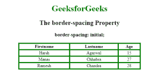

# CSS 边框间距属性

> 原文:[https://www.geeksforgeeks.org/css-border-spacing-property/](https://www.geeksforgeeks.org/css-border-spacing-property/)

**边框间距**属性用于设置表格中相邻单元格边框之间的距离。仅当边框折叠属性设置为不折叠分隔时，此属性才有效。

**默认值:**

*   2px

**语法:**

```css
border-spacing: length|initial|inherit; 
```

**属性值:**

1.  **长度-长度:**用于设置相邻单元格边框之间的距离。它不允许负值。
    *   如果定义了两个值，第一个值定义水平间距，第二个值定义垂直间距。
    *   如果只给出一个值，那么它定义了单元格相邻边框之间的水平和垂直间距。
2.  **初始值:**将属性设置为默认值。

**语法:**

```css
border-spacing:initial;
```

**示例:**

## 超文本标记语言

```css
<!DOCTYPE html>
<html>

<head>
    <title>border-spacing property</title>
    <style>
        table,
        th,
        td {
            border: 2px solid green;
            text-align: center;
        }

        #geeks {
            border-collapse: separate;
            background-color: none;
            border-spacing: initial;
        }

        h1 {
            color: green;
        }
    </style>
</head>

<body>
    <center>
        <h1>GeeksforGeeks</h1>
        <h2> The border-spacing Property</h2>
        <h3>border-spacing: initial;</h3>
        <table style="width:70%" id="geeks">
            <tr>
                <th>Firstname</th>
                <th>Lastname</th>
                <th>Age</th>
            </tr>
            <tr>
                <td>Harsh</td>
                <td>Agarwal</td>
                <td>15</td>
            </tr>
            <tr>
                <td>Manas</td>
                <td>Chhabra</td>
                <td>27</td>
            </tr>
            <tr>
                <td>Ramesh</td>
                <td>Chandra</td>
                <td>28</td>
            </tr>
        </table>
    </center>
</body>

</html>                  
```

**输出:**



**支持的浏览器:**CSS 边框间距属性支持的浏览器如下:

*   谷歌 Chrome 1.0
*   Internet Explorer 8.0
*   Firefox 1.0
*   Opera 4.0
*   Safari 1.0