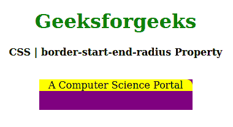
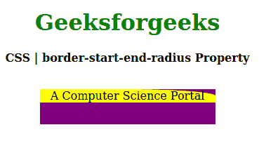

# CSS |边框-起点-终点-半径属性

> 原文:[https://www . geesforgeks . org/CSS-border-start-end-radius-property/](https://www.geeksforgeeks.org/css-border-start-end-radius-property/)

CSS 中的**边界-开始-结束-半径**属性用于指定块开始边界(右上角)的逻辑边界半径。它可以通过元素的**书写模式**、**方向**和**文本方向**进行调整。

**语法:**

```
border-start-end-radius: length | percentage
```

**属性值:**

*   **长度:**该属性以特定单位保存边界半径长度。
*   **百分比:**此属性保存与父元素相比的百分比值。

以下示例说明了 CSS 中的**边界-起点-终点-半径属性**:

**例 1:**

## 超文本标记语言

```
<!DOCTYPE html>
<html>

<head>
    <title>CSS | border-start-end-radius Property</title>
    <style>
        h1 {
            color: green;
        }

        div {
            background-color: purple;
            width: 250px;
            height: 50px;
        }
        .one {
            background-color: yellow;
            border-start-end-radius: 10px;
        }
    </style>
</head>

<body>
    <center>
        <h1>Geeksforgeeks</h1>
        <b>CSS | border-start-end-radius Property</b>
        <br><br>
        <div>
            <p class="one">A Computer Science Portal</p>

        </div>
    </center>
</body>

</html>
```

**输出:**



**例 2:**

## 超文本标记语言

```
<!DOCTYPE html>
<html>

<head>
    <title>CSS | border-start-end-radius Property</title>
    <style>
        h1 {
            color: green;
        }

        div {
            background-color: purple;
            width: 250px;
            height: 50px;
        }
        .one {
            background-color: yellow;
            border-start-end-radius: 50%;
        }
    </style>
</head>

<body>
    <center>
        <h1>Geeksforgeeks</h1>
        <b>CSS | border-start-end-radius Property</b>
        <br><br>
        <div>
             <p class="one">A Computer Science Portal</p>

        </div>
    </center>
</body>

</html>
```

**输出:**



**支持的浏览器:****边界起点终点半径属性**支持的浏览器如下:

*   火狐浏览器

**参考:**T2T4】