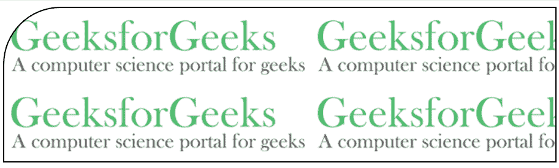

# CSS |边框-左上角-半径属性

> 原文:[https://www . geesforgeks . org/CSS-border-左上角-radius-property/](https://www.geeksforgeeks.org/css-border-top-left-radius-property/)

在 CSS 中**边框左上角半径属性**用于指定*元素左上角的半径*。
**注意:**根据属性的值，边框圆角可以是圆形或椭圆形。如果值为 0，则边框没有变化，仍然是方形边框。
**语法:**

```css
border-top-left-radius: value;
```

**默认值:**有默认值即 **0**

**属性值:**

<figure class="table">

| value | functionality |
| --- | --- |
| length | Used to specify the radius in numerical form. |
| percentage | Used to specify the radius as a percentage. |
| initial | Used to initialize the property to its initial value. |
| inherit | Used to inherit values from its parent element. |

</figure>

**例-1:** 使用**【长度】**。

## 超文本标记语言

```css
<!DOCTYPE html>
<html>

<head>
    <title>
        CSS | border-top-left-radius Property
    </title>
    <style>
        .gfg {
            border: 2px solid black;
            background: url(
https://media.geeksforgeeks.org/wp-content/uploads/20190405121202/GfGLH.png);
            padding: 100px;
            border-top-left-radius: 75px;
        }
    </style>
</head>

<body>
    <div class="gfg">
    </div>
</body>

</html>
```

**输出:**



**例-2:** 使用**【百分比】**。

## 超文本标记语言

```css
<!DOCTYPE html>
<html>

<head>
    <title>
        CSS | border-top-left-radius Property
    </title>
    <style>
        .gfg {
            border: 2px solid black;
            background: url(
https://media.geeksforgeeks.org/wp-content/uploads/20190405121202/GfGLH.png);
            padding: 100px;
            border-top-left-radius: 60%;
        }
    </style>
</head>

<body>
    <div class="gfg">
    </div>
</body>

</html>
```

**输出:**


**浏览器支持:**浏览器支持 *CSS |边框左上角半径*属性如下:

*   Chrome: 5.0，4.0 -webkit-
*   边缘:9.0
*   火狐： 4.0， 3.0 -moz-
*   歌剧:10.5
*   Safari: 5.0，3.1 -webkit-