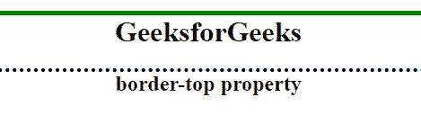

# CSS |边框-顶部属性

> 原文:[https://www.geeksforgeeks.org/css-border-top-property/](https://www.geeksforgeeks.org/css-border-top-property/)

CSS 中的顶部边框属性用于在一行中设置所有顶部边框属性。此属性用于设置上边框的宽度、样式和颜色。
**语法:**

```
border-top: border-width border-style border-color|initial|inherit;
```

**默认值**

*   **初始**

**房产价值:**

*   **边框宽度:**用于设置边框的宽度。
*   **边框样式:**用于设置边框的样式。它的默认值是“无”。
*   **边框颜色:**用于设置边框的颜色。
*   **初始值:**该属性用于将边框顶部设置为默认值。
*   **inherit:** 此属性从其父级继承。

**例:**

## 超文本标记语言

```
<!-- HTML code to illustrates
border-top property -->
<!DOCTYPE html>
<html>
    <head>
        <title>border-top property</title>

        <!-- border-top CSS property -->
        <style>
            h1 {
                border-top: 5px solid green;
            }

            h2 {
                border-top: 4px dotted black;
            }
        </style>
    </head>

    <body style = "text-align:center">

        <h1>GeeksforGeeks</h1>
        <h2>border-top property</h2>
    </body>
</html>                   
```

**输出:**



**支持的浏览器:**边框属性支持的浏览器如下:

*   谷歌 Chrome 1.0
*   Internet Explorer 4.0
*   Firefox 1.0
*   Opera 1.0
*   Safari 3.5