# CSS |边框-顶部样式属性

> 原文:[https://www . geesforgeks . org/CSS-border-top-style-property/](https://www.geeksforgeeks.org/css-border-top-style-property/)

**边框-顶部样式**属性用于指定顶部边框的样式。

**语法:**

```
border-top-style: none | dotted | dashed | solid | groove | inset | 
outset | ridge | double | hidden | initial | inherit;
```

**默认值:**默认值为*无*。

**属性值**

1.  **无:**为默认值，使上边框宽度为零。因此，它是不可见的。
    **语法:**

```
border-top-style:none;
```

**示例-1:**

```
<!DOCTYPE html>
<html>

<head>
    <title>
        CSS | border-top-style Property
    </title>
    <style>
        h3.a {
            border-top-style: none;
        }
    </style>
</head>

<body>
    <h3 class="a">GeeksforGeeks </h3>
</body>

</html>
```

**输出:**
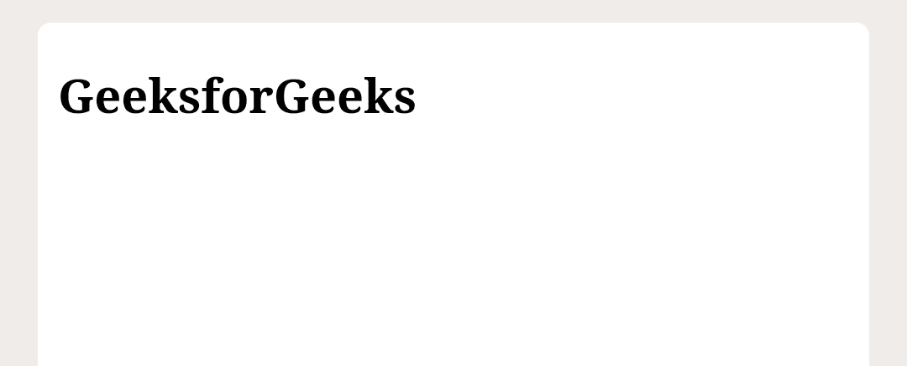

*   **Dotted:** It is used to make the top border with a series of dots.
    **Syntax:**

    ```
    border-top-style:dotted;
    ```

    **示例-2:**

    ```
    <!DOCTYPE html>
    <html>

    <head>
        <title>
            CSS | border-top-style Property
        </title>
        <style>
            h3.a {
                border-top-style: dotted;
            }
        </style>
    </head>

    <body>
        <h3 class="a">GeeksforGeeks </h3>
    </body>

    </html>
    ```

    **输出:**
    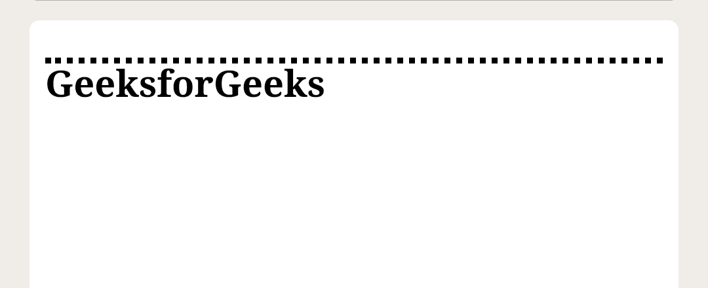

    *   **Dashed:** It makes the top border with a series of short line segments.
    **Syntax:**

    ```
    border-top-style:dashed;
    ```

    **示例-3:**

    ```
    <!DOCTYPE html>
    <html>

    <head>
        <title>
            CSS | border-top-style Property
        </title>
        <style>
            h3.a {
                border-top-style: dashed;
            }
        </style>
    </head>

    <body>
        <h3 class="a">GeeksforGeeks </h3>
    </body>

    </html>
    ```

    **输出:**

    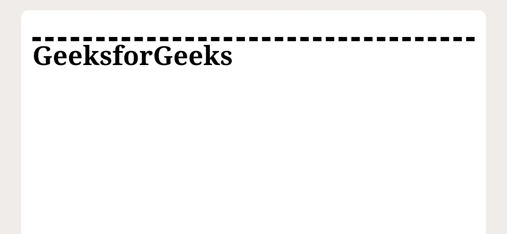

    *   **Solid:** It is used to make the top border with a single solid line segment.

    **语法:**

    ```
    border-top-style:solid;
    ```

    **示例-4:**

    ```
    <!DOCTYPE html>
    <html>

    <head>
        <title>
            CSS | border-top-style Property
        </title>
        <style>
            h3.a {
                border-top-style: solid;
            }
        </style>
    </head>

    <body>
        <h3 class="a">GeeksforGeeks </h3>
    </body>

    </html>
    ```

    **输出:**

    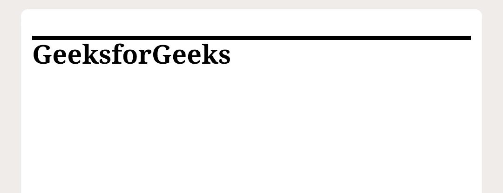

    *   **Groove:** It makes the top border with a grooved line segment, which makes us feel that it is going inside.

    **语法:**

    ```
    border-top-style:groove;
    ```

    **示例-5:**

    ```
    <!DOCTYPE html>
    <html>

    <head>
        <title>
            CSS | border-top-style Property
        </title>
        <style>
            h3.a {
                border-top-style: groove;
            }
        </style>
    </head>

    <body>
        <h3 class="a">GeeksforGeeks </h3>
    </body>

    </html>
    ```

    **输出:**
    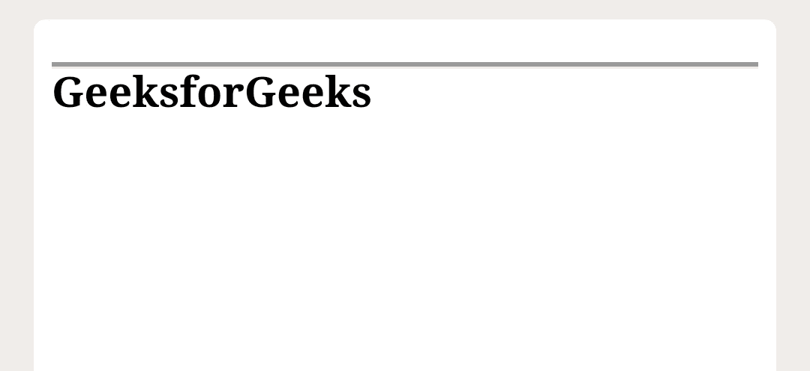

    *   **Inset:** It makes the top border with an embedded line segment which makes us feel that it is fixed deeply on the screen.

    **语法:**

    ```
    border-top-style:inset;
    ```

    **示例-6:**

    ```
    <!DOCTYPE html>
    <html>

    <head>
        <title>
            CSS | border-top-style Property
        </title>
        <style>
            h3.a {
                border-top-style: inset;
            }
        </style>
    </head>

    <body>
        <h3 class="a">GeeksforGeeks </h3>
    </body>

    </html>
    ```

    **输出:**
    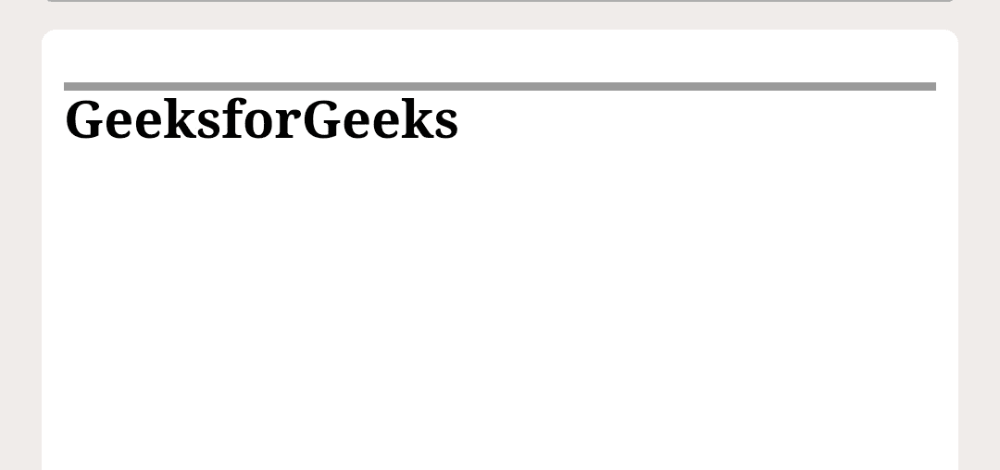

    *   **Outset:** It is the opposite of inset. It makes the top border with a line segment, which appears it to be coming out.

    **语法:**

    ```
    border-top-style:outset;
    ```

    **示例-7:**

    ```
    <!DOCTYPE html>
    <html>

    <head>
        <title>
            CSS | border-top-style Property
        </title>
        <style>
            h3.a {
                border-top-style: outset;
            }
        </style>
    </head>

    <body>
        <h3 class="a">GeeksforGeeks </h3>
    </body>

    </html>
    ```

    **输出:**
    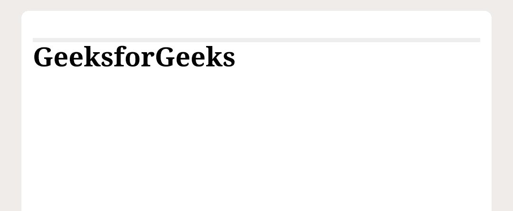

    *   **Ridge:** It is the opposite of groove. It makes the top border with a ridged line segment, which makes us feel that it is coming out.

    **语法:**

    ```
    border-top-style:ridge;
    ```

    **示例-8:**

    ```
    <!DOCTYPE html>
    <html>

    <head>
        <title>
            CSS | border-top-style Property
        </title>
        <style>
            h3.a {
                border-top-style: ridge;
            }
        </style>
    </head>

    <body>
        <h3 class="a">GeeksforGeeks </h3>
    </body>

    </html>
    ```

    **输出:**
    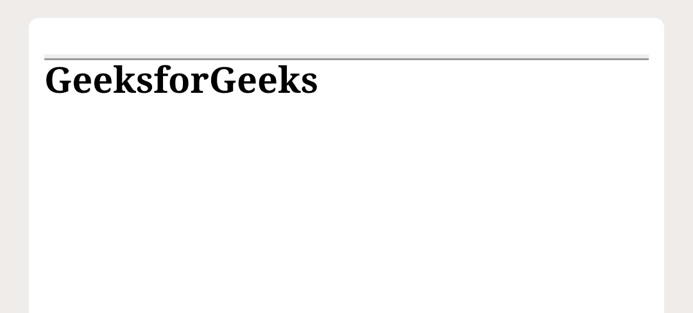

    *   **Double:** It makes the top border with a double solid line. The border width, in this case, is equal to the sum of widths of the two-line segments and the space between them.

    **语法:**

    ```
    border-top-style:double;
    ```

    **示例-9:**

    ```
    <!DOCTYPE html>
    <html>

    <head>
        <title>
            CSS | border-top-style Property
        </title>
        <style>
            h3.a {
                border-top-style: double;
            }
        </style>
    </head>

    <body>
        <h3 class="a">GeeksforGeeks </h3>
    </body>

    </html>
    ```

    **输出:**
    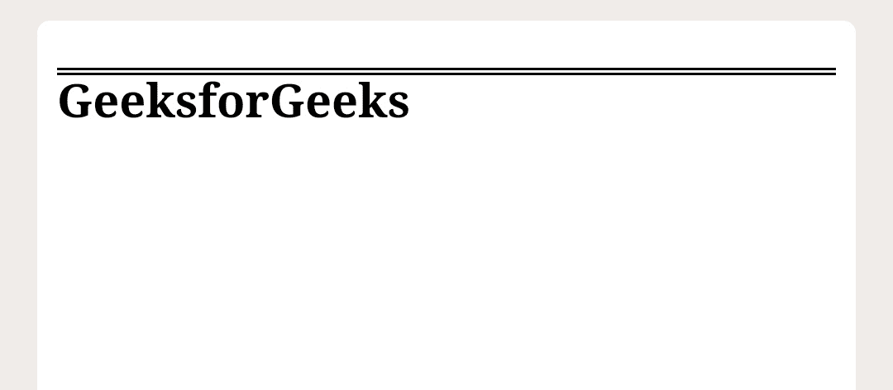

    *   **Hidden:** It is used to make the top border invisible, like *none*, except in case of border conflict resolution of table elements.

    **语法:**

    ```
    border-top-style:hidden;
    ```

    **示例-10**

    ```
    <!DOCTYPE html>
    <html>

    <head>
        <title>
            CSS | border-top-style Property
        </title>
        <style>
            h3.a {
                border-top-style: hidden;
            }
        </style>
    </head>

    <body>
        <h3 class="a">GeeksforGeeks </h3>
    </body>

    </html>
    ```

    **输出:**
    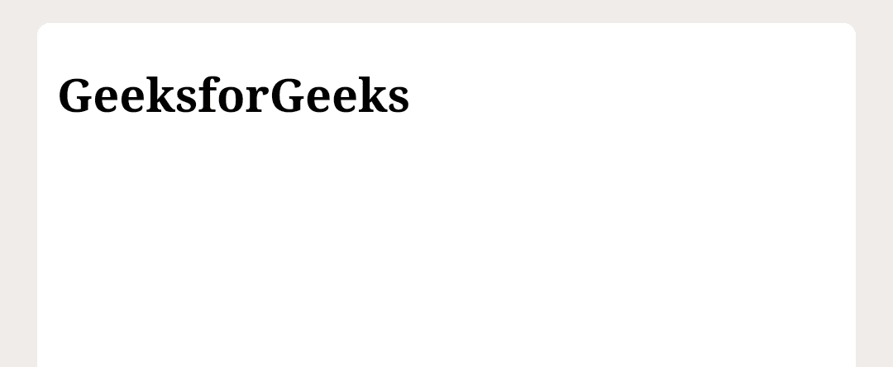

    *   **Initial:** It is used to sets the default value of the element.

    **语法:**

    ```
    border-top-style:initial;
    ```

    **例:11**

    ```
    <!DOCTYPE html>
    <html>

    <head>
        <title>
            CSS | border-top-style Property
        </title>
        <style>
            h3 {
                border-top-style: initial;
            }

        </style>
    </head>

    <body>
        <h3>GeeksforGeeks </h3>
    </body>

    </html>
    ```

    **输出:**
    

    *   **Inherit:** It makes the *top-border-style* property to be inherited from its parent element.

    **语法:**

    ```
    border-top-style:inherit;
    ```

    **例:12**

    ```
    <!DOCTYPE html>
    <html>

    <head>
        <title>
            CSS | border-top-style Property
        </title>
        <style>
            h3 {
                border-top-style: inherit;
            }

            body {
                border-top-style: dotted;
            }
        </style>
    </head>

    <body>
        <h3>GeeksforGeeks </h3>
    </body>

    </html>
    ```

    **输出:**
    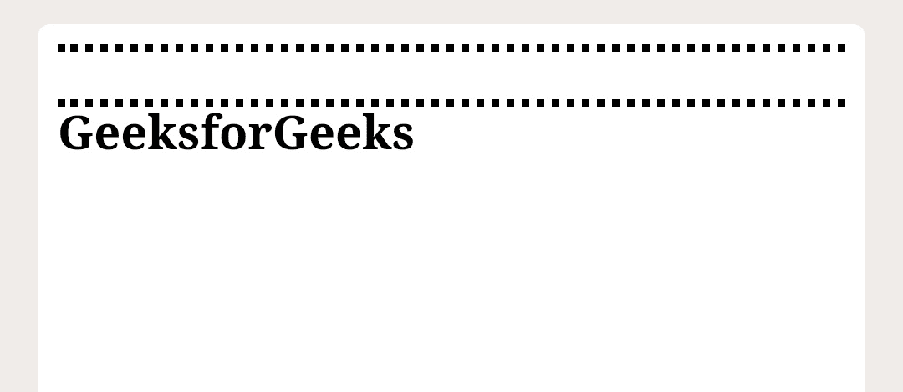

    **注意:**使用边框-顶部属性时，此属性是必需的。

    **支持的浏览器:***边框顶样式属性*支持的浏览器如下:

    *   谷歌 Chrome
    *   边缘
    *   Mozilla Firefox
    *   歌剧
    *   旅行队