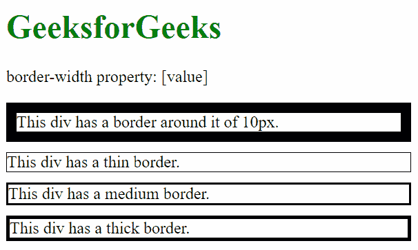
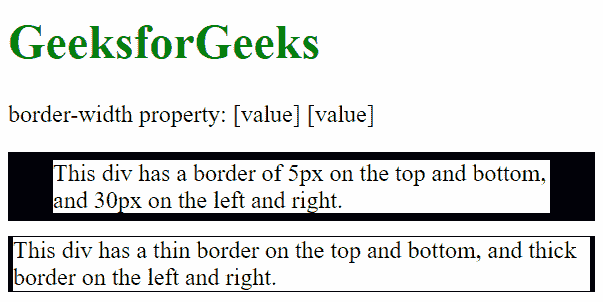
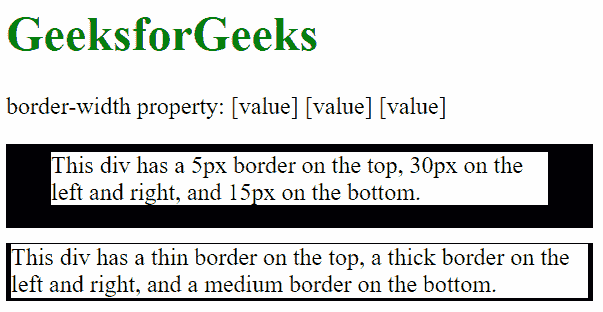
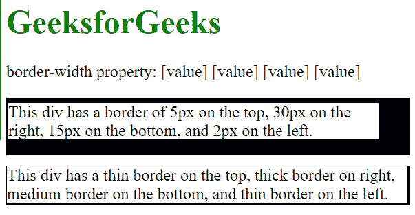
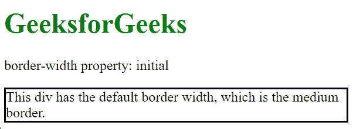
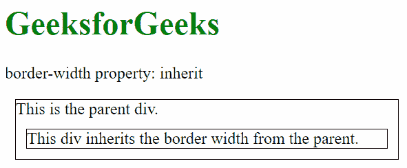

# CSS |边框宽度属性

> 原文:[https://www.geeksforgeeks.org/css-border-width-property/](https://www.geeksforgeeks.org/css-border-width-property/)

CSS 中的边框宽度属性用于设置元素所有四条边的边框宽度。边框宽度属性是四个属性的组合

**默认值:**

*   **中等**

**语法:**

```html
border-width: length|thin|medium|thick|initial|inherit
```

**属性值:**

*   **长度:**用于设置边框的宽度。它不取负值。
*   **细:**用于在元素顶部设置细边框。
*   **中:**用于设置中等大小的上边框。这是默认值。
*   **粗:**用于设置粗顶边框。
*   **初始值:**用于将边框顶宽设置为默认值。
*   **inherit:** 此属性从其父级继承。

**示例 1:** 本示例将所有边的边框宽度设置为单一值。
**边框宽度:val**

*   边框顶部宽度:val
*   边框-右边-宽度:val
*   边框底部宽度:val
*   边框-左宽度:val

## 超文本标记语言

```html
<!DOCTYPE html>
<html>
    <head>
        <title>
            border-width property
        </title>

        <style>
            div {
                margin-bottom: 10px;
                border-style: solid;
            }
        </style>
    </head>

    <body>
        <h1 style="color: green">
            GeeksforGeeks
        </h1>

<p>border-width property: [value]</p>

        <!-- This div has a uniform border
        of 10px around it. -->
        <div style="border-width: 10px">
            This div has a border around it of 10px.
        </div>

        <!-- This div has a uniform thin
        border around it. -->
        <div style="border-width: thin">
            This div has a thin border.
        </div>

        <!-- This div has a uniform medium
        border around it. -->
        <div style="border-width: medium">
            This div has a medium border.
        </div>

        <!-- This div has a uniform thick
        border around it. -->
        <div style="border-width: thick">
            This div has a thick border.
        </div>
    </body>
</html>                   
```

**输出:**



**示例 2:** 本示例包含两个边框宽度值。
**边框宽度:val1 val2**

*   边框顶部宽度:val1
*   边框-右宽:val2
*   边框底部宽度:val1
*   边框-左宽度:val2

## 超文本标记语言

```html
<!DOCTYPE html>
<html>
    <head>
        <title>
            border-width property
        </title>

        <style>
            div {
                margin-bottom: 10px;
                border-style: solid;
            }
        </style>
    </head>

    <body>
        <h1 style = "color: green">
            GeeksforGeeks
        </h1>

<p>border-width property: [value] [value]</p>

        <!-- This div has a 5px border on the top and
        bottom, and 30px on the left and right. -->
        <div style = "border-width: 5px 30px">
            This div has a border of 5px on the top and
            bottom, and 30px on the left and right.
        </div>

        <!-- This div has a thin border on the top and
        bottom, and thick on the left and right. -->
        <div style = "border-width: thin thick">
            This div has a thin border on the top and bottom,
            and thick border on the left and right.
        </div>
    </body>
</html>                   
```

**输出:**



**示例 3:** 本示例将边框宽度设置为三个值。
**边框宽度:val1 val2 val3**

*   边框顶部宽度:val1
*   边框-右宽:val2
*   边框底部宽度:val3
*   边框-左宽度:val2

## 超文本标记语言

```html
<!DOCTYPE html>
<html>
    <head>
        <title>
            border-width property
        </title>

        <style>
            div {
                margin-bottom: 10px;
                border-style: solid;
            }
        </style>
    </head>

    <body>
        <h1 style="color: green">GeeksforGeeks</h1>

<p>
            border-width property: [value] [value] [value]
        </p>

        <!-- This div has a 5px border on the top, 30px
        on the left and right, and 15px on the bottom. -->
        <div style = "border-width: 5px 30px 15px">
            This div has a 5px border on the top, 30px on
            the left and right, and 15px on the bottom.
        </div>

        <!-- This div has a thin border on the top, a thick
        border on the left and right,and a medium border
        on the bottom. -->
        <div style = "border-width: thin thick medium">
            This div has a thin border on the top, a thick
            border on the left and right, and a medium
            border on the bottom.
        </div>
    </body>
</html>                   
```

**输出:**



**示例 4:** 本示例包含四个边框宽度属性值。
**边框宽度:val 1 val 2 val 3 val 4；**

*   边框顶部宽度:val1
*   边框-右宽:val2
*   边框底部宽度:val3
*   边框-左宽度:val4

## 超文本标记语言

```html
<!DOCTYPE html>
<html>
    <head>
        <title>
            border-width property
        </title>

        <style>
            div {
                margin-bottom: 10px;
                border-style: solid;
            }
        </style>
    </head>

    <body>
        <h1 style="color: green">
            GeeksforGeeks
        </h1>

<p>
            border-width property:
            [value] [value] [value] [value]
        </p>

        <!-- This div has a border of 5px on the top,
        30px on the right, 15px on the bottom, and
        2px on the left. -->
        <div style = "border-width: 5px 30px 15px 2px">
            This div has a border of 5px on the top,
            30px on the right, 15px on the bottom,
            and 2px on the left.
        </div>

        <!-- This div has a thin border on the top,
        thick border on right, medium border on the
        bottom, and thin border on the left. -->
        <div style = "border-width: thin thick medium thin">
            This div has a thin border on the top, thick
            border on right, medium border on the bottom,
            and thin border on the left.
        </div>
    </body>
</html>                   
```

**输出:**



**例 5:** 本例描述了边框宽度属性的初始值。

## 超文本标记语言

```html
<!DOCTYPE html>
<html>
    <head>
        <title>
            border-width property
        </title>

        <style>
            div {
                margin-bottom: 10px;
                border-style: solid;
            }
        </style>
    </head>

    <body>
        <h1 style="color: green">
            GeeksforGeeks
        </h1>

<p>border-width property: initial</p>

        <!-- This div has the border width set
        to initial. -->
        <div style="border-width: initial">
            This div has the default border width,
            which is the medium border.
        </div>
    </body>
</html>                   
```

**输出:**



**示例 6:** 本示例描述了继承属性。

## 超文本标记语言

```html
<!DOCTYPE html>
<html>
    <head>
        <title>
            border-width property
        </title>

        <style>
            div {
                margin: 10px;
                border-style: solid;
            }
        </style>
    </head>

    <body>
        <h1 style="color: green">
            GeeksforGeeks
        </h1>

<p>border-width property: inherit</p>

        <!-- This div is the parent with the border
        width set to thick. -->
        <div id="parent" style="border-width: thin">
            This is the parent div.

            <!-- This div inherits the border width
            from the parent div. -->
            <div style="border-width: inherit">
                This div inherits the border width
                from the parent.
            </div>
        </div>
    </body>
</html>                   
```

**输出:**



**支持的浏览器:***边框宽度属性*支持的浏览器如下:

*   谷歌 Chrome 1.0
*   Firefox 1.0
*   Internet Explorer 4.0
*   苹果 Safari 1.0
*   歌剧 3.5