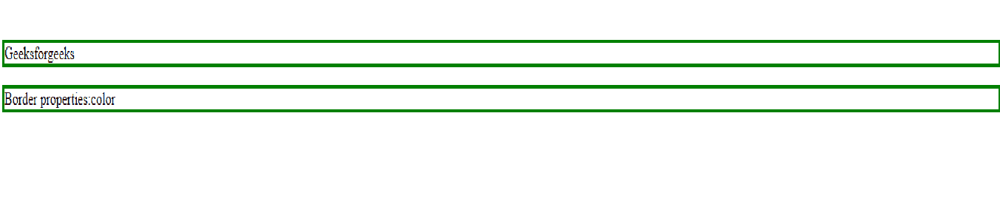

# CSS |边框

> 原文:[https://www.geeksforgeeks.org/css-borders/](https://www.geeksforgeeks.org/css-borders/)

CSS 边框属性允许我们设置边框的样式、颜色和宽度。
**注意:**可以为所有不同的边框设置不同的属性，即上边框、右边框、下边框和左边框。
**CSS 边框属性:**

**1。边框样式:**边框样式属性指定边框的类型。如果不设置边框样式，其他任何边框属性都不起作用。
**以下是边框类型:**
*虚线–定义虚线边框
*虚线–定义虚线边框
*实心–定义实心边框
*双–定义双边框
*凹槽–定义三维凹槽边框。
*脊–定义三维脊状边界。
*插图–定义三维插图边框。
*开头–定义 3D 开头边框。
*无–定义无边框
*隐藏–定义隐藏边框
**示例:**

## 超文本标记语言

```css
<!DOCTYPE html>
<html>

<head>
    <style>
        p.dotted {
            border-style: dotted;
        }

        p.dashed {
            border-style: dashed;
        }

        p.solid {
            border-style: solid;
        }

        p.double {
            border-style: double;
        }
    </style>
</head>

<body>

    <h2>The border-style Property</h2>

<p>Geeksforgeeks</p>

    <p class="dotted">A dotted border.</p>

    <p class="dashed">A dashed border.</p>

    <p class="solid">A solid border.</p>

    <p class="double">A double border.</p>

</body>

</html>
```

**输出:**


**2。边框宽度:**边框宽度设置边框的宽度。边框的宽度可以是 px、pt、cm，也可以是细、中、粗。
T3】例:

## 超文本标记语言

```css
<!DOCTYPE html>
<html>

<head>
    <style>
        p {
            border-style: solid;
            border-width: 8px;
        }
    </style>
</head>

<body>

<p>
        Geeksforgeeks</p>

<p>
        Border properties
    </p>

</body>

</html>
```

**输出:**


**3。边框颜色:**该属性用于设置边框的颜色。可以使用颜色名称、十六进制值或 RGB 值来设置颜色。如果未指定颜色，边框将继承元素本身的颜色。
T3】例:

## 超文本标记语言

```css
<!DOCTYPE html>
<html>

<head>
    <style>
        p {
            border-style: solid;
            border-color: red
        }
    </style>
</head>

<body>

<p>
        Geeksforgeeks</p>

<p>Border properties:color
    </p>

</body>

</html>
```

**输出:**


**4。边框单边:**单边可以设置不同的属性。
**语法:**如果边框属性有 4 个值，那么。

```css
border-style: solid dashed dotted double
Solid: top border
Dashed: right border
Dotted: bottom border
Double: left border
```

**示例:**

## 超文本标记语言

```css
<!DOCTYPE html>
<html>

<head>
    <style>
        p {
            border-style: solid dashed dotted double;
            border-color: red;
        }
    </style>
</head>

<body>

<p>Geeksforgeeks</p>

<p>
        Border properties:color
    </p>

</body>

</html>
```

**输出:**


**语法:**如果边框属性有 3 个值，则:

```css
border-style: solid dotted double
Solid:top border
Dotted: Left and right border
Double: bottom border
```

**示例:**

## 超文本标记语言

```css
<!DOCTYPE html>
<html>

<head>
    <style>
        p {
            border-style: solid dashed dotted;
            border-color: blue;
        }
    </style>
</head>

<body>

<p>Geeksforgeeks</p>

<p>
        Border properties:color
    </p>

</body>

</html>
```

**输出:**


**语法:**如果边框属性有 2 个值

```css
border-style:solid dotted
Solid:top and bottom border
Dotted: right and left border
```

**示例:**

## 超文本标记语言

```css
<!DOCTYPE html>
<html>

<head>
    <style>
        p {
            border-style: solid dashed;
            border-color: blue;
        }
    </style>
</head>

<body>

<p>Geeksforgeeks</p>

<p>
        Border properties:color
    </p>

</body>

</html>
```

**输出:**


**语法:**如果边框属性有 1 个值

```css
border-style:dotted
Dotted:top, bottom, left and right border
```

**示例:**

## 超文本标记语言

```css
<!DOCTYPE html>
<html>

<head>
    <style>
        p {
            border-style: solid;
            border-color: green;
        }
    </style>
</head>

<body>

<p>Geeksforgeeks</p>

<p>
        Border properties:color
    </p>

</body>

</html>
```

**输出:**



**支持的浏览器:**

*   谷歌 Chrome
*   微软公司出品的 web 浏览器
*   火狐浏览器
*   歌剧
*   狩猎