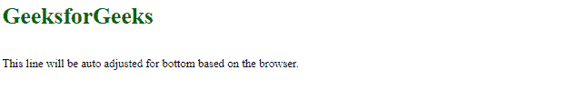
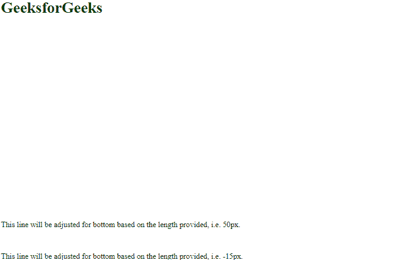
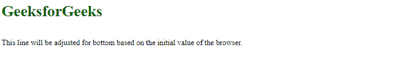
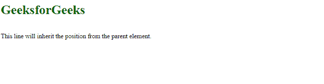

# CSS 底部属性

> 原文:[https://www.geeksforgeeks.org/css-bottom-property/](https://www.geeksforgeeks.org/css-bottom-property/)

**底部** CSS 属性允许改变元素的垂直位置。底部属性用于设置从视口底部开始的元素位置值。

*   如果位置值是固定的或绝对的，则元素相对于其父元素或包含它的块的底部边缘调整其底部边缘。
*   如果位置值是相对的，那么元素相对于它自己的当前底边定位。
*   如果位置值是粘性的，那么当元素在视口内时，元素调整相对位置&它的位置将是固定的，它在视口外。
*   如果位置值是静态的，那么由于底部属性，元素没有任何影响。

**语法:**

```css
bottom: auto| length| %| initial| inherit;
```

**属性值:**下面的例子很好地描述了所有的属性。

**自动:**这是底部属性的默认值。它基于浏览器 ie 设置底部属性。，浏览器将决定底边位置。

**语法:**

```css
bottom: auto;
```

**示例:**此示例说明了底部属性的使用，该属性的值设置为自动。

## 超文本标记语言

```css
<html>
<head>
    <title> Bottom Property</title>
</head>

<body>
    <h1 style="color:darkgreen;">GeeksforGeeks</h1>
     <p style="position: fixed; 
              bottom: auto;"> 
      This line will be auto adjusted for bottom based on the browser. 
     </p>

</body>
</html>
```

**输出:**



**长度**:以像素为单位设置底边位置，厘米也允许负值。

**语法:**

```css
bottom: 5px;
```

**示例:**此示例说明了底部属性的使用，其中属性值被指定为 px。

## 超文本标记语言

```css
<html>
<head>
    <title> Bottom Property</title>
</head>

<body>
    <h1 style="color:darkgreen;">GeeksforGeeks</h1>
    <p style="position: fixed; 
              bottom: 50px;"> 
     This line will be adjusted for bottom based 
     on the length provided, i.e. 50px. 
    </p>

    <p style="position: fixed; 
              bottom: -15px;"> 
     This line will be adjusted for bottom based 
     on the length provided, i.e. -15px.
    </p>

</body>
</html>
```

**输出:**



**百分比:**设置包含元素的底边位置，单位为%。它接受负值。

**语法:**

```css
bottom: 10%;
```

**示例:**此示例说明了底部属性的使用，该属性的值被指定为百分比。

## 超文本标记语言

```css
<html>
<head>
    <title> Bottom Property</title>
</head>

<body>
    <h1 style="color:darkgreen;">GeeksforGeeks</h1>
    <p style="position: 
              fixed; bottom: 10%;"> 
    This line will be adjusted for bottom based 
    on the percentage provided, i.e. 10%.
    </p>

    <p style="position: 
              fixed; bottom: -5%;"> 
    This line will be adjusted for bottom based 
    on the percentage provided, i.e. -5%.
    </p>

</body>
</html>
```

**输出:**


[**初始**](https://www.geeksforgeeks.org/css-value-initial/) **:** 用于将元素的 CSS 属性设置为默认值。初始关键字可以用于任何 CSS 属性和任何 HTML 元素。

**语法:**

```css
bottom: initial;
```

**示例:**此示例说明了底部属性的使用，该属性的值设置为默认值。

## 超文本标记语言

```css
<html>
<head>
    <title> Bottom </title>
</head>

<body>
    <h1 style="color:darkgreen;">GeeksforGeeks</h1>
    <p style="position: fixed;
              bottom: initial;"> 
     This line will be adjusted for bottom based 
     on the initial value of the browser. 
    </p>

</body>
</html>
```

**输出:**



[**继承**](https://www.geeksforgeeks.org/css-value-inherit/) **:** 用于从元素的父元素属性值继承元素的属性。inherit 关键字可用于继承任何 CSS 属性和任何 HTML 元素。

**语法:**

```css
bottom: inherit;
```

**示例:**此示例说明了其值被设置为继承的底部属性的使用。

## 超文本标记语言

```css
<html>
<head>
    <title> Bottom </title>
</head>

<body>
    <h1 style="color:darkgreen;">GeeksforGeeks</h1>
    <p style="position: fixed; 
              bottom: inherit;"> 
     This line will inherit the position from the parent element. 
    </p>

</body>
</html>
```

**输出:**



**支持的浏览器:**

*   谷歌 Chrome 1.0
*   Internet Explorer 5.0
*   微软边缘 12.0
*   Firefox 1.0
*   Opera 6.0
*   Safari 1.0