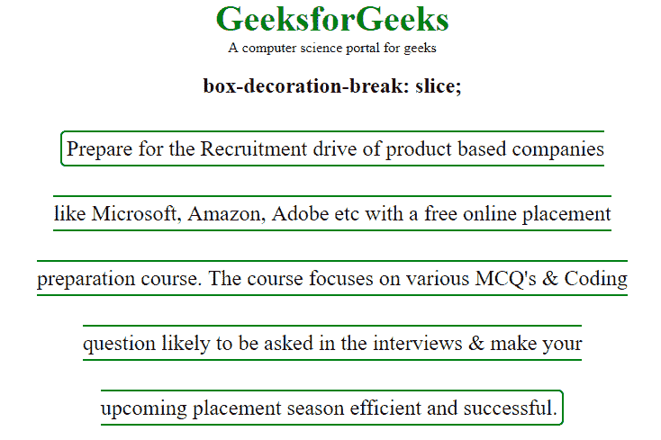
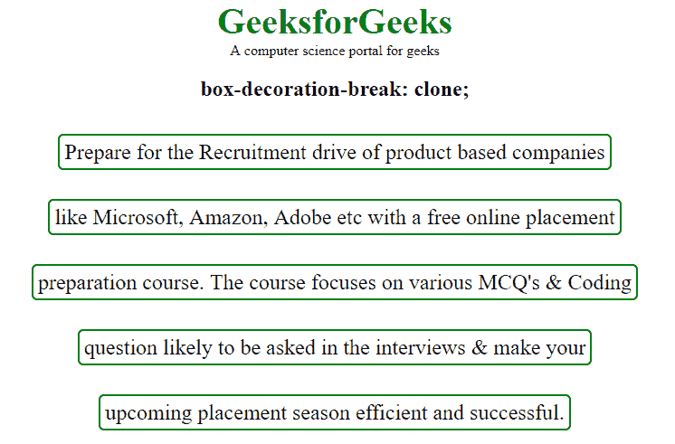
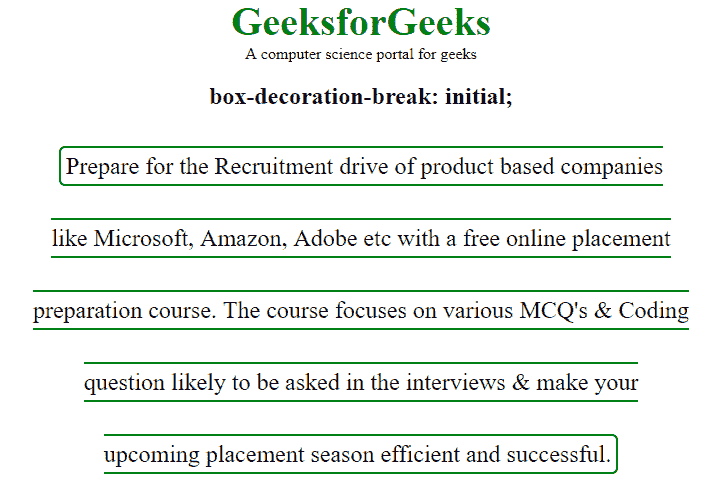

# CSS |盒子装饰破属性

> 原文:[https://www . geesforgeks . org/CSS-box-decision-break-property/](https://www.geeksforgeeks.org/css-box-decoration-break-property/)

**框饰断属性**用于控制段落分片后的框饰。它定义了元素的背景、填充、边框、边距和剪辑路径，当元素的框被分成独立的部分时，将应用这些元素。

**默认值:**

*   **切片**

**语法:**

```css
box-decoration-break: slice|clone|initial|inherit;
```

**属性值:**

**切片:**该属性将元素片段的边缘作为一个整体断开。

*   **语法:**

```css
box-decoration-break: slice;
```

*   **示例:**

## 超文本标记语言

```css
<!DOCTYPE html>
<html>
    <head>
        <title>box-decoration-break property</title>
        <style>
            body {
               text-align:center;
               width:80%;
            }
            span {
                border: 2px solid green;
                padding: 5px;
                border-radius: 6px;
                font-size: 24px;
                line-height: 3;

            }
            span.geek{
                -webkit-box-decoration-break: slice;
                -o-box-decoration-break: slice;
                box-decoration-break: slice;

            }
            .gfg {
                font-size: 40px;
                color: green;
                font-weight: bold;
            }
        </style>
    </head>
    <body>
        <div class = "gfg">GeeksforGeeks</div>
        <div class = "geeks">
          A computer science portal for geeks
        </div>
        <h2>box-decoration-break: slice;</h2>
        <span class="geek">
            Prepare for the Recruitment drive
            of product based companies<br>
            like Microsoft, Amazon, Adobe etc
            with a free online placement<br>
            preparation course. The course focuses
            on various MCQ's & Coding<br>
            question likely to be asked in the
            interviews & make your<br>
            upcoming placement season efficient
            and successful.
        </span>
    </body>
</html>                   
```

*   **输出:**



**克隆:**它用于修饰元素的每个片段，就好像片段是完整的、独立的元素。边框环绕元素每个片段的四条边，每个片段的背景被完全重绘。

*   **语法:**

```css
box-decoration-break: clone;
```

*   **示例:**

## 超文本标记语言

```css
<!DOCTYPE html>
<html>
    <head>
        <title>box-decoration-break property</title>
        <style>
            body {
               text-align:center;
               width:80%;
            }
            span {
                border: 2px solid green;
                padding: 5px;
                border-radius: 6px;
                font-size: 24px;
                line-height: 3;

            }
            span.geek{
                -webkit-box-decoration-break: clone;
                -o-box-decoration-break: clone;
                box-decoration-break: clone;

            }
            .gfg {
                font-size: 40px;
                color: green;
                font-weight: bold;
            }
        </style>
    </head>
    <body>
        <div class = "gfg">GeeksforGeeks</div>
        <div class = "geeks">
            A computer science portal for geeks
        </div>
        <h2>box-decoration-break: clone;</h2>
        <span class="geek">
            Prepare for the Recruitment drive
            of product based companies<br>
            like Microsoft, Amazon, Adobe etc
            with a free online placement<br>
            preparation course. The course focuses
            on various MCQ's & Coding<br>
            question likely to be asked in the
            interviews & make your<br>
            upcoming placement season efficient
            and successful.
        </span>
    </body>
</html>                   
```

*   **输出:**



**初始值:**将属性设置为默认值。

*   **语法:**

```css
box-decoration-break: initial;
```

*   **示例:**

## 超文本标记语言

```css
<!DOCTYPE html>
<html>
    <head>
        <title>box-decoration-break property</title>
        <style>
            body {
               text-align:center;
               width:80%;
            }
            span {
                border: 2px solid green;
                padding: 5px;
                border-radius: 6px;
                font-size: 24px;
                line-height: 3;

            }
            span.geek{
                -webkit-box-decoration-break: initial;
                -o-box-decoration-break: initial;
                box-decoration-break: initial;

            }
            .gfg {
                font-size: 40px;
                color: green;
                font-weight: bold;
            }
        </style>
    </head>
    <body>
        <div class = "gfg">GeeksforGeeks</div>
        <div class = "geeks">
            A computer science portal for geeks
        </div>
        <h2>box-decoration-break: initial;</h2>
        <span class="geek">
            Prepare for the Recruitment drive
            of product based companies<br>
            like Microsoft, Amazon, Adobe etc
            with a free online placement<br>
            preparation course. The course focuses
            on various MCQ's & Coding<br>
            question likely to be asked in the
            interviews & make your<br>
            upcoming placement season efficient
            and successful.
        </span>
    </body>
</html>                   
```

*   **输出:**



**支持的浏览器:***框饰破属性*支持的浏览器如下:

*   谷歌 Chrome 22.0-网络工具包-
*   Firefox 32.0
*   Opera 11.5 -webkit-
*   Safari 6.1 -webkit-