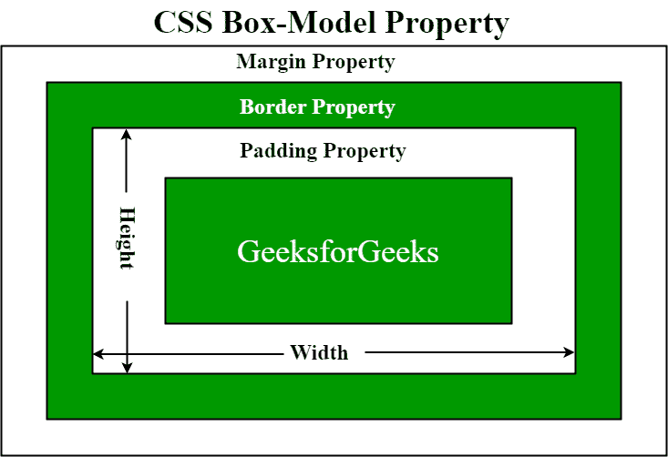
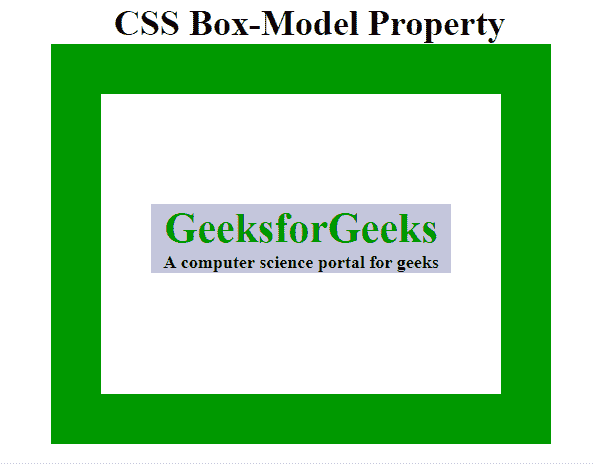
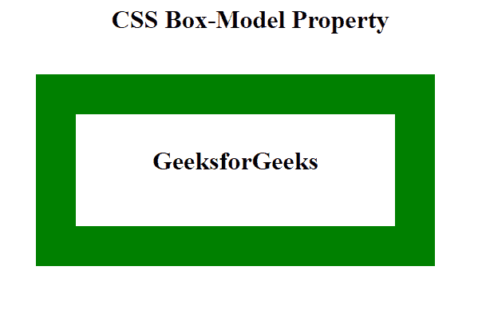

# CSS 盒子模型

> 原文:[https://www.geeksforgeeks.org/css-box-model/](https://www.geeksforgeeks.org/css-box-model/)

**CSS 盒子模型**是一个容器，包含多个属性，包括边框、边距、填充和内容本身。它用于创建网页的设计和布局。它可以用作定制不同元素布局的工具包。网络浏览器根据 CSS 框模型将每个元素呈现为一个矩形框。盒子模型在 CSS 中有多个属性。其中一些如下:

*   **内容**:该属性用于显示文本、图像等，可以使用[宽度&高度](https://www.geeksforgeeks.org/css-height-and-width/)属性来调整大小。
*   [**【填充】**](https://www.geeksforgeeks.org/css-margins-padding/) :该属性用于在任何定义的边框内围绕元素创建空间。
*   [**边框**](https://www.geeksforgeeks.org/css-borders/) :该属性用于覆盖内容&的任何填充，&还允许设置边框的样式、颜色和宽度。
*   [](https://www.geeksforgeeks.org/css-margins-padding/)**:该属性用于在元素 ie 周围创建空间。，在边境地区周围。**

**下图说明了 CSS 中的**方块模型**。**

****

*   ****内容区域:**该区域由文本、图像或其他媒体内容等内容组成。它以内容边缘为界，其尺寸由内容框的宽度和高度给出。**
*   ****填充区域:**包括元素的填充。这个区域实际上是内容区域周围和边框内的空间。它的尺寸由填充盒的宽度和填充盒的高度决定。**
*   ****边框区域:**框的填充和边距之间的区域。其尺寸由边框的宽度和高度给出。**
*   ****边缘区域:**该区域由边框和边缘之间的空间组成。边距区域的尺寸是边距框宽度和边距框高度。将元素与其相邻元素分开是有用的。**

**为了设置元素的宽度和高度属性(为了在浏览器中正确呈现内容)，我们需要了解 *CSS Box 模型*的工作原理。**

**在用 CSS 设置元素的宽度和高度属性时，我们只设置了内容区域的宽度和高度。我们需要添加填充、边框和边距，以便计算元素的完整大小。考虑下面的例子。**

```html
p {
 width: 80px;
 height: 70px;
 margin: 0;
 border: 2px solid black;
 padding: 5px;
}
```

**元素的总宽度可以计算为:**

> **总元素宽度=宽度+左填充+右填充+左边框+右边框+左边距+右边距**

***< p >* 元素的总宽度可以是 94px。**

**总宽度= 80px(宽度)+ 10px(左填充+右填充)+ 4px(左边框+右边框)+ 0px(左边距+右边距)= 94px。**

**元素的总高度可以计算为:**

> **总元素高度=高度+顶部填充+底部填充+顶部边框+底部边框+顶部边距+底部边距**

***< p >* 元素的总高度可以是 84px。**

**总高度= 70px(高度)+ 10px(顶部填充+底部填充)+ 4px(顶部边框+底部边框)+ 0px(顶部边距+底部边距)= 84px。**

**我们将通过例子来理解*盒子模型*的概念。**

****示例 1:** 该示例说明了如何使用 CSS Box 模型来对齐&并正确显示它。**

## **超文本标记语言**

```html
<!DOCTYPE html>
<head>
    <title>CSS Box Model</title>
    <style>
    .main {
        font-size: 36px;
        font-weight: bold;
        Text-align: center;
    }

    .gfg {
        margin-left: 60px;
        border: 50px solid #009900;
        width: 300px;
        height: 200px;
        text-align: center;
        padding: 50px;
    }

    .gfg1 {
        font-size: 42px;
        font-weight: bold;
        color: #009900;
        margin-top: 60px;
        background-color: #c5c5db;
    }

    .gfg2 {
        font-size: 18px;
        font-weight: bold;
        background-color: #c5c5db;
    }
    </style>
</head>

<body>
    <div class="main">CSS Box-Model Property</div>
    <div class="gfg">
        <div class="gfg1">GeeksforGeeks</div>
        <div class="gfg2">
            A computer science portal for geeks
        </div>
    </div>
</body>
</html>
```

****输出:****

****

****示例 2:** 该示例通过实现各种属性来说明 Box 模型。**

## **超文本标记语言**

```html
<!DOCTYPE html>
<head>
    <style>
    .main {
        font-size: 32px;
        font-weight: bold;
        text-align: center;
    }

    #box {
        padding-top: 40px;
        width: 400px;
        height: 100px;
        border: 50px solid green;
        margin: 50px;
        text-align: center;
        font-size: 32px;
        font-weight: bold;
    }
    </style>
</head>

<body>
    <div class="main">CSS Box-Model Property</div>
    <div id="box">GeeksforGeeks</div>
</body>
</html>
```

****输出:****

****

****支持的浏览器:****

*   **谷歌 Chrome**
*   **微软公司出品的 web 浏览器**
*   **微软边缘**
*   **火狐浏览器**
*   **歌剧**
*   **旅行队**