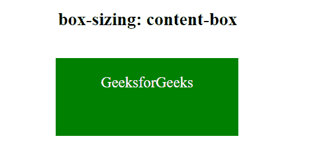
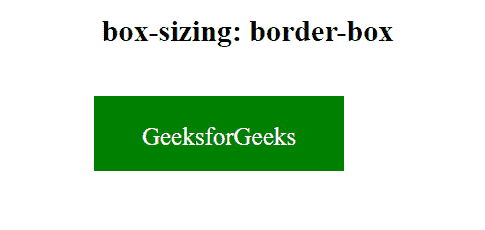

# CSS 框尺寸属性

> 原文:[https://www.geeksforgeeks.org/css-box-sizing-property/](https://www.geeksforgeeks.org/css-box-sizing-property/)

CSS 中的**框大小**属性定义了用户应该如何计算一个元素的总宽度和高度，即填充和边框是否被包含。

**语法:**

```css
box-sizing: content-box|border-box;
```

**属性值**:下面的例子很好的描述了所有的属性。

**内容框:**这是大小框属性的默认值。在此模式下，宽度和高度属性仅包括内容。边框和填充不包括在其中，也就是说，如果我们将元素的宽度设置为 200 像素，那么元素的内容框将为 200 像素宽，并且任何边框或填充的宽度都将被添加到最终渲染的宽度中。

**语法:**

```css
box-sizing: content-box;
```

**示例:**此示例说明了**大小调整框**属性的使用，该属性的值设置为内容框。

## 超文本标记语言

```css
<!DOCTYPE html>
<html>
<head>
    <title>box-sizing Property</title>
    <style>
    div {
        width: 200px;
        height: 60px;
        padding: 20px;
        border: 2px solid green;
        background: green;
        color: white;
    }

    .content-box {
        box-sizing: content-box;
    }
    </style>
</head>

<body style="text-align: center;">
    <h2>box-sizing: content-box</h2>
    <br>
    <div class="content-box">GeeksforGeeks</div>
</body>
</html>
```

**输出:**



**边框框:**在这种模式下，宽度和高度属性包括内容、填充和边框，也就是说，如果我们将元素的宽度设置为 200 像素，这 200 像素将包括我们添加的任何边框或填充，内容框将收缩以吸收额外的宽度。这通常会使元素的大小调整变得更加容易。

**语法:**

```css
box-sizing: border-box;
```

**示例:**此示例说明了**框大小**属性的使用，该属性的值设置为边框框。

## 超文本标记语言

```css
<!DOCTYPE html>
<html>
<head>
    <title>box-sizing Property</title>
    <style>
    div {
        width: 200px;
        height: 60px;
        padding: 20px;
        border: 2px solid green;
        background: green;
        color: white;
    }

    .border-box {
        box-sizing: content-box;
    }
    </style>
</head>

<body style="text-align: center;">
    <h2>box-sizing: border-box</h2>
    <br>
    <div class="border-box">GeeksforGeeks</div>
</body>
</html>
```

**输出:**



**支持的浏览器:**由*大小框属性*支持的浏览器如下:

*   Google Chrome 10.0 4.0 -webkit-
*   Internet Explorer 8.0
*   微软边缘 12.0
*   火狐 29.0 2.0 -moz-
*   歌剧 9.5
*   Apple Safari 5.1 3.2 -webkit-