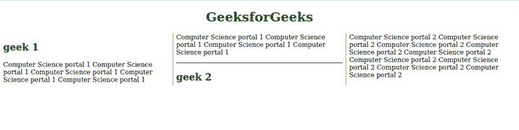

# CSS 断后属性

> 原文:[https://www.geeksforgeeks.org/css-break-after-property/](https://www.geeksforgeeks.org/css-break-after-property/)

*中断后*属性允许您在多区域上下文、分页媒体和多列布局上放置中断。此属性描述区域、列或分页符在生成的框之后的行为。如果根本没有生成的框，则忽略此属性。

**语法:**

```html
break-after: Generic break values;
/* Or */
break-after: Page break values;
/* Or */
break-after: Column break values;
/* Or */
break-after: Region break values;
/* Or */
break-after: Global values;
```

**默认值:**其默认值为自动。

**属性值:**该属性接受上面提到的和下面描述的属性值:

*   **通用中断值:**该属性是指由*自动、避免、始终、全部、*等定义的值。
*   **分页符值:**该属性是指*页面、避页、左、右、recto、verso、*等定义的值。
*   **分栏值:**该属性指的是*栏、回避栏、*等定义的值。
*   **区域中断值:**该属性是指*区域、避区、*等定义的值。
*   **全局值:**该属性是指*定义的值继承、初始、取消设置、*等。

**示例:**以下是说明使用*中断后*属性的示例

## 超文本标记语言

```html
<!DOCTYPE html>

<html lang="en">
    <head>
        <style>
            .Container {
                column-count: 3;
                column-rule: 2px dotted olivedrab;
            }

            .Container hr {
                break-after: column;
            }
        </style>
    </head>

    <body>
        <h1 style="text-align: center; color: green;">
            GeeksforGeeks
        </h1>

        <div class="Container">
            <h2>geek 1</h2>

<p>
              Computer Science portal 1
              Computer Science portal 1
              Computer Science portal 1
              Computer Science portal 1
              Computer Science portal 1
              Computer Science portal 1
              Computer Science portal 1
              Computer Science portal 1
              Computer Science
                portal 1
            </p>

            <hr />

            <h2>geek 2</h2>

<p>
                Computer Science portal 2
              Computer Science portal 2
              Computer Science portal 2
              Computer Science portal 2
              Computer Science portal 2
              Computer Science portal 2
              Computer Science portal 2
              Computer Science portal 2
              Computer Science
                portal 2
            </p>

        </div>
    </body>
</html>
```

**输出:**



**支持的浏览器:**

*   铬
*   Safari(部分支持)
*   歌剧
*   火狐(部分支持)
*   微软公司出品的 web 浏览器