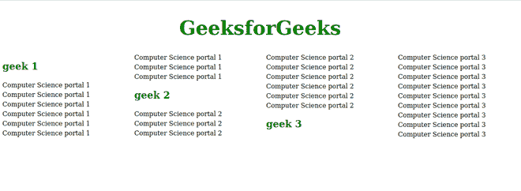

# CSS 中断前属性

> 原文:[https://www.geeksforgeeks.org/css-break-before-property/](https://www.geeksforgeeks.org/css-break-before-property/)

CSS *break-before* 属性用于提及分页符、区域分隔符或分栏符是否应该出现在元素之前。如果没有生成的框，则忽略此属性。

**语法:**

```
break-before: Generic break values;
```

或者

```
break-before: Page break values;
```

或者

```
break-before: Column break values;
```

或者

```
break-before: Region break values;
```

或者

```
break-before: Global values;
```

**默认值:**

*   **自动**

**属性值:**该属性接受上面提到的和下面描述的属性值。

*   **通用中断值:**该属性是指由*自动、避免、始终、全部、*等定义的值。
*   **分页符值:**该属性是指*页面、避页、左、右、recto、verso、*等定义的值。
*   **分栏值:**该属性指的是*栏、回避栏、*等定义的值。
*   **区域中断值:**该属性是指*区域、避区、*等定义的值。
*   **全局值:**该属性是指*定义的值继承、初始、取消设置、*等。

**示例:**以下示例说明了*在*属性之前中断的使用

## 超文本标记语言

```
<!DOCTYPE html>
<html lang="en">

<head>
    <style>
        h1 {
            color: #008000;
            text-align: center;
            font-size: 3rem;
            column-span: all;
        }

        h2 {
            color: green;
            break-before: column;
        }

        p {
            line-height: 1.5;
        }

        div {
            column-width: 250px;
            gap: 30px;
        }
    </style>
</head>

<body>
    <div>
        <h1>GeeksforGeeks</h1>

        <h2>geek 1</h2>

<p>
            Computer Science portal 1
            Computer Science portal 1
            Computer Science portal 1
            Computer Science portal 1
            Computer Science portal 1
            Computer Science portal 1
            Computer Science portal 1
            Computer Science portal 1
            Computer Science portal 1
        </p>

        <h2>geek 2</h2>

<p>
            Computer Science portal 2
            Computer Science portal 2
            Computer Science portal 2
            Computer Science portal 2
            Computer Science portal 2
            Computer Science portal 2
            Computer Science portal 2
            Computer Science portal 2
            Computer Science portal 2
        </p>

        <h2>geek 3</h2>

<p>
            Computer Science portal 3
            Computer Science portal 3
            Computer Science portal 3
            Computer Science portal 3
            Computer Science portal 3
            Computer Science portal 3
            Computer Science portal 3
            Computer Science portal 3
            Computer Science portal 3
        </p>

    </div>
</body>

</html>
```

**输出:**



**支持的浏览器:**

*   铬
*   火狐(部分支持)
*   Safari(部分支持)
*   歌剧
*   微软公司出品的 web 浏览器
*   边缘