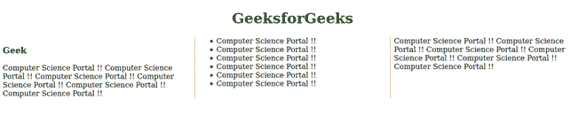

# CSS 内部中断属性

> 原文:[https://www.geeksforgeeks.org/css-break-inside-property/](https://www.geeksforgeeks.org/css-break-inside-property/)

*内部中断*属性允许您在多区域上下文、多列布局和分页媒体中防止无用的中断。此属性设置区域、列或分页符在生成的框中的行为方式。如果没有生成的框，则忽略此属性。

**默认值:**

*   **自动**

**语法:**

```html
break-inside: Keywor_values;
/* Or */
break-inside: Global_values;
```

**属性值:**该属性接受上面提到的和下面描述的属性值:

*   **关键字 _ 值:**该属性是指定义为*自动、回避、避页、避列、避区域、*等的值。
*   **Global_values:** 该属性是指定义为*初始、继承、取消设置、*等的值。

**示例:**以下是说明*内部突破*属性使用的示例

## 超文本标记语言

```html
<!DOCTYPE html>

<html lang="en">

    <head>
        <style>

            .Container {
                column-count: 3;
                column-rule: 2px dotted coral;
            }

            .Container ul {
                break-inside: avoid;
            }

        </style>
    </head>
    <body>

        <h1 style="text-align: center;
                color: green;">
                GeeksforGeeks
        </h1>

        <div class="Container">
            <h3>Geek</h3>

<p>
                Computer Science Portal !!
                Computer Science Portal !!
                Computer Science Portal !!
                Computer Science Portal !!
                Computer Science Portal !!
                Computer Science Portal !!
            </p>

            <ul>
                <li>Computer Science Portal !!</li>
                <li>Computer Science Portal !!</li>
                <li>Computer Science Portal !!</li>
                <li>Computer Science Portal !!</li>
                <li>Computer Science Portal !!</li>
                <li>Computer Science Portal !!</li>
            </ul>

<p>
                Computer Science Portal !!
                Computer Science Portal !!
                Computer Science Portal !!
                Computer Science Portal !!
                Computer Science Portal !!
                Computer Science Portal !!
            </p>

          </div>
    </body>

</html>
```

**输出:**



**支持的浏览器:**

*   铬
*   Firefox(部分支持)
*   歌剧
*   Safari(部分支持)
*   边缘
*   微软公司出品的 web 浏览器