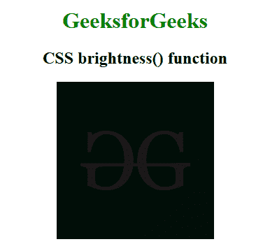

# CSS |亮度()功能

> 原文:[https://www.geeksforgeeks.org/css-brightness-function/](https://www.geeksforgeeks.org/css-brightness-function/)

亮度()函数是一个内置函数，用于应用滤镜来设置图像的亮度。该功能使用图像的线性乘法器来增加或减少亮度。

**语法:**

```html
brightness( amount )
```

**参数:**该功能接受单个参数**量**，它保存亮度的量。亮度值根据*数*和*百分比*设定。值 0%代表完全黑色图像，100%代表原始图像。

下面的例子说明了 CSS 中的亮度()函数:

**示例:**

```html
<!DOCTYPE html> 
<html> 

<head> 
    <title>CSS brightness() Function</title> 

    <style>
        h1 {
            color:green;
        }
        body {
            text-align:center;
        }
        .brightness_effect {
            filter: brightness(10%);
        }
    </style>
</head> 

<body> 
    <h1>GeeksforGeeks</h1> 

    <h2>CSS brightness() function</h2>

     
</body> 

</html>
```

**输出:**


**支持的浏览器:**亮度()功能支持的浏览器如下:

*   谷歌 Chrome
*   微软公司出品的 web 浏览器
*   火狐浏览器
*   旅行队
*   歌剧