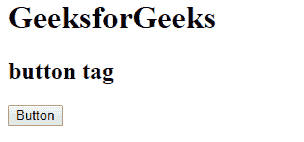
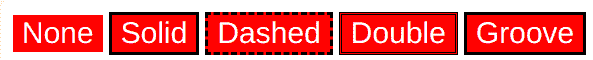
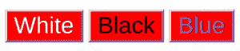
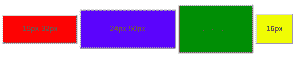
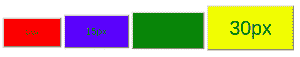
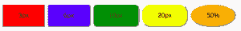
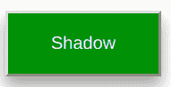
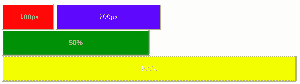
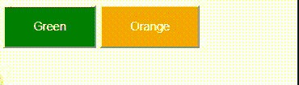

# CSS 按钮

> 原文:[https://www.geeksforgeeks.org/css-buttons/](https://www.geeksforgeeks.org/css-buttons/)

CSS **按钮**用于通过对按钮应用各种样式属性来装饰网页。按钮用于事件处理和与用户交互。从提交表单到查看一些信息，我们必须点击按钮。按钮标签用于在 HTML 中创建按钮。

**示例:**这个简单的示例描述了按钮标签。

## 超文本标记语言

```css
<!DOCTYPE html>
<html>

<head>
    <title> button tag </title>
</head>

<body>
    <h1>GeeksforGeeks</h1>
    <h2>button tag</h2>
    <button>Button</button>
</body>

</html>
```

**输出:**



**按钮中的基本样式:**有许多 CSS 属性用于设置按钮元素的样式，如下所述:

[**【背景色】**](https://www.geeksforgeeks.org/css-background-color-property/) **:此属性用于设置按钮的背景色。**

**语法:**

```css
element {
     background-color: color_name;
}
```

**示例:**本示例描述了具有基本样式属性的按钮，其中背景色应用于按钮。

## 超文本标记语言

```css
<!DOCTYPE html>
<html>

<head>
    <title> button background Color </title>
    <style>
    .button {
        border: none;
        color: white;
        text-align: center;
        font-size: 20px;
    }

    .b1 {

        /* Set button background color */
        background-color: red;
    }

    .b2 {

        /* Set button background color */
        background-color: blue;
    }

    .b3 {

        /* Set button background color */
        background-color: green;
    }

    .b4 {

        /* Set button background color */
        background-color: yellow;
    }
    </style>
</head>

<body>
    <button class="button b1">Red</button>
    <button class="button b2">Blue</button>
    <button class="button b3">Green</button>
    <button class="button b4">Yellow</button>
</body>

</html>
```

**输出:**


[**边框**](https://www.geeksforgeeks.org/css-borders/) **:** 此属性用于设置按钮的边框。

**语法:**

```css
element {
      border: style;
}
```

**示例:**本示例描述了带有边框属性的按钮。

## 超文本标记语言

```css
<!DOCTYPE html>
<html>

<head>
    <title> button background Color </title>
    <style>
    .button {
        background-color: red;
        color: white;
        text-align: center;
        font-size: 20px;
    }

    .b1 {

        /* Set border property */
        border: none;
    }

    .b2 {

        /* Set border property */
        border: 2px black solid;
    }

    .b3 {

        /* Set border property */
        border: 2px black dashed;
    }

    .b4 {

        /* Set border property */
        border: 2px black double;
    }

    .b5 {

        /* Set border property */
        border: 2px black groove;
    }
    </style>
</head>

<body>
    <button class="button b1">None</button>
    <button class="button b2">Solid</button>
    <button class="button b3">Dashed</button>
    <button class="button b4">Double</button>
    <button class="button b5">Groove</button>
</body>

</html>
```

**输出:**



[**颜色**](https://www.geeksforgeeks.org/css-colors/) **:** 此属性用于设置按钮中文本的颜色。颜色值可以根据颜色名称、颜色十六进制代码等进行设置。

**语法:**

```css
element {
     color: style;
}
```

**示例:**本示例描述了具有颜色属性的按钮。

## 超文本标记语言

```css
<!DOCTYPE html>
<html>

<head>
    <title> button background Color </title>
    <style>
    .button {
        background-color: red;
        border: none;
        text-align: center;
        font-size: 20px;
    }

    .b1 {

        /* Set the color of text */
        color: white;
    }

    .b2 {

        /* Set the color of text */
        color: black;
    }

    .b3 {

        /* Set the color of text */
        color: blue;
    }
    </style>
</head>

<body>
    <button class="button b1">White</button>
    <button class="button b2">Black</button>
    <button class="button b3">Blue</button>
</body>

</html>
```

**输出:**



[**【填充】**](https://www.geeksforgeeks.org/css-margins-padding/) **:** 此属性用于设置按钮中的填充。

**语法:**

```css
element {
     padding: style;
}
```

**示例:**本示例描述了具有填充属性的按钮。

## 超文本标记语言

```css
<!DOCTYPE html>
<html>

<head>
    <title> button padding property </title>
    <style>
    .b {
        border: none;
        font-size: 16px;
    }

    .b1 {
        background-color: red;
        padding: 15px 32px;
    }

    .b2 {
        background-color: blue;
        padding: 24px 50px;
    }

    .b3 {
        background-color: green;
        padding: 32px 32px;
    }

    .b4 {
        background-color: yellow;
        padding: 16px;
    }
    </style>
</head>

<body>
    <button class="button b1">15px 32px</button>
    <button class="button b2">24px 50px</button>
    <button class="button b3">32px 32px</button>
    <button class="button b4">16px</button>
</body>

</html>
```

**输出:**



[**字号**](https://www.geeksforgeeks.org/css-font-size-property/) **:** 此属性用于设置按钮中文本的大小。更改像素值以获得所需的大小。

**语法:**

```css
element {
     font-size: style;
}
```

**示例:**本示例描述了使用 font-size 属性调整按钮字体的 Button。

## 超文本标记语言

```css
<!DOCTYPE html>
<html>

<head>
    <title> button font-size property </title>
    <style>
    .button {
        padding: 15px 32px;
        border: none font-size: 16px;
    }

    .b1 {
        background-color: red;
        font-size: 10px;
    }

    .b2 {
        background-color: blue;
        font-size: 15px;
    }

    .b3 {
        background-color: green;
        font-size: 20px;
    }

    .b4 {
        background-color: yellow;
        font-size: 30px;
    }
    </style>
</head>

<body>
    <button class="button b1">10px </button>
    <button class="button b2">15px</button>
    <button class="button b3">20px</button>
    <button class="button b4">30px</button>
</body>

</html>
```

**输出:**



[](https://www.geeksforgeeks.org/css-border-radius-property/)****:**此属性用于设置按钮的边框半径。它设置边框的圆角。**

****语法:****

```css
element {
     border-radius: property;
}
```

****示例:**本示例描述了带有边框半径属性的按钮。**

## **超文本标记语言**

```css
<!DOCTYPE html>
<html>

<head>
    <title> button border-radius property </title>
    <style>
    .b {
        padding: 15px 32px;
        border: none;
        font-size: 16px;
    }

    .b1 {
        background-color: red;
        border-radius: 3px;
    }

    .b2 {
        background-color: blue;
        border-radius: 6px;
    }

    .b3 {
        background-color: green;
        border-radius: 10px;
    }

    .b4 {
        background-color: yellow;
        border-radius: 20px;
    }

    .b5 {
        background-color: orange;
        border-radius: 50%;
    }
    </style>
</head>

<body>
    <button class="b b1">3px </button>
    <button class="b b2">6px</button>
    <button class="b b3">10px</button>
    <button class="b b4">20px</button>
    <button class="b b5">50%</button>
</body>

</html>
```

****输出:****

****

**[**框-阴影**](https://www.geeksforgeeks.org/css-box-shadow-property/) **:此属性用于创建按钮框的阴影。****

****语法:****

```css
box-shadow: [horizontal offset] [vertical offset] [blur radius] 
            [optional spread radius] [color];
```

****示例:**本示例描述了带有阴影属性的按钮。**

## **超文本标记语言**

```css
<!DOCTYPE html>
<html>

<head>
    <title> button box-shadow property </title>
    <style>
    .b {
        padding: 15px 32px;
        border: none font-size: 16px;
        color: white;
    }

    .b1 {
        background-color: green;
        box-shadow: 0 8px 16px 0 rgba(0, 0, 0, 0.2),
                    0 6px 20px 0 rgba(0, 0, 0, 0.19);
    }
    </style>
</head>

<body>
    <button class="b b1">Shadow 1 </button>
</body>

</html>
```

****输出:****

****

**[**宽度**](https://www.geeksforgeeks.org/css-width-property/) **:** 此属性用于设置按钮的宽度。**

****语法:****

```css
element {
     width: property;
}
```

****示例:**本示例描述了使用 width 属性设置按钮宽度的按钮。**

## **超文本标记语言**

```css
<!DOCTYPE html>
<html>

<head>
    <title>button width property</title>
    <style>
    .button {
        padding: 15px 32px;
        border: none;
        font-size: 16px;
        color: white;
    }

    .b1 {
        background-color: red;
        width: 100px;
    }

    .b2 {
        background-color: blue;
        width: 200px;
    }

    .b3 {
        background-color: green;
        width: 50%;
    }

    .b4 {
        background-color: yellow;
        width: 100%;
    }
    </style>
</head>

<body>
    <button class="button b1">100px </button>
    <button class="button b2">200px </button>
    <button class="button b3">50% </button>
    <button class="button b4">100%</button>
</body>

</html>
```

****输出:****

****

****悬停效果:**此属性用于鼠标移动到上方时改变按钮界面。**

****语法:****

```css
element:hover {
    // CSS property
}
```

****示例:**本示例描述了按钮上有悬停效果的按钮。**

## **超文本标记语言**

```css
<!DOCTYPE html>
<html>

<head>
    <title>button width property</title>
    <style>
    .button {
        padding: 15px 32px;
        border: none font-size: 16px;
        color: white;
        transition-duration: 0.3s;
    }

    .b1 {
        background-color: green;
    }

    .b2 {
        background-color: orange;
    }

    .b1:hover {
        background-color: white;
        color: orange;
    }

    .b2:hover {
        background-color: white;
        color: green;
    }
    </style>
</head>

<body>
    <button class="button b1">Green </button>
    <button class="button b2">Orange </button>
</body>

</html>
```

****输出:****

****

****支持的浏览器:****

*   **谷歌 Chrome**
*   **火狐浏览器**
*   **微软边缘**
*   **微软公司出品的 web 浏览器**
*   **歌剧**
*   **旅行队**