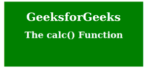
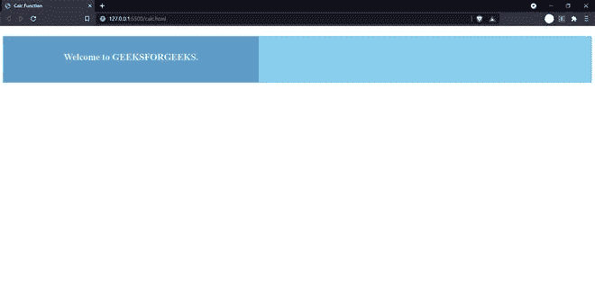
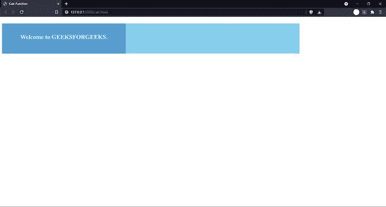

# CSS | calc()函数

> 原文:[https://www.geeksforgeeks.org/css-calc-function/](https://www.geeksforgeeks.org/css-calc-function/)

calc()函数是 CSS 中的一个内置函数，用于根据 CSS 属性执行计算。
**语法:**

```html
calc( Expression )
```

**参数:**该功能接受单参数*表达式*，为必选项。该参数包含需要实现的数学表达式。该参数使用的运算符有:+、-、*、/
下面的程序说明了 CSS 中的 calc()函数:
**程序:**

## 超文本标记语言

```html
<!DOCTYPE html>
<html>
    <head>
        <title>calc function</title>
        <style>
            .geeks {
                position: absolute;
                left: 50px;
                width: calc(100% - 20%);
                height:calc(500px - 300px);
                background-color: green;
                padding-top:30px;
                text-align: center;
            }
            .gfg {
                font-size:40px;
                font-weight:bold;
                color:white
            }
            h1 {
                color:white;
            }
        </style>
    </head>
    <body>
        <div class = "geeks">
            <div class = "gfg">GeeksforGeeks</div>
            <h1>The calc() Function</h1>
        </div>
    </body>
</html>
```

**输出:**



### 了解 CSS 中 calc()函数的工作原理

CSS 中的 calc()函数根据其父元素的值或用户在计算过程中提供的值进行计算。

让我们通过一些例子来更深入地了解工作:

#### 例 1:

## 超文本标记语言

```html
<!DOCTYPE html>
<html lang="en">

<head>
    <meta charset="UTF-8">
    <meta http-equiv="X-UA-Compatible" content="IE=edge">
    <meta name="viewport" content="width=device-width, initial-scale=">
    <title>Calc Function</title>
    <style>
        .parent{
            background-color: skyblue;

        }
        .heading {

            left: 30px;
            width: calc(50% - 100px);
            height: 100px;
            background-color: #579dcf;
            padding-top: 20px;
            text-align: center;
        }

        h2 {
            color: #e9e8e9;
        }
    </style>
</head>

<body>
    <br>
    <div class="parent">
        <div class="heading">
            <h2> Welcome to GEEKSFORGEEKS.</h2>
        </div>

    </div>
</body>

</html>
```

在上面的代码示例中，calc()函数用于给标题赋予宽度值。这里，我们使用了默认设置为 100%屏幕宽度的父值。calc(50%–100 px)表示标题的宽度将等于**“父标题宽度的 50%–100 px”。**因此，我们在这里使用 calc()函数，既有来自父级的值，也有一个常数值。

#### 下面是代码的输出:



#### 例 2:

## 超文本标记语言

```html
<!DOCTYPE html>
<html lang="en">

<head>
    <meta charset="UTF-8">
    <meta http-equiv="X-UA-Compatible" content="IE=edge">
    <meta name="viewport" content="width=device-width, initial-scale=">
    <title>Calc Function</title>
    <style>
        .parent{
            background-color: skyblue;
            width: calc(80% - 2em);
        }
        .heading {

            left: 30px;
            width: calc(50% - 100px);
            height: 100px;
            background-color: #579dcf;
            padding-top: 20px;
            text-align: center;
        }

        h2 {
            color: #e9e8e9;
        }
    </style>
</head>

<body>
    <br>
    <div class="parent">
        <div class="heading">
            <h2> Welcome to GEEKSFORGEEKS.</h2>
        </div>

    </div>
</body>

</html>
```

在上面的代码示例中，我们已经使用了 calc()函数两次。首先，使用 calc()函数，我们定义了父 div 的值。然后，使用父 div 元素的值并使用 calc()函数，我们定义标题 div 元素的值。因此，很明显，父元素中的 calc()函数可以访问子 calc()函数产生的值。

#### 下面是代码的输出:



**支持的浏览器:**

*   谷歌 Chrome
*   微软公司出品的 web 浏览器
*   火狐浏览器
*   歌剧
*   旅行队