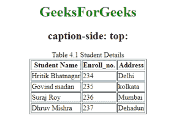
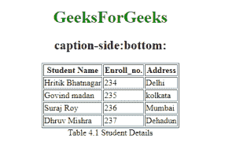
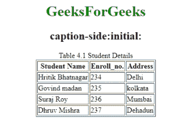

# CSS |字幕侧属性

> 原文:[https://www.geeksforgeeks.org/css-caption-side-property/](https://www.geeksforgeeks.org/css-caption-side-property/)

此属性用于指定表格标题的放置位置。它用在 HTML 表格中。此属性可用于显示属性设置为标题端的任何元素。

**语法:**

```css
caption-side: top|bottom|initial|inherit;
```

**默认值**

*   顶端

**属性:**

**1。top:** 指定表格标题放在表格顶部。这是默认值。

**语法:**

```css
caption-side:top;
```

**示例:**

## 超文本标记语言

```css
<!DOCTYPE html>
<html>
    <head>
        <title>caption-side property</title>
        <style>
            .geeks {
                caption-side: top;
            }
        </style>
    </head>
    <body>
        <center>
            <h1 style="color:green;">GeeksForGeeks</h1>
            <h2>caption-side: top:</h2>
            <table class="geeks" border="1">
                <caption>Table 4.1 Student Details</caption>
                <tr>
                    <th>Student Name</th>
                    <th>Enroll_no.</th>
                    <th>Address</th>
                </tr>
                <tr>
                    <td>Hritik Bhatnagar</td>
                    <td>234</td>
                    <td>Delhi</td>
                </tr>
                <tr>
                    <td>Govind madan</td>
                    <td>235</td>
                    <td>kolkata</td>
                </tr>
                <tr>
                    <td>Suraj Roy</td>
                    <td>236</td>
                    <td>Mumbai</td>
                </tr>
                <tr>
                    <td> Dhruv Mishra</td>
                    <td>237</td>
                    <td>Dehadun</td>
                </tr>
            </table>
        </center>
    </body>
</html>                   
```

**输出:**



**2。底部:**该属性指定表格标题放置在表格底部。

**语法:**

```css
caption-side:bottom;
```

**示例:**

## 超文本标记语言

```css
<!DOCTYPE html>
<html>
    <head>
        <title>caption-side property</title>
        <style>
            .geeks {
                caption-side: bottom;
            }
        </style>
    </head>
    <body>
        <center>
            <h1 style="color:green;">GeeksForGeeks</h1>
            <h2>caption-side: bottom:</h2>
            <table class="geeks" border="1">
                <caption>Table 4.1 Student Details</caption>
                <tr>
                    <th>Student Name</th>
                    <th>Enroll_no.</th>
                    <th>Address</th>
                </tr>
                <tr>
                    <td>Hritik Bhatnagar</td>
                    <td>234</td>
                    <td>Delhi</td>
                </tr>
                <tr>
                    <td>Govind madan</td>
                    <td>235</td>
                    <td>kolkata</td>
                </tr>
                <tr>
                    <td>Suraj Roy</td>
                    <td>236</td>
                    <td>Mumbai</td>
                </tr>
                <tr>
                    <td> Dhruv Mishra</td>
                    <td>237</td>
                    <td>Dehadun</td>
                </tr>
            </table>
        </center>
    </body>
</html>                   
```

**输出:**



**3。initial:** 它将属性设置为默认值。

**语法:**

```css
captipn-side:initial
```

**示例:**

## 超文本标记语言

```css
<!DOCTYPE html>
<html>
    <head>
    <style>
    .geeks{
        caption-side: initial;
        }
    </style>
    </head>
    <body>
        <center>
            <h1 style="color:green;">GeeksForGeeks</h1>

            <h2>caption-side:initial:</h2>
            <table class="geeks" border="1">
                <caption>Table 4.1 Student Details</caption>
                <tr>
                    <th>Student Name</th>
                    <th>Enroll_no.</th>
                    <th>Address</th>
                </tr>
                <tr>
                    <td>Hritik Bhatnagar</td>
                    <td>234</td>
                    <td>Delhi</td>
                </tr>
                <tr>
                    <td>Govind madan</td>
                    <td>235</td>
                    <td>kolkata</td>
                </tr>
                <tr>
                    <td>Suraj Roy</td>
                    <td>236</td>
                    <td>Mumbai</td>
                </tr>
                <tr>
                    <td> Dhruv Mishra</td>
                    <td>237</td>
                    <td>Dehadun</td>
                </tr>
            </table>
        </center>
    </body>
</html>                   
```

**输出:**



**支持的浏览器:**CSS 字幕侧属性支持的浏览器如下:

*   谷歌 Chrome 1.0
*   Internet Explorer 8.0
*   Firefox 1.0
*   Opera 4.0
*   Safari 1.0