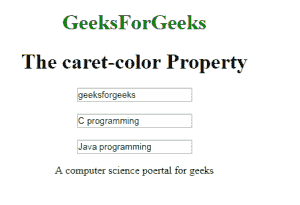

# CSS |插入符号颜色属性

> 原文:[https://www.geeksforgeeks.org/css-caret-color-property/](https://www.geeksforgeeks.org/css-caret-color-property/)

此属性用于设置输入、文本区域或其他可编辑区域中光标的颜色。

**语法:**

```html
caret-color: auto|color;
```

**默认值:**

*   **自动**

**属性值:**

*   **自动:**有默认值。它使用网页浏览器中的当前颜色。
*   **颜色:**用于指定插入符号使用的颜色值。可以使用所有值(rgb、十六进制、命名颜色等)。

以下示例说明了 CSS 中的插入符号颜色属性:

**示例:**

## 超文本标记语言

```html
<!DOCTYPE html>
<html>
    <head>
        <title>caret-color property</title>
        <style>
            body {
                text-align: center;
            }
            .geeks {
                caret-color: red;
            }
            .gfg {
                caret-color: transparent;
            }
        </style>
    </head>
    <body>
        <h1 style="color:green;">GeeksForGeeks</h1>
        <h1>The caret-color Property</h1>
        <input value="geeksforgeeks"><br><br>
        <input class="geeks" value="C programming">
        <br><br>
        <input class="gfg" value="Java programming">
        <p contenteditable class="geeks">
         A computer science portal for geeks
        </p>

    </body>
</html>
```

**输出:**



**支持的浏览器:****脱字号属性**支持的浏览器如下:

*   谷歌 Chrome 57.0 及以上版本
*   互联网浏览器:不支持
*   Mozilla 53.0 及以上版本
*   Opera 44.0 及以上版本
*   Safari 11.1 及以上版本