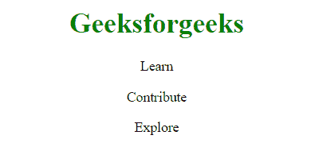

# CSS | @字符集规则

> 原文:[https://www.geeksforgeeks.org/css-charset-rule/](https://www.geeksforgeeks.org/css-charset-rule/)

@charset 规则指定样式表中使用的字符编码。@charset 必须是样式表中的第一个元素，如果定义了几个@charset 规则，则只使用第一个。不能用在与 HTML 页面字符集相关的

```
@charset "utf-8";

```

**属性值:**该参数接受单值“字符集”。
在内容中使用一些非 ASCII 字符时很有用。定义样式表的字符编码有很多方法。所有浏览器按照给定的顺序遵循以下方法。

*   Unicode 字节顺序字符的值必须放在文件的开头。
*   该值由内容类型:HTTP 头的字符集属性或用于服务样式表的协议中的等效属性给出。
*   使用参考文档定义的字符编码。HTML 5 中不使用此方法。
*   假设文件是 UTF-8

**注意:**下面的列表描述了正确和不正确的字符集编码:

> @ charset ' iso-8859-15 '；【引用风格错误，无效】
> @ charset“UTF-8”；【多个空格无效】
> @ charset“UTF-8”；【无效，at-rule 前有一个字符(空格)】
> @ charset“UTF-8”；[它将样式表的编码设置为 Unicode UTF-8]

**示例:**

```
<!DOCTYPE html>
<html>
    <head>
        <meta charset="UTF-8">
        <title>CSS @charset Rule</title>
        <style>
            h1 {
                color: green;
            }
        </style>
    </head>

    <body>
        <center>
            <h1>Geeksforgeeks</h1>

            <p>Learn</p>
            <p>Contribute</p>
            <p>Explore</p>
        <center>
    </body>
</html>                    
```

**输出:**


**支持的浏览器:***@字符集规则*支持的浏览器如下:

*   谷歌 Chrome 2.0
*   Internet Explorer 5.5 以上版本
*   Firefox 1.4
*   Safari 4.0
*   Opera 9.0