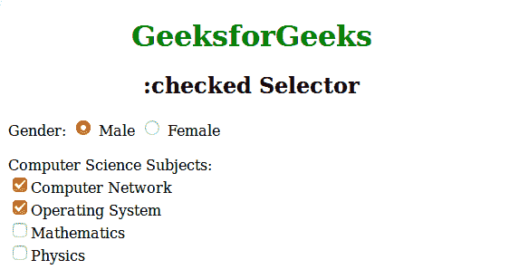
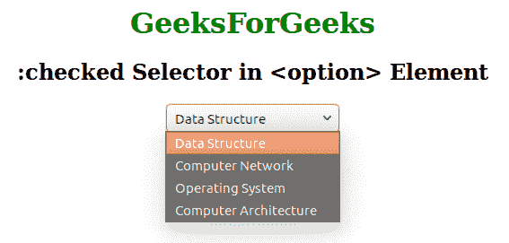

# CSS |:选中选择器

> 原文:[https://www.geeksforgeeks.org/css-checked-selector/](https://www.geeksforgeeks.org/css-checked-selector/)

选中的选择器用于选择输入标签和单选按钮中所有选中的元素。该选择器与单选按钮、复选框和选项元素一起使用。

**语法:**

```css
:checked {
    // CSS property
} 

```

**例 1:**

```css
<!DOCTYPE html>
<html>
    <head>
        <title>checked selector property</title>
        <style>
            h1 {
            color:green;
            }
            input:checked {
                height: 8px;
                width: 10px;
            }
            body {
                width:60%;
            }
        </style>
    </head>
    <body>
        <h1>GeeksforGeeks</h1>
        <h2>:checked Selector</h2>
        <form action="">
            Gender:
            <input type="radio" checked="checked" value="male" name="gender"> Male
            <input type="radio" value="female" name="gender"> Female<br><br>
            Computer Science Subjects:<br>
            <input type="checkbox" checked="checked" value="Bike">Computer Network<br>
            <input type="checkbox" checked="checked" value="Bike">Operating System<br>
            <input type="checkbox" value="Bike">Mathematics<br>
            <input type="checkbox" value="Bike">Physics<br>
        </form>
        </center>
    </body>
</html>                    
```

**输出:**


**例 2:**

```css
<!DOCTYPE html>
<html>
    <head>
        <title>checked selector</title>
        <style> 
            option:checked {
                height: 10px;
                font-size:20px;
            }
            h1 {
            color:green;
            }
        </style>
    </head>
    <body>
        <center>
        <h1>GeeksForGeeks</h1>
        <h2>:checked Selector in <option> Element</h2>
        <select>
            <option value="DataStructure">Data Structure</option>
            <option value="Computer Network">Computer Network</option>
            <option value="Operating System">Operating System</option>
            <option value="Computer Architecture">Computer Architecture</option>
        </select>
        </center>
    </body>
</html>                    
```

**输出:**


**支持的浏览器:***支持的浏览器:勾选选择器*如下:

*   苹果 Safari 3.2
*   谷歌 Chrome 4.0
*   Firefox 3.5
*   歌剧 9.6
*   Internet Explorer 9.0