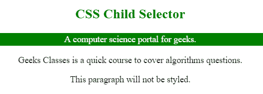
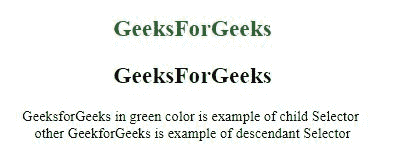

# CSS 子代与后代选择器

> 原文:[https://www . geesforgeks . org/CSS-子代-vs-后代-选择器/](https://www.geeksforgeeks.org/css-child-vs-descendant-selectors/)

**子选择器:**子选择器用于匹配指定元素的所有子元素。它给出了两个元素之间的关系。元素>元素选择器选择特定父元素的子元素。>左侧的操作数是父元素，右侧的操作数是子元素。

**语法:**

```css
element > element {
    // CSS Property
}

```

**示例:**匹配所有< h2 >元素，它们只是< div >元素的子元素。

```css
<!DOCTYPE html> 
<html> 
    <head> 
        <title> 
            CSS child Selector 
        </title> 
        <style> 
            div > p { 
                color:white; 
                background: green; 
                padding:2px; 
            } 
        </style> 
    </head> 

    <body style = "text-align: center;"> 
        <div> 
            <h2 style = "color:green;"> 
                CSS Child Selector 
            </h2> 

            <p> 
                A computer science portal for geeks. 
            </p> 
        </div> 

        <p>Geeks Classes is a quick course to cover 
        algorithms questions.</p> 

        <p>This paragraph will not be styled.</p> 
    </body> 
</html> 
```

**输出:**


**后代选择器:**后代选择器用于选择元素(不是特定元素)的所有子元素。它选择元素内部的元素，也就是说，它组合了两个选择器，这样，如果第二个选择器匹配的元素具有与第一个选择器匹配的祖先元素，则选择它们。

**语法:**

```css
element element {
    // CSS Property
}
```

**示例:**选择 div 的所有子元素 h2 元素。

```css
<!DOCTYPE html>
<html>

<head> 
    <title>
        CSS Descendant Selector
    </title>

    <style>
        div h2 {
            font-size:26px;
        }
    </style>
</head> 

<body style = "text-align:center;"> 
    <div>
        <h2 style = "color:green;" > 
            GeeksForGeeks 
        </h2> 

        <div>
            <h2>GeeksForGeeks</h2>
        </div>
    </div>

    <p>
        GeeksforGeeks in green color is
        example of child Selector 
        <br>other GeekforGeeks is example
        of descendant Selector
    </p>
</body>

</html>                    
```

**输出:**
