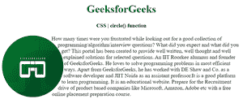

# CSS |圆()功能

> 原文:[https://www.geeksforgeeks.org/css-circle-function/](https://www.geeksforgeeks.org/css-circle-function/)

**圆形()函数**是 CSS 中的一个内置函数，用于在圆形图片或其他任何东西周围创建浮动文本。
**语法:**

```css
circle(100px at 10px 150px);
```

或者

```css
circle( percentage );
```

**参数:**该功能接受单个参数**长度**或**百分比**，用于保存半径值。这是一个强制参数。
**返回值:**让文字按照用户想要的那样循环。
**例 1:** 用百分比程序，我们继续。

## 超文本标记语言

```css
<!DOCTYPE html>
<html>

<head>
    <title>
        CSS circle() function
    </title>

    <style>
        div {
            float: left;
            width: 185px;
            height: 185px;
            shape-outside: circle();
        }

        img {
            border-radius: 50%;
        }

        h1,
        h4 {
            text-align: center;
        }

        h1 {
            color: green;
        }
    </style>
</head>

<body>
    <h1>GeeksforGeeks</h1>
    <h4>CSS | circle() function</h4>
    <div>
        
    </div>

<p>How many times were you frustrated while looking out
      for a good collection of programming/algorithm/interview
      questions? What did you expect and what did you get?
      This portal has been created to provide well written,
      well thought and well explained solutions for selected
      questions. An IIT Roorkee alumnus and founder of
      GeeksforGeeks. He loves to solve programming problems
      in most efficient ways. Apart from GeeksforGeeks, he
      has worked with DE Shaw and Co. as a software developer
      and JIIT Noida as an assistant professor.It is a good
      platform to learn programming. It is an educational
      website. Prepare for the Recruitment drive of product
      based companies like Microsoft, Amazon, Adobe etc with
      a free online placement preparation course.</p>

</body>

</html>
```

**输出:**



**例 2:**

## 超文本标记语言

```css
<!DOCTYPE html>
<html>

<head>
    <title>
        CSS circle() function
    </title>

    <style>
        div {
            float: left;
            width: 200px;
            height: 200px;
            shape-outside: circle(135px at 55px 50px);
        }

        img {
            border-radius: 0px 10px 130px 0px;
        }

        h1,
        h4 {
            text-align: center;
        }

        h1 {
            color: green;
        }
    </style>
</head>

<body>
    <h1>GeeksforGeeks</h1>
    <h4>CSS | circle() function</h4>
    <div>
        
    </div>

<p>How many times were you frustrated while looking out for a
      good collection of programming/algorithm/interview questions?
      What did you expect and what did you get? This portal has
      been created to provide well written, well thought and well
      explained solutions for selected questions. An IIT Roorkee
      alumnus and founder of GeeksforGeeks. He loves to solve
      programming problems in most efficient ways. Apart from
      GeeksforGeeks, he has worked with DE Shaw and Co. as a
      software developer and JIIT Noida as an assistant professor.
      It is a good platform to learn programming. It is an educational
      website. Prepare for the Recruitment drive of product based
      companies like Microsoft, Amazon, Adobe etc with a free online
      placement preparation course.</p>

 </body>

</html>
```

**输出:**


**支持的浏览器:**以下是 **CSS | circle()函数**支持的浏览器:

*   谷歌 Chrome
*   微软边缘
*   Mozilla Firefox
*   旅行队
*   歌剧