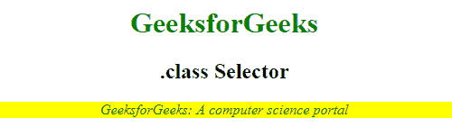
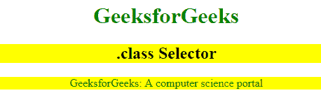

# CSS 类选择器

> 原文:[https://www.geeksforgeeks.org/css-class-selector/](https://www.geeksforgeeks.org/css-class-selector/)

***。类*** **选择器**用于选择属于特定类属性的所有元素。为了选择具有特定类别的元素，请使用句点(。)字符指定类名 ie。，它将根据其类属性的内容匹配 HTML 元素。类名主要用于给定类设置 CSS 属性。

**语法:**

```
.class {
    // CSS property
} 
```

**示例 1:** 这个示例演示了特定 HTML 元素的**类选择器**。

## 超文本标记语言

```
<!DOCTYPE html>
<html>
<head>
    <style>
    .geeks {
        color: green;
    }

    .gfg {
        background-color: yellow;
        font-style: italic;
        color: green;
    }
    </style>
</head>

<body style="text-align:center">
    <h1 class="geeks">
            GeeksforGeeks
    </h1>
    <h2>.class Selector</h2>
    <div class="gfg">
        <p>GeeksforGeeks: A computer science portal</p>
    </div>
</body>
</html>
```

**输出:**



**示例 2:** 本示例描述了以空格分隔的类名。

## 超文本标记语言

```
<!DOCTYPE html>
<html>
<head>
    <title>class selector</title>
    <style>
        .geeks {
        color: green;
    }

    .gfg {
        background-color: yellow;
    </style>
</head>

<body style="text-align:center">
    <h1 class="geeks">
            GeeksforGeeks
    </h1>
    <h2 class="gfg">.class Selector</h2>
    <p class="geeks gfg"> 
      GeeksforGeeks: A computer science portal 
      </p>

</body>
</html>
```

**输出:**



**支持的浏览器:**T2 支持的浏览器。类别选择器如下:

*   谷歌 Chrome 1.0
*   Firefox 1.0
*   微软边缘 12.0
*   歌剧 3.5
*   Internet Explorer 3.0
*   Safari 1.0