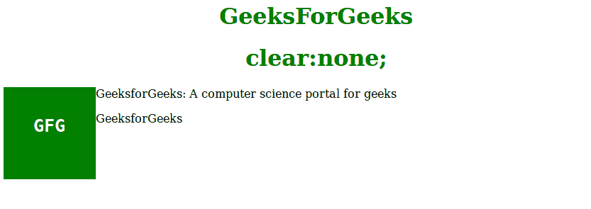
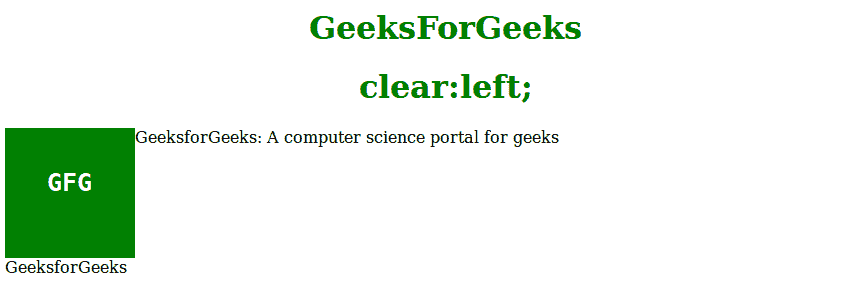
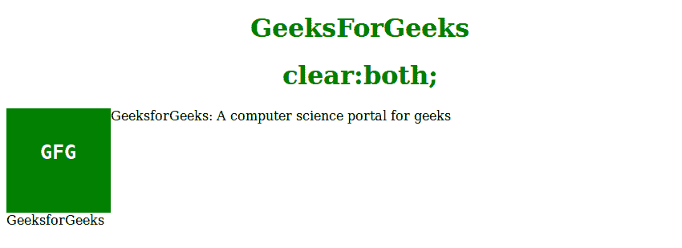
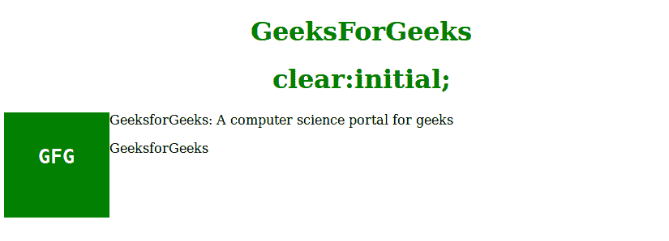

# CSS |清除属性

> 原文:[https://www.geeksforgeeks.org/css-clear-property/](https://www.geeksforgeeks.org/css-clear-property/)

**清除属性**用于指定浮动元素的哪一侧不允许浮动。它设置或返回元素相对于浮动对象的位置。如果元素可以水平地放在另一个浮动元素旁边的空间中，它就会。

**语法:**

```html
clear: none|left|right|both|initial;
```

**属性值:**

*   **none:** It has a default value. It allows element are float on both the sides.

    **语法:**

    ```html
    clear:none;
    ```

    **示例:**

    ```html
    <!DOCTYPE html>
    <html>
        <head>
            <style>
                div {
                    width:100px;
                    height:100px;
                    background-color:green;
                    color:white;
                    font-weight:bold;
                    font-style;itallic;
                    font-size:25px;
                    text-align:center;
                    float: left;
                    padding:15px;
                }
                p.GFG {
                    clear: none;
                }
                h1, h2 {
                    color:green;
                    text-align:center;
                }
            </style>
        </head>
        <body>
            <h1>GeeksForGeeks</h1>
            <h1>clear:none;</h1>
            <div><pre>GFG</pre></div>
            <p>
              GeeksforGeeks:
              A computer science portal for geeks
            </p>
            <p class="GFG">GeeksforGeeks</P>
        </body>
    </html>                                        
    ```

    **输出:**
    

*   **left:** This property specifies that elements are not allowed to Float on the left side in relation to other element.

    **语法:**

    ```html
    clear:left;
    ```

    **示例:**

    ```html
    <!DOCTYPE html>
    <html>
        <head>
            <style>
                div {
                    width:100px;
                    height:100px;
                    background-color:green;
                    color:white;
                    font-weight:bold;
                    font-style;itallic;
                    font-size:25px;
                    text-align:center;
                    float: left;
                    padding:15px;
                }
                p.GFG {
                    clear: left;
                }
                h1, h2 {
                    color:green;
                    text-align:center;
                }
            </style>
        </head>
        <body>
            <h1>GeeksForGeeks</h1>
            <h1>clear:left;</h1>
            <div><pre>GFG</pre></div>
            <p>
              GeeksforGeeks:
              A computer science portal for geeks
            </p>        
            <p class="GFG">GeeksforGeeks</P>
        </body>
    </html>                    
    ```

    **输出:**
    

*   **right:** It means elements are not allowed to float on the right side.

    **语法:**

    ```html
    clear:right;
    ```

    **示例:**

    ```html
    <!DOCTYPE html>
    <html>
        <head>
            <style>
                div {
                    width:100px;
                    height:100px;
                    background-color:green;
                    color:white;
                    font-weight:bold;
                    font-style;itallic;
                    font-size:25px;
                    text-align:center;
                    float: left;
                    padding:15px;
                }
                p.GFG {
                    clear: right;
                }
                h1, h2 {
                    color:green;
                    text-align:center;
                }
            </style>
        </head>
        <body>
            <h1>GeeksForGeeks</h1>
            <h1>clear:right;</h1>
            <div><pre>GFG</pre></div>
            <p>
              GeeksforGeeks:
              A computer science portal for geeks
            </p>
            <p class="GFG">GeeksforGeeks</P>
        </body>
    </html>                    
    ```

    **输出:**
    

*   **both:** It means floating elements are not allowed to float on the both sides.

    **语法:**

    ```html
    clear:both;
    ```

    **示例:**

    ```html
    <!DOCTYPE html>
    <html>
        <head>
            <style>
                div {
                    width:100px;
                    height:100px;
                    background-color:green;
                    color:white;
                    font-weight:bold;
                    font-style;itallic;
                    font-size:25px;
                    text-align:center;
                    float: left;
                    padding:15px;
                }
                p.GFG {
                    clear: both;
                }
                h1, h2 {
                    color:green;
                    text-align:center;
                }
            </style>
        </head>
        <body>
            <h1>GeeksForGeeks</h1>
            <h1>clear:both;</h1>
            <div><pre>GFG</pre></div>
            <p>
              GeeksforGeeks:
              A computer science portal for geeks
            </p>
            <p class="GFG">GeeksforGeeks</P>
        </body>
    </html>                    
    ```

    **输出:**
    

*   **initial:** It sets the property to its default value.
    **Syntax:**

    ```html
    clear:initial;
    ```

    **示例:**

    ```html
    <!DOCTYPE html>
    <html>
        <head>
            <style>
                div {
                    width:100px;
                    height:100px;
                    background-color:green;
                    color:white;
                    font-weight:bold;
                    font-style;itallic;
                    font-size:25px;
                    text-align:center;
                    float: left;
                    padding:15px;
                }
                p.GFG {
                    clear: initial;
                }
                h1, h2 {
                    color:green;
                    text-align:center;
                }
            </style>
        </head>
        <body>
            <h1>GeeksForGeeks</h1>
            <h1>clear:initial;</h1>
            <div><pre>GFG</pre></div>
            <p>
              GeeksforGeeks:
              A computer science portal for geeks
            </p>
            <p class="GFG">GeeksforGeeks</P>
        </body>
    </html>                    
    ```

    **输出:**
    

    **支持的浏览器:****clear property**支持的浏览器如下:

    *   谷歌 Chrome 1.0
    *   Internet Explorer 5.0
    *   Firefox 1.0
    *   Opera 6.0
    *   Safari 1.0