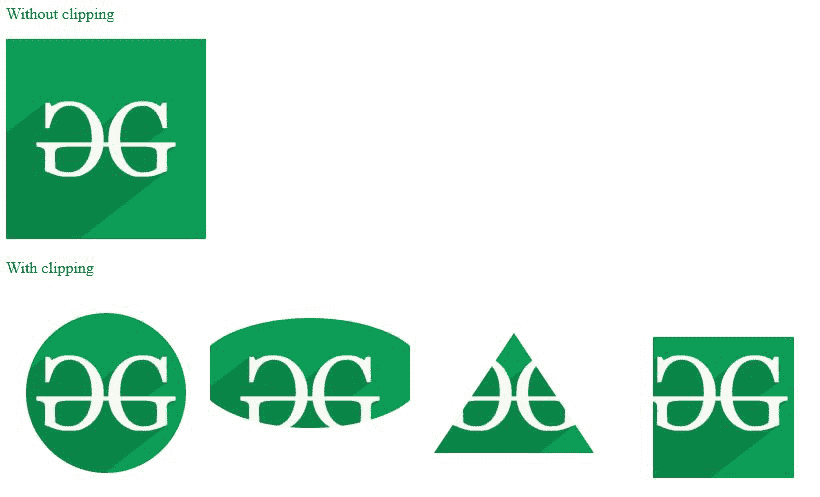
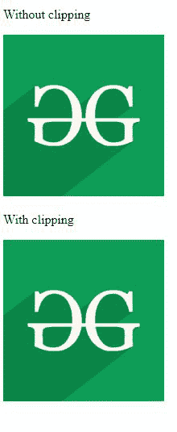
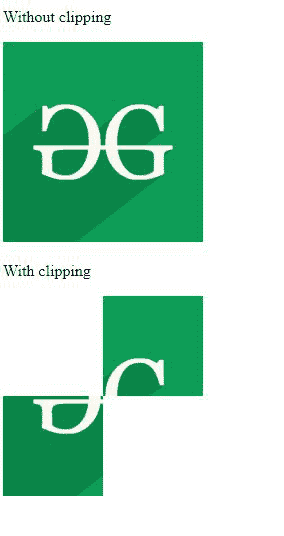

# CSS 剪辑路径属性

> 原文:[https://www.geeksforgeeks.org/css-clip-path-property/](https://www.geeksforgeeks.org/css-clip-path-property/)

CSS 的**剪辑路径**属性用于剪辑图像的特定部分，使得部分内的图像被显示，而部分外的图像不被显示。

**语法:**

```css
clip-path: <clip-source> | <basic-shape> | none;
```

**属性值:**下面的例子很好地描述了所有的属性。

**<基本形状> :** 它包括一些形状，如圆形、矩形、椭圆形等，用于剪辑给定的图像。

**示例 1:** 本示例显示了**剪辑路径**属性的基本用法，用于插入剪辑给定图像的特定形状。

## 超文本标记语言

```css
<!DOCTYPE html>
<html lang="en">
<head>
    <meta charset="UTF-8">
    <meta name="viewport"
          content="width=device-width,
                   initial-scale=1.0">
    <style>
    #img {
        margin-bottom: 20px;
        clip-path: circle(40%);
    }

    #img1 {
        margin-bottom: 20px;
        clip-path: ellipse(115px 55px at 50% 40%);
    }

    #img2 {
        margin-bottom: 20px;
        clip-path: polygon(50% 20%, 90% 80%, 10% 80%)
    }

    #img3 {
        margin-bottom: 20px;
        clip-path: inset(22% 12% 15px 35px)
    }

    div {
        float: left;
    }
    </style>
</head>

<body>

<p>Without clipping</p>

        

<p>With clipping</p>

    <div>
        
       
       
       
    </div>
</body>
</html>
```

**输出:**



**夹-径:** **无；:**不包括剪裁。这是默认值。

**示例 2:** 本示例显示了**剪辑路径**属性的基本用法，其中该值设置为无。

## 超文本标记语言

```css
<!DOCTYPE html>
<html lang="en">
<head>
    <meta charset="UTF-8">
    <meta name="viewport"
    content="width=device-width,
             initial-scale=1.0">
    <style>
    #img1 {
        margin-bottom: 20px;
        clip-path: none
    }
    </style>
</head>

<body>
    <div>

<p>Without clipping</p>

            

<p>With clipping</p>

        <div>
            
        </div>
    </div>
</body>
</html>
```

**输出:**



**剪辑路径:剪辑源；:**在这种情况下，剪辑部分取自另一个包含图像或元素的 HTML 元素。元素 id 用于引用元素。

**示例 3:** 本示例显示了**剪辑路径**属性的基本用法，其中属性值被设置为 url。

## 超文本标记语言

```css
<!DOCTYPE html>
<html lang="en">
<head>
    <meta charset="UTF-8">
    <meta name="viewport"
    content="width=device-width,
             initial-scale=1.0">
    <style>
    #img1 {
        margin-bottom: 20px;
        clip-path: url("#clip")
    }
    </style>
</head>

<body>

<p>Without clipping</p>

        

    <!-- Making a rectangle to clip
        rectangle area -->
    <svg height="0" width="0">
        <clipPath id="clip">
            <rect y="100" x="0" width="100" height="100" />
            <rect x="100" y="0" width="100" height="100" />
        </clipPath>
    </svg>

<p>With clipping</p>

        
</body>
</html>
```

**输出:**



**支持的浏览器:**

*   Firefox 3.5
*   Edge 12.0(仅支持 url()定义的剪辑路径)
*   Internet Explorer 10.0(仅支持由 url()定义的剪辑路径)
*   Opera 42.0
*   Safari 9.1
*   Chrome 55.0