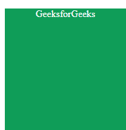
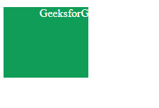
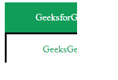

# CSS 剪辑属性

> 原文:[https://www.geeksforgeeks.org/css-clip-property/](https://www.geeksforgeeks.org/css-clip-property/)

**剪辑属性**指定定义要使绝对定位元素的哪一部分可见。除了指定的区域，其余所有其他区域都被隐藏。clip 属性仅适用于绝对定位的元素 ie。，具有*位置的元素:绝对*或*位置:固定*。

**语法:**

```css
clip: auto|shape|initial|inherit;
```

**注:**

*   CSS 剪辑属性对“*溢出不起作用:可见*”。
*   剪辑属性现在被取消，将被[剪辑路径属性](https://www.geeksforgeeks.org/css-clip-path-property/)取代。

**属性值:** 下面的例子很好地描述了所有的属性。

**自动:**是默认值，不会有任何削波。元素按原样显示。

**语法:**

```css
clip: auto;
```

**示例:**此示例说明了**剪辑属性**的使用，该属性的值设置为自动，不会对指定区域应用任何剪辑。

## 超文本标记语言

```css
<!DOCTYPE html>
<html>
<head>
    <title> CSS | clip Property </title>
    <style>
    .shape {
        position: absolute;
        background: #0F9D58;
        width: 200px;
        height: 200px;
        color: #ffffff;
        text-align: center;
    }

    #clip_property {
        clip: auto;
    }
    </style>
</head>

<body>
    <p class="shape" id="clip_property"> GeeksforGeeks </p>

</body>
</html>
```

**输出:**



**形状:**形状剪辑元素的定义部分。矩形(顶部、右侧、底部、左侧)用于定义可见部分。

**语法:**

```css
clip: rect(top, right, bottom, left);
```

**示例:**此示例说明了**裁剪属性**的使用，该属性的值被设置为裁剪元素指定部分的特定形状。

## 超文本标记语言

```css
<!DOCTYPE html>
<html>
<head>
    <title> CSS | clip Property </title>
    <style>
    .shape {
        position: absolute;
        background: #0F9D58;
        width: 200px;
        height: 200px;
        color: #ffffff;
        text-align: center;
    }

    #clip_property {
        clip: rect(0px, 120px, 100px, 0px);
    }
    </style>
</head>

<body>
    <p class="shape" id="clip_property"> GeeksforGeeks </p>

</body>
</html>
```

**输出:**



**初始:**初始设置默认值，即不会有任何削波，因为默认值是自动。

**语法:**

```css
clip: initial;
```

**示例:**该示例说明了**剪辑属性**的使用，该属性的值设置为初始值。

## 超文本标记语言

```css
<!DOCTYPE html>
<html>
<head>
    <title> CSS | clip Property </title>
    <style>
    .shape {
        position: absolute;
        background: #0F9D58;
        width: 200px;
        height: 200px;
        color: #ffffff;
        text-align: center;
    }

    #clip_property {
        clip: initial;
    }
    </style>
</head>

<body>
    <p class="shape" id="clip_property"> GeeksforGeeks </p>

</body>
</html>
```

**输出:**


**inherit:** inherit 从父元素接收属性。当它与根元素一起使用时，将使用初始属性。

**语法:**

```css
clip: inherit;
```

**示例:**该示例说明了**剪辑属性**的使用，该属性的值被设置为继承。

## 超文本标记语言

```css
<!DOCTYPE html>
<html>
<head>
    <title> CSS | clip Property </title>
    <style>
    .shape {
        position: absolute;
        background: #0F9D58;
        width: 200px;
        height: 200px;
        color: #ffffff;
        text-align: center;
    }

    .shape1 {
        border: solid;
        border-color: black;
        position: absolute;
        background: #ffffff;
        width: 200px;
        height: 200px;
        color: #0F9D58;
        text-align: center;
    }

    #clip_property {
        clip: rect(0px, 120px, 100px, 0px);
    }

    #clip_property1 {
        clip: inherit;
    }
    </style>
</head>

<body>
    <div class="shape" id="clip_property">

<p> GeeksforGeeks </p>

        <div class="shape1" id="clip_property1">

<p> GeeksGeeks </p>

        </div>
    </div>

    <!-- Here clip_property1 inherits the
    clip property from clip_property -->
</body>
</html>
```

**输出:**



**支持的浏览器:****剪辑属性**支持的浏览器如下:

*   谷歌 Chrome 1.0
*   微软边缘 12.0
*   Internet Explorer 4.0
*   Firefox 1.0
*   Opera 7.0
*   Safari 1.0