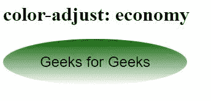
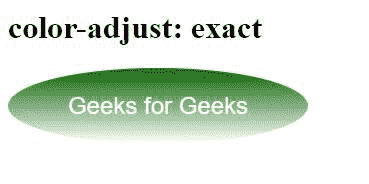

# CSS 颜色调整属性

> 原文:[https://www.geeksforgeeks.org/css-color-adjust-property/](https://www.geeksforgeeks.org/css-color-adjust-property/)

当涉及到打印文档时，**颜色调整**属性已经被证明是有用的。浏览器可以更改元素的颜色和外观，以防止使用颜色调整属性。

**语法:**

```html
color-adjust: economy | exact
```

**属性值:**

*   **经济:**在这种情况下，浏览器可能会留下图像，以便调整文本的颜色，使其更具可读性。

**语法:**

```html
color-adjust: economy
```

**示例:**

```html
<!DOCTYPE html>
<html lang="en">
<head>
  <meta charset="UTF-8">
  <meta name="viewport" 
        content="width=device-width, 
                 initial-scale=1.0">
  <title>Document</title>
</head>
<style>
  #box{
  width: 300px;
  height: auto;
  border-radius: 50% 50%;
  background-color: black;
  background-image: linear-gradient(
rgba(17, 199, 0, 0.5), rgb(255, 255, 255));
  color: rgb(0, 0, 0);
  text-align: center;
  font: 24px "Helvetica", sans-serif;
  display: grid;
  justify-content: center;
  color-adjust: economy;
}
</style>
<body>
  <h1>color-adjust: economy</h1>
  <div id="box">
    <p>Geeks for Geeks</p>
  </div>
</body>
</html>
```

**输出:**



*   **确切:**在这种情况下，没有用户的请求，页面的外观一定不能改变。

**语法:**

```html
color-adjust: exact
```

**示例:**

```html
<!DOCTYPE html>
<html lang="en">
<head>
  <meta charset="UTF-8">
  <meta name="viewport" 
        content="width=device-width,
                 initial-scale=1.0">
  <title>Document</title>
</head>
<style>
  #box{
  width: 300px;
  height: auto;
  border-radius: 50% 50%;
  background-color: black;
  background-image: linear-gradient(
rgba(17, 199, 0, 0.5), rgb(255, 255, 255));
  color:#fff;
  text-align: center;
  font: 24px "Helvetica", sans-serif;
  display: grid;
  justify-content: center;
  color-adjust: exact;
}
</style>
<body>
  <h1>color-adjust: exact</h1>
  <div id="box">
    <p>Geeks for Geeks</p>
  </div>
</body>
</html>
```

**输出:**



**支持的浏览器:**

*   火狐浏览器
*   歌剧
*   Mozilla firefox
*   旅行队
*   边缘