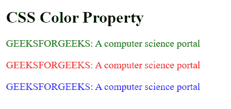
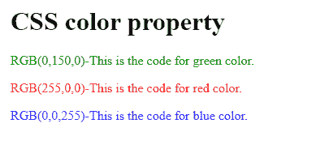
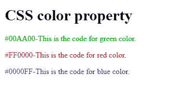
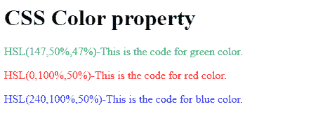
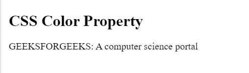

# CSS 颜色属性

> 原文:[https://www.geeksforgeeks.org/css-color-property/](https://www.geeksforgeeks.org/css-color-property/)

CSS 中的 color 属性用于设置文本的颜色、网页的背景以及边框的颜色。

**语法**

```
color: color/initial/inherit;
```

**属性值:**

**1。颜色:**它会将颜色设置为程序员在 CSS 文件中指定的文本。颜色可以设置为 4 种形式的文本-

**2。颜色名称:**通过直接指定颜色的名称，如蓝色、绿色、黄色、白色、黑色等。

**语法:**

```
     color: name-of-the-color; 
```

**示例:**

## 超文本标记语言

```
<!DOCTYPE html>
<html>
    <head>
        <title>
            CSS color-name property
        </title>
        <style>
            h1 {
                color: black;
            }
            p {
                font-size: 20px;
                color: green;
            }
            .gfg1 {
                font-size: 20px;
                color: red;
            }
            .gfg2 {
                font-size: 20px;
                color: blue;
            }
        </style>
    </head>
    <body>
        <h1>
            CSS Color Property
        </h1>

<p>
            GEEKSFORGEEKS: A computer science portal
        </p>

        <p class="gfg1">
            GEEKSFORGEEKS: A computer science portal
        </p>

        <p class="gfg2">
            GEEKSFORGEEKS: A computer science portal
        </p>

    </body>
</html>
```

**输出:**



**3。RGB/RGBA 值:**这里 R 代表红色，G 代表绿色，B 代表蓝色。将使用这些值的范围为文本指定颜色。这些值的范围从 0 到 255。

**语法:**

```
color: RGB(value, value, value);
```

**示例:**

## 超文本标记语言

```
<!DOCTYPE html>
<html>
    <head>
        <title>
            CSS RGB value property
        </title>
        <style>
            h1 {
                color: RGB(0, 0, 0);
            }
            p {
                color: RGB(0, 150, 0);
            }
            .gfg1 {
                color: RGB(255, 0, 0);
            }
            .gfg2 {
                color: RGB(0, 0, 255);
            }
        </style>
    </head>
    <body>
        <h1>
            CSS color property
        </h1>

<p>
            RGB(0, 150, 0)-This is the code for green color.
        </p>

        <p class="gfg1">
            RGB(255, 0, 0)-This is the code for red color.
        </p>

        <p class="gfg2">
            RGB(0, 0, 255)-This is the code for blue color.
        </p>

    </body>
</html>
```

**输出:**



**4。六位十进制值:**以十六进制格式表示颜色的值。它应该以前缀#开头。这些值的范围从#000000 到#FFFFFF。

**语法:**

```
color: #RRGGBB;
```

**示例:**

## 超文本标记语言

```
<!DOCTYPE html>
<html>
    <head>
        <title>
            CSS Hexa-decimal value property
        </title>
        <style>
            body {
                background-color: rgb(200, 200, 200);
            }
            h1 {
                color: #000000;
            }
            p {
                color: #00aa00;
            }
            .gfg1 {
                color: #ff0000;
            }
            .gfg2 {
                color: #0000ff;
            }
        </style>
    </head>
    <body>
        <h1>
            CSS color property
        </h1>

<p>
            #00AA00-This is the code for green color.
        </p>

        <p class="gfg1">
            #FF0000-This is the code for red color.
        </p>

        <p class="gfg2">
            #0000FF-This is the code for blue color.
        </p>

    </body>
</html>
```

**输出:**



**5。HSL/HSLA 值:** HSL 代表色相、饱和度和明度。色调的范围是从(0 到 360 度)，饱和度是指它的范围是从(0 到 100%)的灰色效果，亮度是指范围是从(0 到 100%)的光的效果。

**语法:**

```
color: HSL(value, value, value);
```

**示例:**

## 超文本标记语言

```
<!DOCTYPE html>
<html>
    <head>
        <title>
            CSS HSL value property
        </title>
        <style>
            body {
                background-color: white;
            }
            h1 {
                color: HSL(0, 0, 0);
            }
            p {
                color: HSL(147, 50%, 47%);
            }
            .gfg1 {
                color: HSL(0, 100%, 50%);
            }
            .gfg2 {
                color: HSL(240, 100%, 50%);
            }
        </style>
    </head>
    <body>
        <h1>
            CSS Color property
        </h1>

<p>
            HSL(147, 50%, 47%)-This is the code for green color.
        </p>

        <p class="gfg1">
            HSL(0, 100%, 50%)-This is the code for red color.
        </p>

        <p class="gfg2">
            HSL(240, 100%, 50%)-This is the code for blue color.
        </p>

    </body>
</html>
```

**输出:**



**6。初始值:**该值将颜色的值设置为默认值。

**语法:**

```
color: initial;
```

**示例:**

## 超文本标记语言

```
<!DOCTYPE html>
<html>
    <head>
        <title>
            CSS color-name property
        </title>
        <!-- CSS style-->
        <style>
            h1 {
                color: black;
            }
            p {
                font-size: 20px;
                color: initial;
            }
        </style>
    </head>
    <body>
        <h1>
            CSS Color Property
        </h1>

<p>
            GEEKSFORGEEKS: A computer science portal
        </p>

    </body>
</html>
```

**输出:**



**7。inherit:** 它将从其父元素继承颜色的属性。

**支持的浏览器:**颜色属性支持的浏览器有-

*   谷歌 Chrome 1.0
*   Internet Explorer 3.0
*   Firefox 1.0
*   Safari 1.0
*   歌剧 3.5