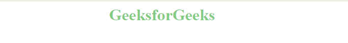
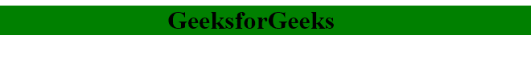
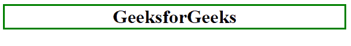

# CSS |颜色

> 原文:[https://www.geeksforgeeks.org/css-colors/](https://www.geeksforgeeks.org/css-colors/)

CSS 颜色属性用于设置 HTML 元素的颜色。该属性用于设置字体颜色、背景颜色等。

元素的颜色可以通过以下方式定义:

*   内置颜色
*   RGB 格式
*   RGBA 格式
*   十六进制表示法
*   high-speedlaunch 高速快艇
*   high-strength low-alloy 高力低合金

**内置颜色:**这些是一组预定义的颜色，按其名称使用。例如:红色、蓝色、绿色等。
**语法:**

```css
h1 {
    color: color-name;
}

```

**示例:**

```css
<html>
    <head>
        <title>CSS color property</title>
        <style>
            h1 {
                color:green;
                text-align:center;
            }
        </style>
    </head>
    <body>
        <h1>
            GeeksforGeeks
        </h1>
    </body>
</html>                    
```

**输出:**


**RGB 格式:**RGB(红、绿、蓝)格式用于通过指定 0 到 255 之间的 R、G、B 值来定义 HTML 元素的颜色。例如:红色的 RGB 值为(255，0，0)，绿色为(0，255，0)，蓝色为(0，0，255)等。
**语法:**

```css
h1 {
    color: rgb(R, G, B);
}

```

**示例:**

```css
<html>
    <head>
        <title>CSS color property</title>
        <style>
            h1{
                color: rgb(0, 153, 0);
                text-align:center;
            }
        </style>
    </head>
    <body>
        <h1>
            GeeksforGeeks
        </h1>
    </body>
</html>                    
```

**输出:**


**RGBA 格式:**RGBA 格式类似于 RGB，但不同的是 RGBA 包含指定元素透明度的 A (Alpha)。α的值介于 0.0 到 1.0 之间，其中 0.0。表示完全透明，1.0 表示不透明。
**语法:**

```css
h1 {
    color:rgba(R, G, B, A);
}

```

**示例:**

```css
<html>
    <head>
        <title>CSS RGBA color property</title>
        <style>
            h1 {
                color:rgba(0, 153, 0, 0.5);
                text-align:center;
            }
        </style>
    </head>
    <body>
        <h1>
            GeeksforGeeks
        </h1>
    </body>
</html>                    
```

**输出:**


**十六进制记数法:**十六进制记数法以#符号开头，后跟 6 个字符，每个字符的范围从 0 到 f。例如:红色#FF0000，绿色#00FF00，蓝色#0000FF 等。
**语法:**

```css
h1 {
    color:#(0-F)(0-F)(0-F)(0-F)(0-F)(0-F);
}

```

**示例:**

```css
<html>
    <head>
        <title>CSS hex property</title>
        <style>
            h1{
                color:#009900;
                text-align:center;
            }
        </style>
    </head>
    <body>
        <h1>
            GeeksforGeeks
        </h1>
    </body>
</html>                    
```

**输出:**


**HSL:** HSL 分别代表色相、饱和度和明度。这种格式使用圆柱坐标系。

*   **色相:**色相是色轮的度数。它的值介于 0 到 360 之间，其中 0 代表红色，120 代表绿色，240 代表蓝色。
*   **饱和度:**取百分比值，100%代表完全饱和，0%代表完全不饱和(灰色)。
*   **明度:**取百分比值，100%代表白色，0%代表黑色。

**语法:**

```css
h1 {
    color:hsl(H, S, L);
}

```

**示例:**

```css
<html>
    <head>
        <title>CSS hsl color property</title>
        <style>
            h1{
                color:hsl(120, 100%, 30%);
                text-align:center;
            }
        </style>
    </head>
    <body>
        <h1>
            GeeksforGeeks
        </h1>
    </body>
</html>                    
```

**输出:**


**HSLA:**HSLA 颜色属性与 HSL 属性相似，不同的是 HSLA 包含指定元素透明度的 A (Alpha)。α的值介于 0.0 到 1.0 之间，其中 0.0。表示完全透明，1.0 表示不透明。
**语法:**

```css
h1 {
    color:hsla(H, S, L, A);
}

```

**示例:**

```css
<html>
    <head>
        <title>CSS hsla color property</title>
        <style>
            h1 {
                color:hsla(120, 100%, 50%, 0.50);
                text-align:center;
            }
        </style>
    </head>
    <body>
        <h1>
            GeeksforGeeks
        </h1>
    </body>
</html>                    
```

**输出:**


**文字颜色:**用于设置文字的颜色。
**语法:**

```css
h1 {
    color:color_name;
}

```

**示例:**

```css
<html>
    <head>
        <title>CSS text color property</title>
        <style>
            h1 {
                color:#009900;
                text-align:center;
            }
        </style>
    </head>
    <body>
        <h1>
            GeeksforGeeks
        </h1>
    </body>
</html>                    
```

**输出:**


**背景色:**用于设置一个 HTML 元素的背景色。
**语法:**

```css
h1 {
    background-color:color_name;
}

```

**示例:**

```css
<html>
    <head>
        <title>CSS background color property</title>
        <style>
            h1 {
                background-color:green;
                text-align:center;
            }
        </style>
    </head>
    <body>
        <h1>
            GeeksforGeeks
        </h1>
    </body>
</html>                    
```

**输出:**


**边框颜色:**用于设置元素的边框颜色。边框样式用于设置边框类型。
**语法:**

```css
h1 {
    border-style:solid/dashed/dotted
    border-color:color_name;
}

```

**示例:**

```css
<html>
    <head>
        <title>CSS border color</title>
        <style>
            h1 {
                border-style:solid;
                border-color:green;
                text-align:center;
            }
        </style>
    </head>
    <body>
        <h1>
            GeeksforGeeks
        </h1>
    </body>
</html>                    
```

**输出:**


**颜色列表:**下面是几个 CSS 颜色的列表。

| 颜色名称 | Hex(RGB) | 十进制（RGB） | 颜色 |
| --- | --- | --- | --- |
| 红色 | FF0000 | 255, 0, 0 |  |
| 粉红色 | FFC0CB 通信处理器 | 255, 192, 203 |  |
| 柑橘 | FFA500 | 255, 165, 0 |  |
| 黄色 | FFFF00 | 255, 255, 0 |  |
| 紫罗兰 | EE82EE | 238, 130, 238 |  |
| 格林（姓氏）；绿色的 | 008000 | 0, 128, 0 |  |
| 浅绿色 | 00FFFF | 0, 255, 255 |  |
| 蓝色 | 0000FF | 0, 0, 255 |  |
| 褐色的 | A52A2A | 165, 42, 42 |  |
| 怀特（姓氏） | FFFFFF | 255, 255, 255 |  |
| 灰色的 | Eight hundred and eight thousand and eighty | 128, 128, 128 |  |
| 黑色 | 000000 | 0, 0, 0 |  |