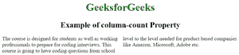

# CSS |列数属性

> 原文:[https://www.geeksforgeeks.org/css-column-count-property/](https://www.geeksforgeeks.org/css-column-count-property/)

CSS 中的**列计数**属性用于将任何 HTML 元素中的一部分内容分成给定数量的列。

**语法:**

```html
column-count: number|auto|initial|inherit;
```

**默认值:**

*   **自动**

**属性值:**

*   **数字:**该值用于表示列数。
*   **自动:**为默认值。列的数量由其他属性决定。
*   **初始值:**该值用于将属性设置为默认值。
*   **继承:**它从其父级继承属性。

**例 1:**

## 超文本标记语言

```html
<!-- HTML program to illustrate the
    column-count property -->

<!DOCTYPE html>
<html>
    <head>
        <title>column count property</title>
        <style>
            .gfg {
            -webkit-column-count: 2;
            -moz-column-count: 2;
            column-count: 2; /* divides text in 2 columns */
            }

            h1 {
                color:green;
            }
            h1, h2 {
                text-align:center;
            }
        </style>
    </head>
    <body>
        <h1>
            GeeksforGeeks
        </h1>

        <h2>
            Example of column-count Property
        </h2>

        <!-- Text inside below div will be
            divided into 2 columns -->
        <div class="gfg">
            The course is designed for students as
            well as working professionals to prepare
            for coding interviews. This course is going
            to have coding questions from school level
            to the level needed for product based
            companies like Amazon, Microsoft, Adobe etc.
        </div>
    </body>
</html>                   
```

**输出:**



**例 2:**

## 超文本标记语言

```html
<!-- HTML program for column-count property of CSS -->

<!DOCTYPE html>
<html>
    <head>
        <title>column count property</title>
        <style>

            .gfg {
            -webkit-column-count: 2;
            -moz-column-count: 2;
            column-count: 2;
            -webkit-column-rule: 10px double green;
            -moz-column-rule: 10px double green;
            column-rule: 10px double green;
            text-align:justify;
            }

            h1 {
                color:green;
            }

            h1, h2 {
                text-align:center;
            }
        </style>
    </head>
    <body>
        <h1>
            GeeksforGeeks
        </h1>

        <h2>
            Example column-count Property
        </h2>

        <!-- The text inside below div will be divided into
            2 columns -->
        <div class="gfg">
            The course is designed for students as well
            as working professionals to prepare for
            coding interviews. This course is going to
            have coding questions from school level to
            the level needed for product based companies
            like Amazon, Microsoft, Adobe, etc.
        </div>
    </body>
</html>                   
```

**输出:**


**支持的浏览器:**列数属性支持的浏览器如下:

*   谷歌 Chrome 50.0，4.0 -webkit-
*   Internet Explorer 10.0
*   火狐 52.0， 2.0 -moz-
*   Safari 9.0，3.1 -webkit-
*   Opera 37.0，15.0 -webkit-，11.1