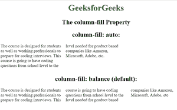

# CSS |列填充属性

> 原文:[https://www.geeksforgeeks.org/css-column-fill-property/](https://www.geeksforgeeks.org/css-column-fill-property/)

CSS 中的**列填充**属性用于指定是否以平衡方式填充列。

**语法:**

```css
column-fill: balance|auto|initial|inherit
```

**默认值:**

*   **平衡**

**属性值:**

*   **余额:**这是属性的默认值。此值用相同数量的内容填充每列，但不允许列高于高度。
*   **自动:**该值填充每一列，直到达到高度
*   **初始值:**该值用于将列填充属性设置为默认值。
*   **继承:**该值用于从其父级继承列填充属性。

**示例:**说明列填充属性的自动值和平衡值。

## 超文本标记语言

```css
<DOCTYPE html>
<html>

<head>
    <title>The column-fill Property</title>
    <style>
        div {
            -webkit-column-count: 3;
            -moz-column-count: 3;
            column-count: 3;
            height: 100px;
        }

        .gfg1 {
            -moz-column-fill: auto;
            column-fill: auto;
        }

        .gfg2 {
            -moz-column-fill: balance;
            column-fill: balance;
        }

        h1 {
            color: green;
        }

        h1,
        h2 {
            text-align: center;
        }
    </style>
</head>

<body>

    <h1>
    GeeksforGeeks
</h1>
    <h2>
    The column-fill Property
</h2>

    <h2>column-fill: auto:</h2>
    <div class="gfg1">
        The course is designed for students
    as well as working professionals to
    prepare for coding interviews. This
    course is going to have coding questions
    from school level to the level needed for
    product based companies like Amazon,
    Microsoft, Adobe, etc.
    </div>

    <h2>column-fill: balance (default):</h2>
    <div class="gfg2">
        The course is designed for students
    as well as working professionals to
    prepare for coding interviews. This
    course is going to have coding questions
    from school level to the level needed for
    product based companies like Amazon,
    Microsoft, Adobe, etc
    </div>
</body>

</html>                   
```

**输出:**



**支持的浏览器**:以下是 **CSS |填列属性**支持的浏览器:

*   谷歌 Chrome 50.0，4.0 -webkit-
*   Internet Explorer 10.0
*   火狐 52.0， 2.0 -moz-
*   Opera 37.0，15.0 -webkit-，11.1
*   Safari 9.0，3.1 -webkit-