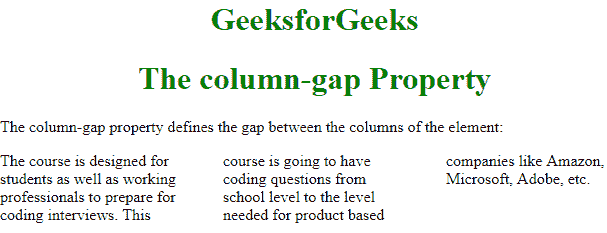

# CSS |列间隙属性

> 原文:[https://www.geeksforgeeks.org/css-column-gap-property/](https://www.geeksforgeeks.org/css-column-gap-property/)

CSS 中的**列间距**属性用于指定使用列计数属性分割给定文本的列之间的间距。

**语法:**

```html
column-gap: length|normal|initial|inherit;
```

**默认值:**

*   **正常**

**属性值:**

*   **长度:**该值指定将设置列间间隙的长度。
*   **正常**:这是默认值。该值用于指定列之间的正常间距。
*   **初始**:该值用于将列间隙属性设置为默认值。
*   **继承**:该值告诉列间隙属性从其父级继承属性。

**示例:**

## 超文本标记语言

```html
<!DOCTYPE html>
<html>
<head>
    <title>The column-gap Property</title>
    <style>
    .gfg {
        -webkit-column-count: 3;
        -moz-column-count: 3;
        column-count: 3;

        -webkit-column-gap: 40px;
        -moz-column-gap: 40px;
        column-gap: 40px; /* Specifying Column Gap */
    }

    h1 {
        color:green;
    }

    h1, h2 {
        text-align:center;
    }
    </style>
</head>

<body>
    <h1>
        GeeksforGeeks
    </h1>

    <h1>
        The column-gap Property
    </h1>

<p>
        The column-gap property defines the gap
        between the columns of the element:
    </p>

    <!-- The text inside below div tag is divided in
        3 columns with a gap of 40px between
        the columns -->
    <div class="gfg">
        The course is designed for students as well as
        working professionals to prepare for coding
        interviews. This course is going to have coding
        questions from school level to the level
        needed for product based companies like Amazon,
        Microsoft, Adobe, etc.
    </div>
</body>
</html>                   
```

**输出:**



**支持的浏览器:****列间隙属性**支持的浏览器如下:

*   谷歌 Chrome 50.0，4.0 -webkit-
*   Internet Explorer 10.0
*   火狐 52.0， 2.0 -moz-
*   Opera 9.0，3.1 -webkit-
*   Safari 37.0，15.0 -webkit