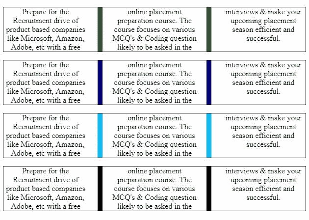

# CSS |列-规则-颜色属性

> 原文:[https://www . geesforgeks . org/CSS-column-rule-color-property/](https://www.geeksforgeeks.org/css-column-rule-color-property/)

CSS 的*列-规则-颜色*属性用于改变列间规则的颜色。

**语法:**

```css
column-rule-color: color | initial | inherit 
```

**属性值:**

*   **颜色:**用于将规则颜色设置为任意有效的 CSS 颜色。
*   **初始:**用于设置规则的默认颜色。
*   **继承:**在这种情况下，颜色将从其父元素继承。

**例**:

```css
<!DOCTYPE html>

<html>

  <head>
    <title> CSS property | column-rule-color </title>

    <!-- column-rule-color CSS property -->
    <style>

      p.one{
        column-gap: 50px;
        column-count: 3; 
        column-rule-style: solid;
        column-rule-width: 10px;
        column-rule-color: green;
        border: 1px solid black;
        text-align: center;
      }

      p.two{
        column-gap: 50px;
        column-count: 3; 
        column-rule-style: solid;
        column-rule-width: 10px;
        column-rule-color: #000080;
        border: 1px solid black;
        text-align: center;
      }

      p.three{
        column-gap: 50px;
        column-count: 3; 
        column-rule-style: solid;
        column-rule-width: 10px;
        column-rule-color: rgb(0, 191, 255);
        border: 1px solid black;
        text-align: center;
      }

      p.four{
        column-gap: 50px;
        column-count: 3; 
        column-rule-style: solid;
        column-rule-width: 10px;
        column-rule-color: initial;
        border: 1px solid black;
        text-align: center;
      }

    </style>
  </head>

  <body>

    <!-- column-rule-color: green; property -->
    <p class="one">
      Prepare for the Recruitment drive of product 
      based companies like Microsoft, Amazon, Adobe, 
      etc with a free online placement preparation 
      course. The course focuses on various MCQ's  
      & Coding question likely to be asked in the  
      interviews & make your upcoming placement 
      season efficient and successful. 
    </p>

    <!-- column-rule-color: #000080; property -->
    <p class="two">
      Prepare for the Recruitment drive of product 
      based companies like Microsoft, Amazon, Adobe, 
      etc with a free online placement preparation 
      course. The course focuses on various MCQ's  
      & Coding question likely to be asked in the  
      interviews & make your upcoming placement 
      season efficient and successful. 
    </p>

    <!-- column-rule-color: rgb(0, 191, 255); property -->
    <p class="three">
      Prepare for the Recruitment drive of product 
      based companies like Microsoft, Amazon, Adobe, 
      etc with a free online placement preparation 
      course. The course focuses on various MCQ's  
      & Coding question likely to be asked in the  
      interviews & make your upcoming placement 
      season efficient and successful. 
    </p>

    <!-- column-rule-color: initial; property -->
    <p class="four">
      Prepare for the Recruitment drive of product 
      based companies like Microsoft, Amazon, Adobe, 
      etc with a free online placement preparation 
      course. The course focuses on various MCQ's  
      & Coding question likely to be asked in the  
      interviews & make your upcoming placement 
      season efficient and successful. 
    </p>

  </body>  
</html>
```

**输出:**


**支持的浏览器:***列-规则-颜色属性*支持的浏览器如下；

*   谷歌 Chrome: 50.0，4.0 -webkit-
*   互联网浏览器:10.0
*   火狐浏览器： 52.0， 2.0 -moz-
*   Opera: 37.0，15.0 -webkit-，11.1
*   Safari: 9.0，3.1 -webkit-

**参考:**T2【Mozilla 开发者网络(MDN)

如果您发现任何错误或有改进建议，请在下面评论。