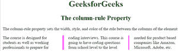

# CSS |列规则属性

> 原文:[https://www.geeksforgeeks.org/css-column-rule-property/](https://www.geeksforgeeks.org/css-column-rule-property/)

CSS 中的**列规则**属性用于指定列之间规则的宽度、样式和颜色。
**语法:**

```html
column-rule: column-rule-width column-rule-style column-rule-color|
initial|inherit;
```

**房产价值:**

*   **列-规则-宽度:**该值用于设置列间规则的宽度。该属性值的默认值为*中*。
*   **列-规则-样式:**该值用于设置列间规则的样式。该属性值的默认值为*无*。
*   **列-规则-颜色:**该值用于设置列间规则的颜色。该属性值的默认值是元素的颜色。
*   **初始值:**该值用于设置*列规则*属性的默认值。
*   **inherit:** 该值告诉列规则属性从其父级继承属性。

**例** :

## 超文本标记语言

```html
<!DOCTYPE html>
<html>
<head>
    <title>The column-rule Property</title>

    <style>
    .gfg {
        -webkit-column-count: 3;
        -moz-column-count: 3
        column-count: 3;

        -webkit-column-gap: 40px;
        -moz-column-gap: 40px;
        column-gap: 40px;

        -webkit-column-rule: 4px double #ff00ff;
        -moz-column-rule: 4px double #ff00ff;
        column-rule: 4px double #ff00ff;
    }

    h1 {
        color:green;
    }
    h1, h2 {
        text-align:center;
    }
    </style>
</head>
<body>
    <h1>
        GeeksforGeeks
    </h1>
    <h2>
        The column-rule Property
    </h2>

<p>
        The column-rule property sets the width, style,
        and color of the rule between the columns of
        the element:
    </p>

    <div class="gfg">
        The course is designed for students
        as well as working professionals to prepare
        for coding interviews. This course is going
        to have coding questions from school level
        to the level needed for product based companies
        like Amazon, Microsoft, Adobe, etc.
    </div>
</body>
</html>                   
```

**输出:**



**支持的浏览器:***列规则属性*支持的浏览器如下；

*   谷歌 Chrome: 50.0，4.0 -webkit-
*   互联网浏览器:10.0
*   火狐浏览器： 52.0， 2.0 -moz-
*   Opera: 37.0，15.0 -webkit-，11.1
*   Safari: 9.0，3.1 -webkit-