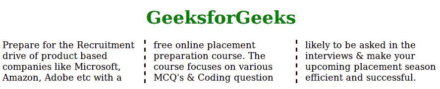
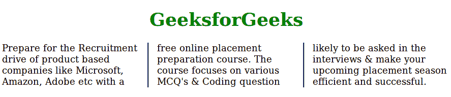

# CSS |列规则样式属性

> 原文:[https://www . geesforgeks . org/CSS-column-rule-style-property/](https://www.geeksforgeeks.org/css-column-rule-style-property/)

CSS 中的“列规则样式”属性用于设置多列布局中各列之间的列规则样式。

**语法:**

```css
column-rule-style: none|double|groove|ridge|inset|hidden|dotted|
dashed|solid|outset|initial|inherit
```

**属性值:**列规则样式的属性包含许多值，如下所示:

*   **无:**为默认值，用于指定列间无规则。
*   **隐藏:**定义列之间的隐藏规则。
*   **虚线:**定义列间的虚线规则。
*   **虚线:**定义列间的虚线规则。
*   **实心:**定义柱间的实心规则。
*   **double:** 定义列间的 double 规则。
*   **凹槽:**它定义了一个 3D 凹槽规则。效果取决于宽度和颜色值。
*   **脊线:**它定义了一个 3D 脊线规则。效果取决于宽度和颜色值。
*   **嵌入:**它定义了一个三维嵌入规则。效果取决于宽度和颜色值。
*   **开头:**定义了 3D 开头规则。效果取决于宽度和颜色值。
*   **初始值:**设置默认值。
*   **inherit:** 从其父元素继承的属性。

**例 1:**

```css
<!DOCTYPE html>
<html>
    <head>
        <title>
             CSS | column-rule-style Property
        </title>
        <style>
            .geeks {

                /* Chrome, Safari, Opera */
                -webkit-column-count: 3;
                -webkit-column-gap: 35px;
                -moz-column-rule-style: dashed;

                /* Firefox */
                -moz-column-count: 3;
                -moz-column-gap: 35px;
                -moz-column-rule-style: dashed;

                column-count: 3;
                column-gap: 35px;
                column-rule-style: dashed;
            }
        </style>
    </head>

    <body>
        <h1 style = "text-align:center;color:green;">
            GeeksforGeeks
        </h1>

        <div class = "geeks">
            Prepare for the Recruitment drive of product
            based companies like Microsoft, Amazon, Adobe
            etc with a free online placement preparation
            course. The course focuses on various MCQ's
            & Coding question likely to be asked in the
            interviews & make your upcoming placement 
            season efficient and successful. 
        </div>
    </body>
</html>                    
```

**输出:**


**例 2:**

```css
<!DOCTYPE html>
<html>
    <head>
        <title>
             CSS | column-rule-style Property
        </title>
        <style>
            .geeks {

                /* Chrome, Safari, Opera */
                -webkit-column-count: 3;
                -webkit-column-gap: 35px;
                -moz-column-rule-style: double;

                /* Firefox */
                -moz-column-count: 3;
                -moz-column-gap: 35px;
                -moz-column-rule-style: double;

                column-count: 3;
                column-gap: 35px;
                column-rule-style: double;
            }
        </style>
    </head>

    <body>
        <h1 style = "text-align:center;color:green">
            GeeksforGeeks
        </h1>

        <div class = "geeks">
            Prepare for the Recruitment drive of product
            based companies like Microsoft, Amazon, Adobe
            etc with a free online placement preparation
            course. The course focuses on various MCQ's
            & Coding question likely to be asked in the
            interviews & make your upcoming placement 
            season efficient and successful. 
        </div>
    </body>
</html>                    
```

**输出:**


**例 3:**

```css
<!DOCTYPE html>
<html>
    <head>
        <title>
             CSS | column-rule-style Property
        </title>
        <style>
            .geeks {

                /* Chrome, Safari, Opera */
                -webkit-column-count: 3;
                -webkit-column-gap: 35px;
                -moz-column-rule-style: groove;

                /* Firefox */
                -moz-column-count: 3;
                -moz-column-gap: 35px;
                -moz-column-rule-style: groove;

                column-count: 3;
                column-gap: 35px;
                column-rule-style: groove;
            }
        </style>
    </head>

    <body>
        <h1 style = "text-align:center;color:green">
            GeeksforGeeks
        </h1>

        <div class = "geeks">
            Prepare for the Recruitment drive of product
            based companies like Microsoft, Amazon, Adobe
            etc with a free online placement preparation
            course. The course focuses on various MCQ's
            & Coding question likely to be asked in the
            interviews & make your upcoming placement 
            season efficient and successful. 
        </div>
    </body>
</html>                    
```

**输出:**


**支持的浏览器:****列规则样式属性**支持的浏览器如下:

*   谷歌 Chrome 50.0，4.0 -webkit-
*   Internet Explorer 10.0
*   火狐 52.0， 2.0 -moz-
*   Safari 9.0，31.0 -webkit-
*   Opera 37.0，15.0 -webkit-，11.1