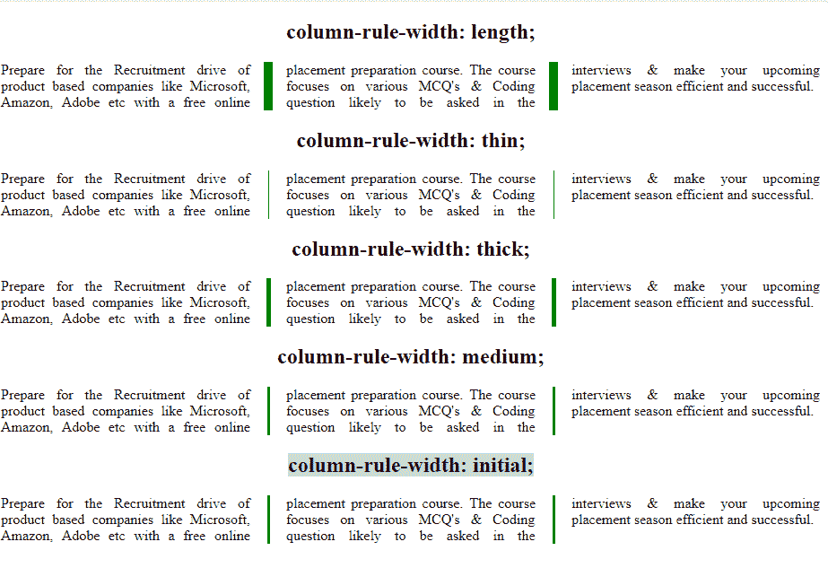

# CSS |列宽规则属性

> 原文:[https://www . geesforgeks . org/CSS-column-rule-width-property/](https://www.geeksforgeeks.org/css-column-rule-width-property/)

CSS 中的列规则宽度属性用于更改列规则的宽度，即列之间的垂直线。

**语法:**

```html
column-rule-width: length|thin|medium|thick|initial|inherit;
```

**默认值:**

*   **中等**

**属性值:**

*   **精简:**用于在列之间设置精简规则。
*   **中等:**用于在列之间创建中等宽度规则。这是默认宽度。
*   **粗:**它在列之间创建粗宽度规则。
*   **长度:**用于按长度设置宽度。它不取负值。
*   **初始值:**用于将列宽属性设置为默认值。
*   **inherit:** 此属性从其父级继承。

**示例:**

## 超文本标记语言

```html
<!DOCTYPE html>
<html>
    <head>
        <title>
            column-rule-width property
        </title>

        <!-- column-rule-width CSS property -->
        <style>
            .length {
                column-count: 3;
                column-rule: solid green;
                column-gap:40px;
                column-rule-width: 10px;
                text-align:justify;
            }

            .thin {
                column-count: 3;
                column-rule: solid green;
                column-gap:40px;
                column-rule-width: thin;
                text-align:justify;
            }

            .thick {
                column-count: 3;
                column-rule: solid green;
                column-gap:40px;
                column-rule-width: thick;
                text-align:justify;
            }

            .medium {
                column-count: 3;
                column-rule: solid green;
                column-gap:40px;
                column-rule-width: medium;
                text-align:justify;
            }

            .initial {
                column-count: 3;
                column-rule: solid green;
                column-gap:40px;
                column-rule-width: initial;
                text-align:justify;
            }
            h2 {
                text-align:center;
            }
        </style>
    </head>

    <body>

        <!-- column-rule-width: length; property -->
        <h2>column-rule-width: length;</h2>
        <div class = "length">
            Prepare for the Recruitment drive of product
            based companies like Microsoft, Amazon, Adobe
            etc with a free online placement preparation
            course. The course focuses on various MCQ's
            & Coding question likely to be asked in the
            interviews & make your upcoming placement
            season efficient and successful.
        </div>

        <!-- column-rule-width: thin; property -->
        <h2>column-rule-width: thin;</h2>
        <div class = "thin">
            Prepare for the Recruitment drive of product
            based companies like Microsoft, Amazon, Adobe
            etc with a free online placement preparation
            course. The course focuses on various MCQ's
            & Coding question likely to be asked in the
            interviews & make your upcoming placement
            season efficient and successful.
        </div>

        <!-- column-rule-width: thick; property -->
        <h2>column-rule-width: thick;</h2>
        <div class = "thick">
            Prepare for the Recruitment drive of product
            based companies like Microsoft, Amazon, Adobe
            etc with a free online placement preparation
            course. The course focuses on various MCQ's
            & Coding question likely to be asked in the
            interviews & make your upcoming placement
            season efficient and successful.
        </div>

        <!-- column-rule-width: medium; property -->
        <h2>column-rule-width: medium;</h2>
        <div class = "medium">
            Prepare for the Recruitment drive of product
            based companies like Microsoft, Amazon, Adobe
            etc with a free online placement preparation
            course. The course focuses on various MCQ's
            & Coding question likely to be asked in the
            interviews & make your upcoming placement
            season efficient and successful.
        </div>

        <!-- column-rule-width: initial; property -->
        <h2>column-rule-width: initial;</h2>
        <div class = "initial">
            Prepare for the Recruitment drive of product
            based companies like Microsoft, Amazon, Adobe
            etc with a free online placement preparation
            course. The course focuses on various MCQ's
            & Coding question likely to be asked in the
            interviews & make your upcoming placement
            season efficient and successful.
        </div>
    </body>
</html>                   
```

**输出:**



**支持的浏览器:***列宽*属性支持的浏览器如下:

*   谷歌 Chrome 50.0，4.0 -webkit-
*   Internet Explorer 10.0
*   火狐 52.0， 2.0 -moz-
*   Safari 9.0，3.1 -webkit-
*   Opera 37.0，15.0 -webkit-，11.1